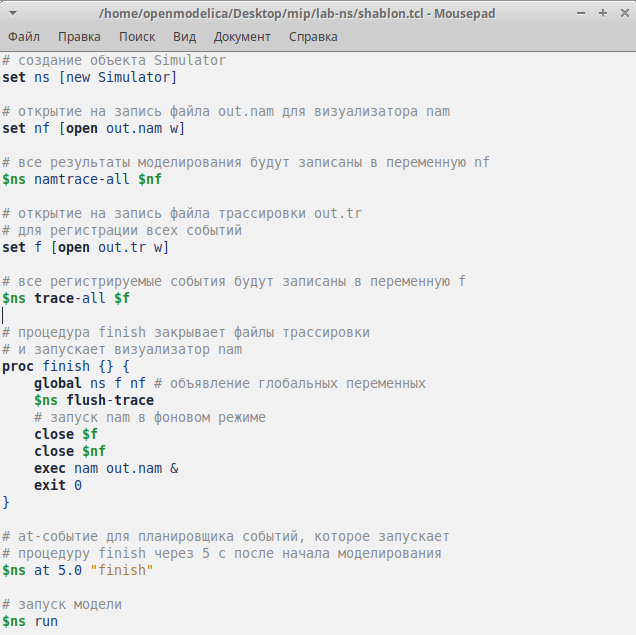
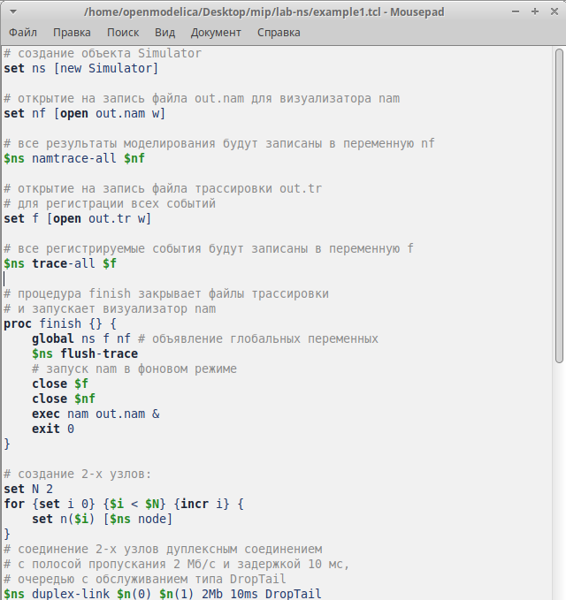
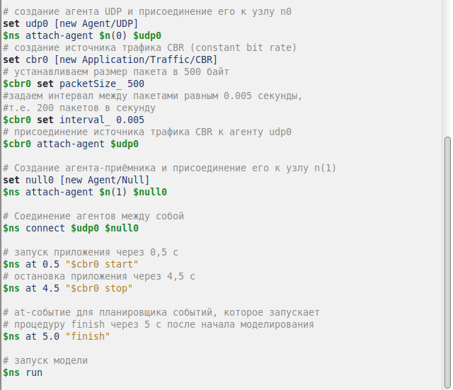
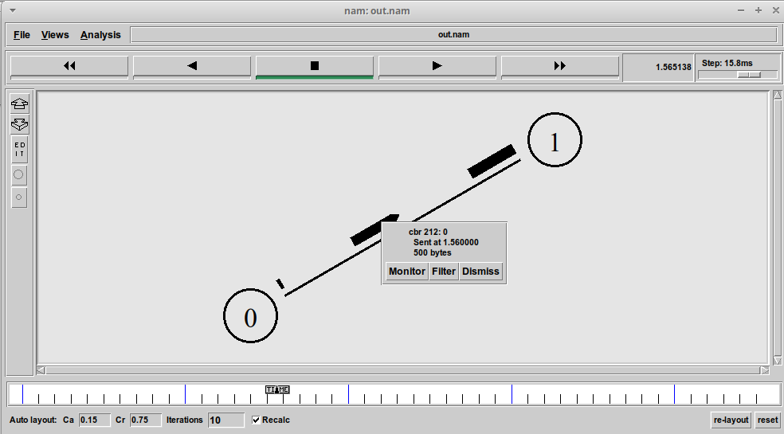
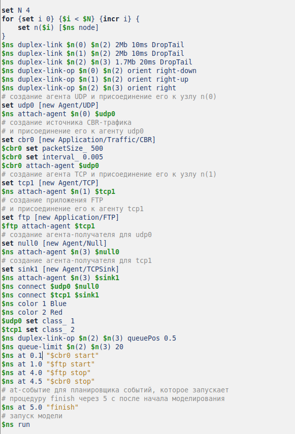
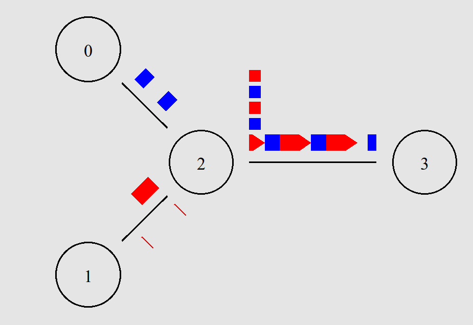
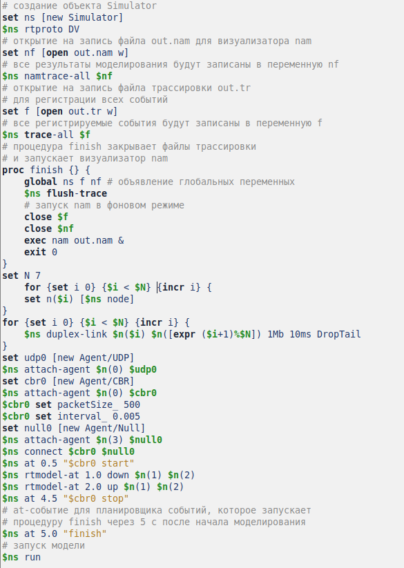
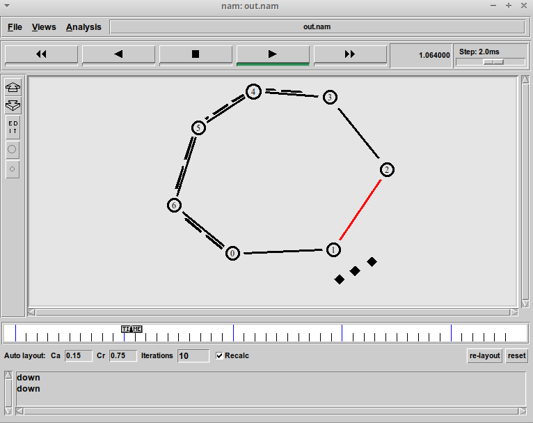
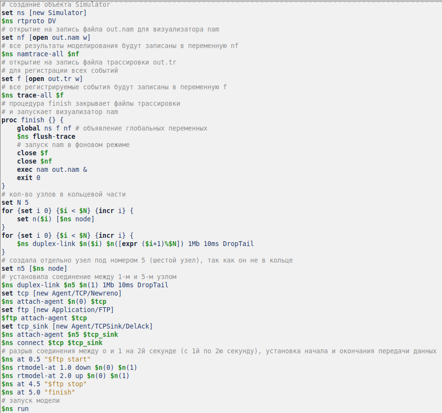
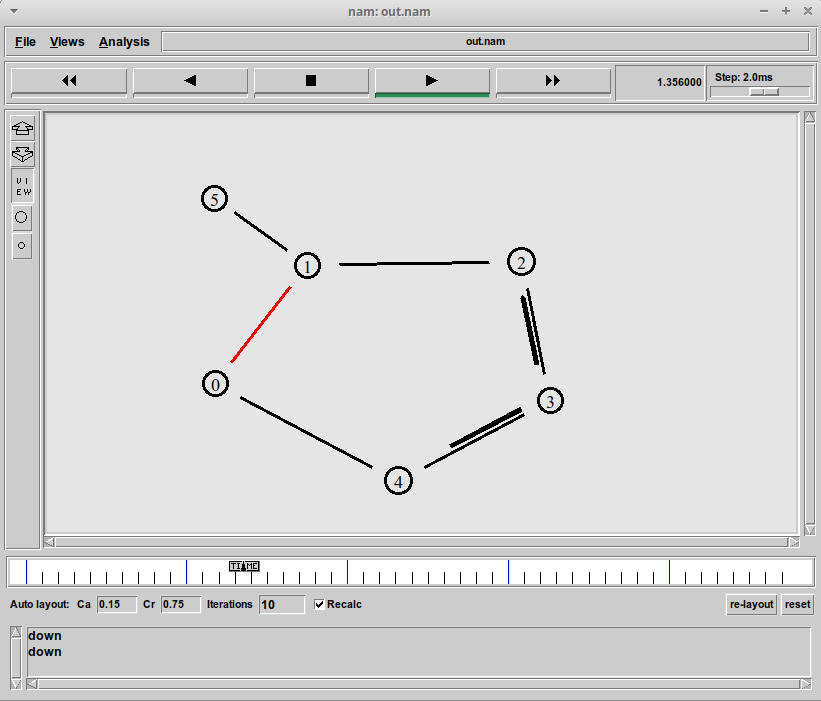

---
## Front matter
lang: ru-RU
title: Презентация по лабораторной работе №1
subtitle: простые модели компьютерной сети
author:
  - Ибатулина Д.Э.
institute:
  - Российский университет дружбы народов, Москва, Россия
date: 11 февраля 2025

## i18n babel
babel-lang: russian
babel-otherlangs: english

## Formatting pdf
toc: false
toc-title: Содержание
slide_level: 2
aspectratio: 169
section-titles: true
theme: metropolis
header-includes:
 - \metroset{progressbar=frametitle,sectionpage=progressbar,numbering=fraction}
---

# Информация

## Докладчик

:::::::::::::: {.columns align=center}
::: {.column width="70%"}

  * Ибатулина дарья эдуардовна
  * студентка группы НФИбд-01-22
  * Российский университет дружбы народов
  * [1132226434@rudn.ru](mailto:1132226434@rudn.ru)
  * <https://deibatulina.github.io>

:::
::: {.column width="30%"}

:::
::::::::::::::

# Вводная часть

## Актуальность

Тема моделирования процессов, происходящих в компьютерных сетях, актуальна, поскольку позволяет найти решения для оптимизации того или иного процесса.

## Объект и предмет исследования

- Информационные процессы
- Программное обеспечение для моделирования (NS-2)

## Цели и задачи

- Ознакомиться со средой моделирования NS-2
- Смоделировать несколько простых примеров информационных процессов

# Основная часть

## Теоретическое введение

Network Simulator (NS-2) — один из программных симуляторов моделирования процессов в компьютерных сетях. NS-2 позволяет описать топологию сети, конфигурацию источников и приёмников трафика, параметры соединений (полосу пропускания, задержку, вероятность потерь пакетов и т.д.) и множество других параметров моделируемой системы.

## Создание шаблона

\centering
{width=50%}

## Моделирование процесса (образец 1, часть 1)

\centering
{width=50%}

## Моделирование процесса (образец 1, часть 2)

\centering
{width=60%}

## Моделирование процесса (образец 1, часть 3)

\centering

## Моделирование процесса (образец 2, часть 1)

\centering
{width=60%}

## Моделирование процесса (образец 2, часть 2)

\centering

## Моделирование процесса (образец 3, часть 1)

\centering
{width=45%}

## Моделирование процесса (образец 3, часть 2)

\centering

## Моделирование процесса (самостоятельная работа, часть 1)

\centering
{width=60%}

## Моделирование процесса (самостоятельная работа, часть 2)

\centering

# Заключительная часть

## Выводы

- Научилась работать со средством NS-2
- Узнала больше о процессах передачи данных
- Закрепила знания о сетях и топологиях

