---
## Front matter
title: "Отчёт по лабораторной работе №1"
subtitle: "Простые модели компьютерной сети"
author: "Ибатулина Дарья Эдуардовна"

## Generic otions
lang: ru-RU
toc-title: "Содержание"

## Bibliography
bibliography: bib/cite.bib
csl: pandoc/csl/gost-r-7-0-5-2008-numeric.csl

## Pdf output format
toc: true # Table of contents
toc-depth: 2
lof: true # List of figures
lot: false # List of tables
fontsize: 12pt
linestretch: 1.5
papersize: a4
documentclass: scrreprt
## I18n polyglossia
polyglossia-lang:
  name: russian
  options:
	- spelling=modern
	- babelshorthands=true
polyglossia-otherlangs:
  name: english
## I18n babel
babel-lang: russian
babel-otherlangs: english
## Fonts
mainfont: IBM Plex Serif
romanfont: IBM Plex Serif
sansfont: IBM Plex Sans
monofont: IBM Plex Mono
mathfont: STIX Two Math
mainfontoptions: Ligatures=Common,Ligatures=TeX,Scale=0.94
romanfontoptions: Ligatures=Common,Ligatures=TeX,Scale=0.94
sansfontoptions: Ligatures=Common,Ligatures=TeX,Scale=MatchLowercase,Scale=0.94
monofontoptions: Scale=MatchLowercase,Scale=0.94,FakeStretch=0.9
mathfontoptions:
## Biblatex
biblatex: true
biblio-style: "gost-numeric"
biblatexoptions:
  - parentracker=true
  - backend=biber
  - hyperref=auto
  - language=auto
  - autolang=other*
  - citestyle=gost-numeric
## Pandoc-crossref LaTeX customization
figureTitle: "Рис."
lofTitle: "Список иллюстраций"
## Misc options
indent: true
header-includes:
  - \usepackage{indentfirst}
  - \usepackage{float} # keep figures where there are in the text
  - \floatplacement{figure}{H} # keep figures where there are in the text
---

# Цель работы

Приобретение навыков моделирования сетей передачи данных с помощью средства имитационного моделирования NS-2, а также анализ полученных результатов
 моделирования.

# Задание

Смоделировать несколько сетей передачи данных различной сложности с помощью средства имитационного моделирования NS-2.

# Теоретическое введение

Network Simulator (NS-2) — один из программных симуляторов моделирования процессов в компьютерных сетях. NS-2 позволяет описать топологию сети, конфигурацию источников и приёмников трафика, параметры соединений (полосу пропускания, задержку, вероятность потерь пакетов и т.д.) и множество других параметров моделируемой системы. Данные о динамике трафика, состоянии соединений и объектов сети, а также информация о работе протоколов фиксируются в генерируемом trace-файле.

NS-2 является объектно-ориентированным программным обеспечением. Его ядро реализовано на языке С++. В качестве интерпретатора используется язык скриптов (сценариев) OTcl (Object oriented Tool Command Language). NS-2 полностью поддерживает иерархию классов С++ и подобную иерархию классов интерпретатора OTcl.

Обе иерархии обладают идентичной структурой, т.е. существует однозначное соответствие между классом одной иерархии и таким же классом другой. Объединение для совместного функционирования С++ и OTcl производится при помощи TclCl (Classes Tcl). В случае, если необходимо реализовать какую-либо специфическую функцию, не реализованную в NS-2 на уровне ядра, для этого используется код на С++.

Процесс создания модели сети для NS-2 состоит из нескольких этапов:
1. Создание нового объекта класса Simulator, в котором содержатся методы, необ
ходимые для дальнейшего описания модели (например, методы new и delete
 используются для создания и уничтожения объектов соответственно);
2. Описание топологии моделируемой сети с помощью трёх основных функциональ
ных блоков: узлов (nodes), соединений (links) и агентов (agents);
3. Задание различных действий, характеризующих работу сети.

Для создания узла используется метод node. При этом каждому узлу автоматически присваивается уникальный адрес. Для построения однонаправленных и двунаправленных линий соединения узлов используют методы simplex-link и duplex-link соответственно.

Важным объектом NS-2являются агенты,которые могут рассматриваться как процессы и/или как транспортные единицы, работающие на узлах моделируемой сети.

Агенты могут выступать в качестве источников трафика или приёмников, а также как динамические маршрутизирующие и протокольные модули. Агенты создаются с помощью методов общего класса Agent и являются объектами его подкласса, т.е. Agent/type, где type определяет тип конкретного объекта. Например, TCP-агент может быть создан с помощью команды:
`set tcp [ new Agent/TCP ]`

Для закрепления агента за конкретным узлом используется метод attach-agent.
Каждому агенту присваивается уникальный адрес порта для заданного узла (аналогично портам tcp и udp). Чтобы за конкретным агентом закрепить источник, используют методы attach-source и attach-traffic. Например, можно прикрепить ftp или telnet источники к TCP-агенту. Есть агенты, которые генерируют свои собственные данные, например, CBR-агент (Constant Bit-Rate) — источник трафика с постоянной интенсивностью.

Действия разных агентов могут быть назначены планировщиком событий (Event Scheduler) в определённые моменты времени (также в определённые моменты времени могут бытьзадействованы или отключены те или иные источники данных, запись  и т.д.). Для этого может использоваться метод at. Моделирование начинается при помощи метода run.

В качестве дополнения к NS-2 часто используют средство визуализации nam (network animator) для графического отображения свойств моделируемой системы и проходящего через неё трафика и пакет Xgraph для графического представления результатов моделирования.

Запуск сценария NS-2 осуществляется в командной строке с помощью команды:
`ns [tclscript]`

Здесь [tclscript] — имя файла скрипта Tcl, который определяет сценарий моделирования (т.е. топологию и различные события).
Nam можно запустить с помощью команды
`nam [nam-file]`
Здесь [nam-file] — имя nam trace-файла, сгенерированного с помощью ns.

# Выполнение лабораторной работы

Создадим директорию для лабораторных работ по ns-2, перейдем в неё и создадим файл, в котором затем напишем код для первого задания (рис. [-@fig:001]).

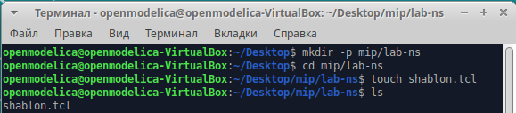{#fig:001 width=70%}

Напишем код, описывающий "пустой" процесс. Пустым я назвала его потому, что trace file - файл трассировки пустой, поскольку в процессе не задано ни объектов, ни действий. Впоследствии я буду использовать его для моделирования более сложных процессов (рис. [-@fig:002]).

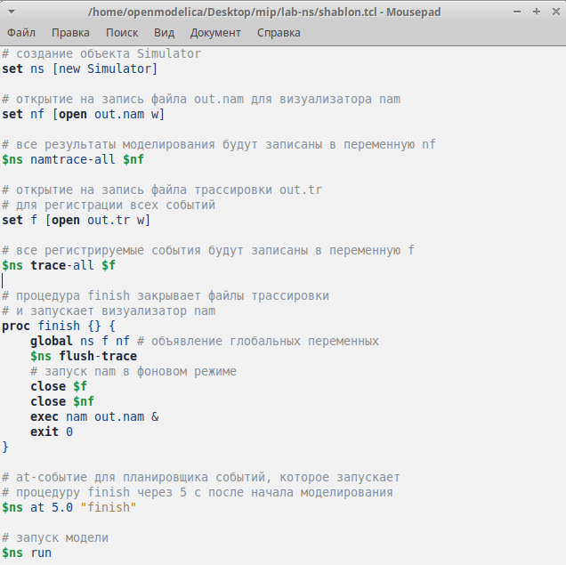{#fig:002 width=70%}

С помощью команды `ns имя_файла` я запустила симуляцию процесса (рис. [-@fig:003]).

{#fig:003 width=70%}

Открылось графическое окно программы ns-2 с данным процессом. Белое окошко пустое, поскольку в процессе не заданы объекты и действия (рис. [-@fig:004]).

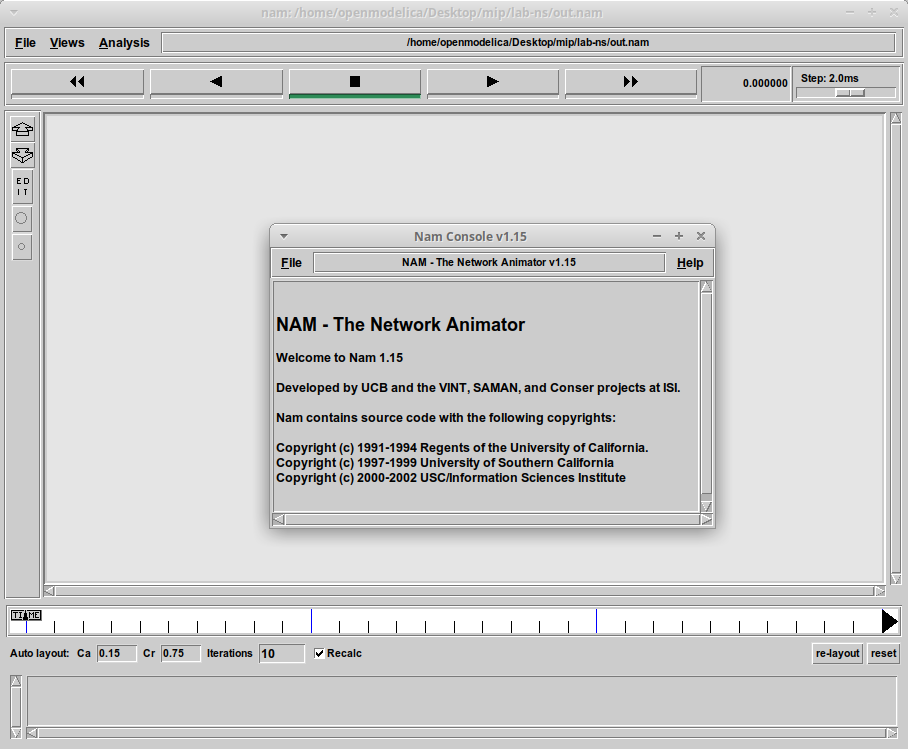{#fig:004 width=70%}

Создаем файл *example1.tcl*, чтобы смоделировать простой процесс (рис. [-@fig:005]).

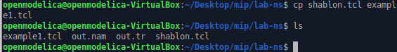{#fig:005 width=70%}

Пишем по приведенному в лабораторной работе указанию код для симуляции сети, состоящей из двух узлов. Требование к заданию:
Требуется смоделировать сеть передачи данных, состоящую из двух узлов, соединённых дуплексной линией связи с полосой пропускания 2 Мб/с и задержкой 10 мс, очередью с обслуживанием типа DropTail. От одного узла к другому по протоколу UDP осуществляется передача пакетов, размером 500 байт, с постоянной скоростью 200 пакетов в секунду. (рис. [-@fig:006], [-@fig:007]).

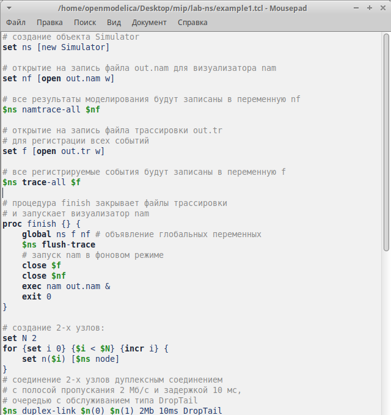{#fig:006 width=70%}

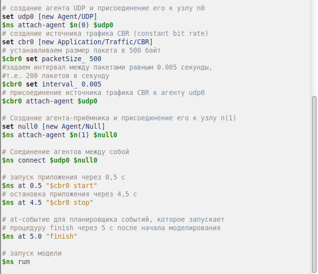{#fig:007 width=70%}

Запускаем процесс и, нажав кнопку *play*, наблюдаем его симуляцию: в окне nam через 0.5 секунды из узла 0 данные начнут поступать к узлу 1 (рис. [-@fig:008]). Это процесс можно замедлить, выбирая шаг отображения в nam. Можно осуществлять наблюдение за отдельным пакетом, щёлкнув по нему в окне nam, а щёлкнув по соединению, можно получить о нем некоторую информацию (рис. [-@fig:009]).

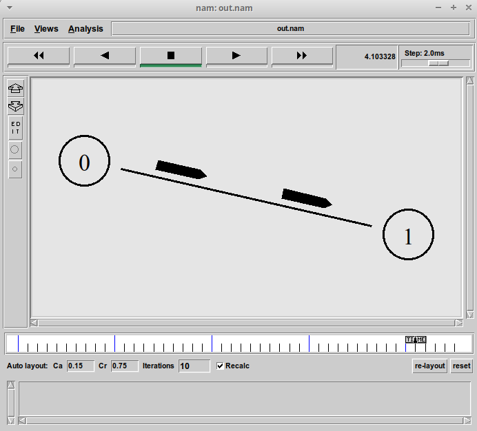{#fig:008 width=70%}

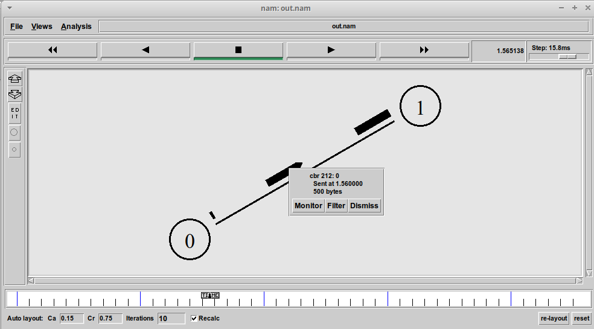{#fig:009 width=70%}

Создаём новый файл для симуляции более сложной топологии сети (рис. [-@fig:010]).

{#fig:010 width=70%}

Напишем код для симуляции проуесса, отвечающего требованиям:

– сеть состоит из 4 узлов (n0, n1, n2, n3);
- между узлами n0 и n2, n1 и n2 установлено дуплексное соединение с пропускной способностью 2 Мбит/с и задержкой 10 мс;
– между узлами n2 и n3 установлено дуплексное соединение с пропускной способностью 1,7 Мбит/с и задержкой 20 мс;
– каждый узел использует очередь с дисциплиной DropTail для накопления пакетов, максимальный размер которой составляет 10;
– TCP-источник на узле n0 подключается к TCP-приёмнику на узле n3 (по-умолчанию, максимальный размер пакета, который TCP-агент может генерировать, равняется 1KByte)
– TCP-приёмник генерирует и отправляет ACK пакеты отправителю и откидывает полученные пакеты;
– UDP-агент, который подсоединён к узлу n1, подключён к null-агенту на узле n3 (null-агент просто откидывает пакеты);
– генераторы трафика ftp и cbr прикреплены к TCP и UDP агентам соответственно;
– генератор cbr генерирует пакеты размером 1 Кбайт со скоростью 1 Мбит/с;
– работа cbr начинается в 0,1 секунду и прекращается в 4,5 секунды, а ftp начинает работать в 1,0 секунду и прекращает в 4,0 секунды (рис. [-@fig:011]).

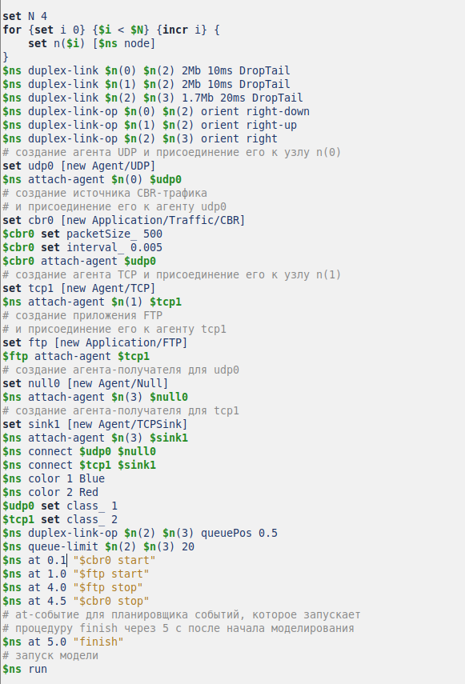{#fig:011 width=70%}

Запускаем процесс и, нажав кнопку *play*, наблюдаем его симуляцию (рис. [-@fig:012], [-@fig:013], [-@fig:014]).

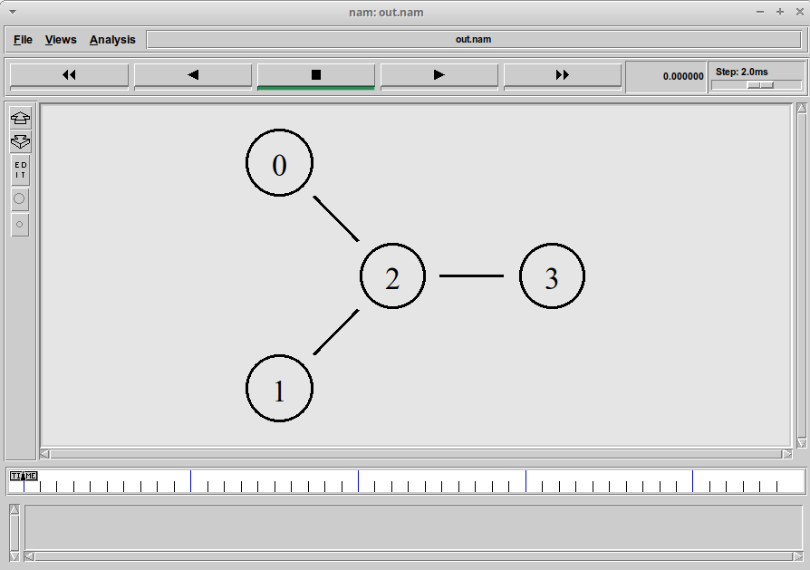{#fig:012 width=70%}

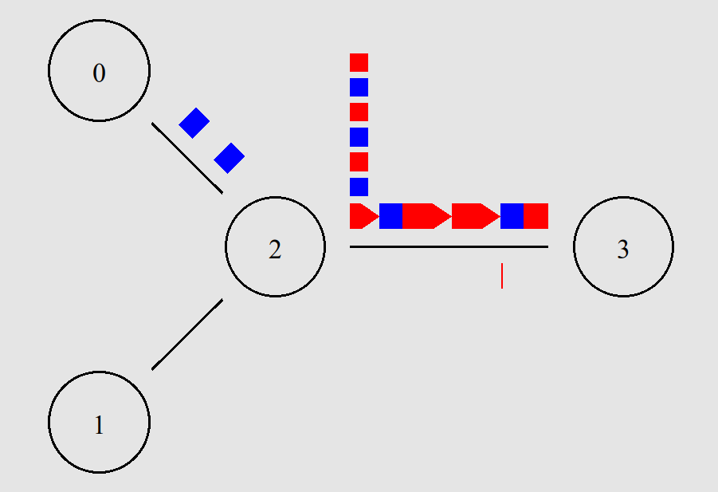{#fig:013 width=70%}

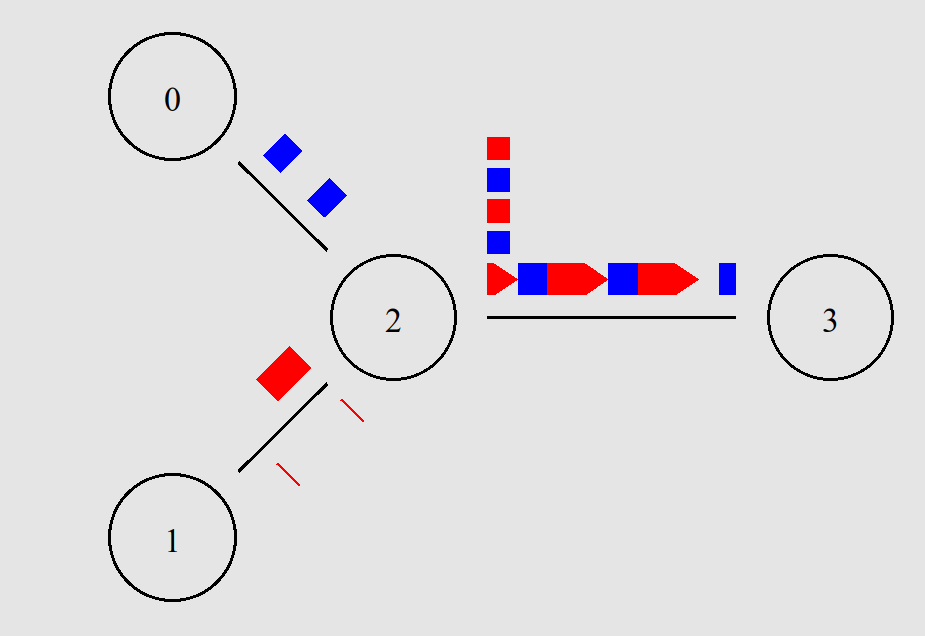{#fig:014 width=70%}

При запуске скрипта можно заметить, что по соединениям между узлами n(0)–>n(2) и n(1)–>n(2) к узлу n(2) передаётся данных больше, чем способно передаваться по соединению от узла n(2) к узлу n(3). Действительно, мы передаём 200 пакетов в секунду от каждого источника данных в узлах n(0) и n(1), а каждый пакет имеет размер 500 байт. Таким образом, полоса каждого соединения 0.8 Mb, а суммарная — 1.6Mb. Но соединение n(2)–>n(3) имеет полосу лишь 1 Mb. Следовательно, часть пакетов должна теряться. В окне аниматора можно видеть пакеты в очереди, а также те пакеты, которые отбрасываются при переполнении.

Создадим файл для новой топологии - кольцо (рис. [-@fig:015]).

{#fig:015 width=70%}

Затем смоделируем более сложную топологию сети - кольцо из семи узлов. Требования:
– сеть состоит из 7 узлов, соединённых в кольцо;
– данные передаются от узла n(0) к узлу n(3) по кратчайшему пути;
– с 1 по 2 секунду модельного времени происходит разрыв соединения между узлами n(1) и n(2);

Напишем код (рис. [-@fig:016]).

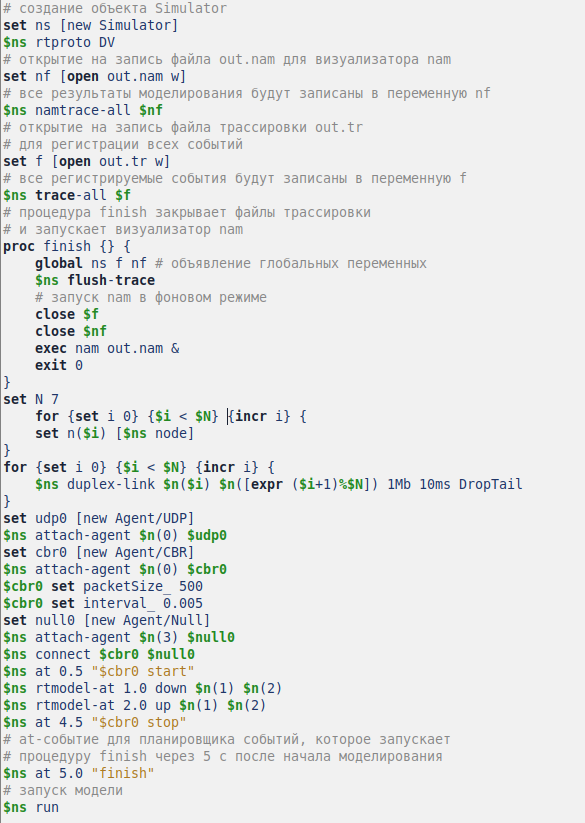{#fig:016 width=70%}

Запускаем процесс и, нажав кнопку *play*, наблюдаем его симуляцию (рис. [-@fig:017]).

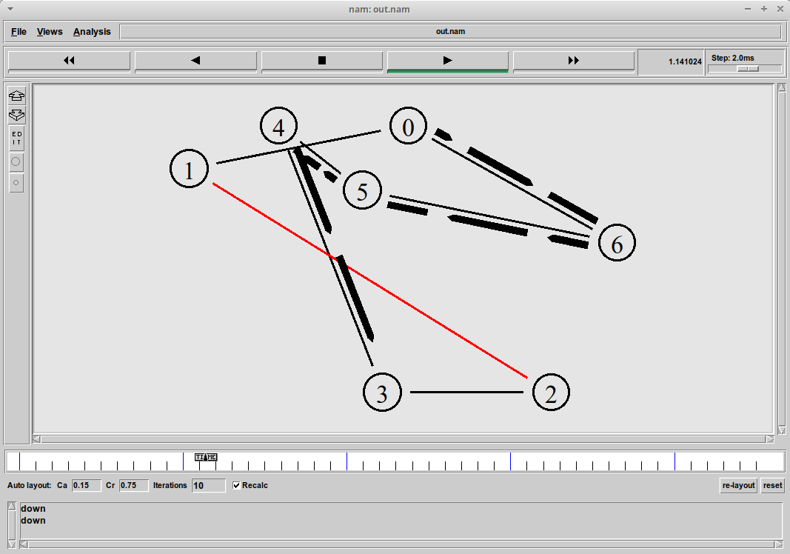{#fig:017 width=70%}

Нажав на кнопку *edit* слева, можно сделать процесс более понятным (красиво перерисовать, чтобы смотрелось действительно как кольцо) (рис. [-@fig:018]). Можно заметить, что на секундах с 0й по 1ую данные передаются из 0 в 3 по кратайшему пути (через 1 и 2), а затем, когда происходит разрыв соединения между 1 и 2 на 2й секунде, данные идут от 0 в 3 по длинному пути (6, 5 и 4), а затем снова идут по кратчайшему пути, когда соединение между узлами 1 и 2 восстанавливается (рис. [-@fig:019], [-@fig:020]).

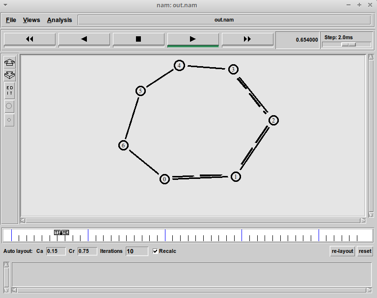{#fig:018 width=70%}

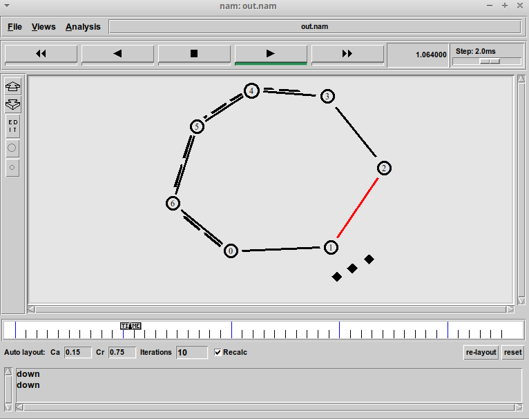{#fig:019 width=70%}

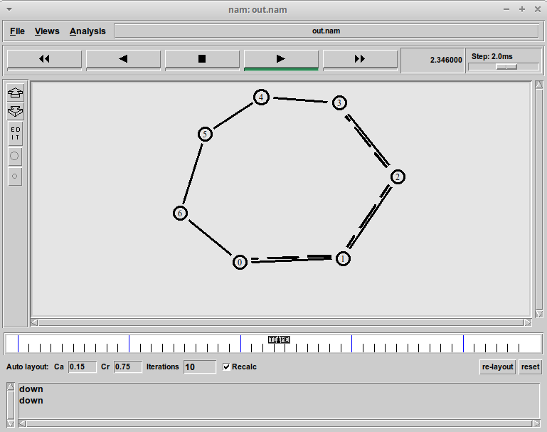{#fig:020 width=70%}

Пришло время для самостоятельной работы. Теперь требуется построить сеть из 6 узлов, 5 из которых образуют кольцо, а из узла 1 выходит узел 5, при этом:

- передача данных должна осуществляться от узла n(0) до узла n(5) по кратчайшему пути в течение 5 секунд модельного времени;
- передача данных должна идти по протоколу TCP (тип Newreno), на принимающей стороне используется TCPSink-объект типа DelAck;
- поверх TCP работает протокол FTP с 0,5 до 4,5 секунд модельного времени;
- с 1 по 2 секунду модельного времени происходит разрыв соединения между узлами n(0) и n(1);
- при разрыве соединения маршрут передачи данных должен измениться на резервный, после восстановления соединения пакеты снова должны пойти по кратчайшему пути.

Пишем код (рис. [-@fig:021]).

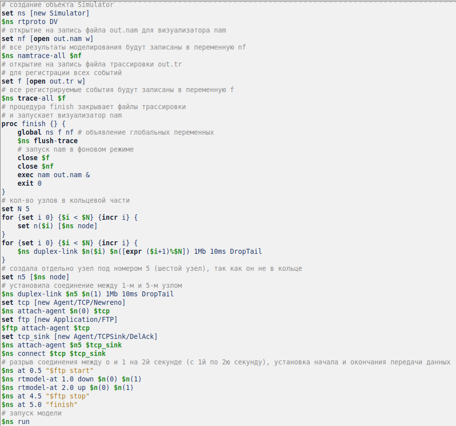{#fig:021 width=70%}

Я решила включить 5 узлов с 0го по 4й в кольцо, а затем привязать к узлу 1 узел 5 отдельно. Узлы с 0го по 4й связала между собой дуплексными соединениями по порядку, чтобы получилось кольцо. Между первым и пятым узлом установила дуплексное соединение отдельно. Затем подключила Агентов tcp и tcpSink и приложение ftp, установила разрыв между 0 и 1 на 2й секунде (с 1й по 2ую секунду). ftp запускается через полсекнды, и заканчивает работу в 4,5 секунды. Всего передача данных от узла 0 к узлу 5 длится 5 секунд.

Запускаем файл и видим наш процесс (рис. [-@fig:022]).

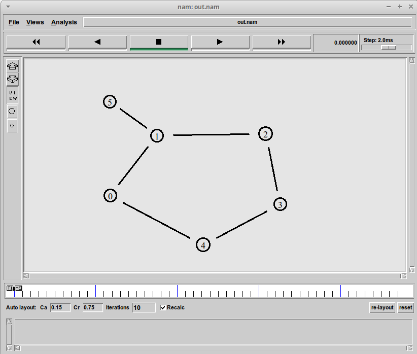{#fig:022 width=70%}

Нажав на кнопку *play*, мы увидим, как проходит процесс. Можно заметить, что на секундах с 0й по 1ую данные передаются из 0 в 5 по кратайшему пути (через 1), а затем, когда происходит разрыв соединения между 0 и 1 на 2й секунде (во время с 1й секунды по 2ую), данные идут от 0 в 5 по длинному пути (4, 3 и 2), а затем снова идут по кратчайшему пути, когда соединение между узлами 0 и 1 восстанавливается (рис. [-@fig:023], [-@fig:024], [-@fig:025]).

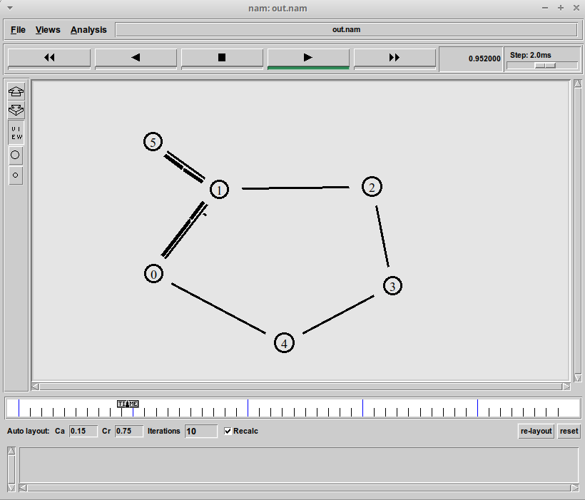{#fig:023 width=70%}

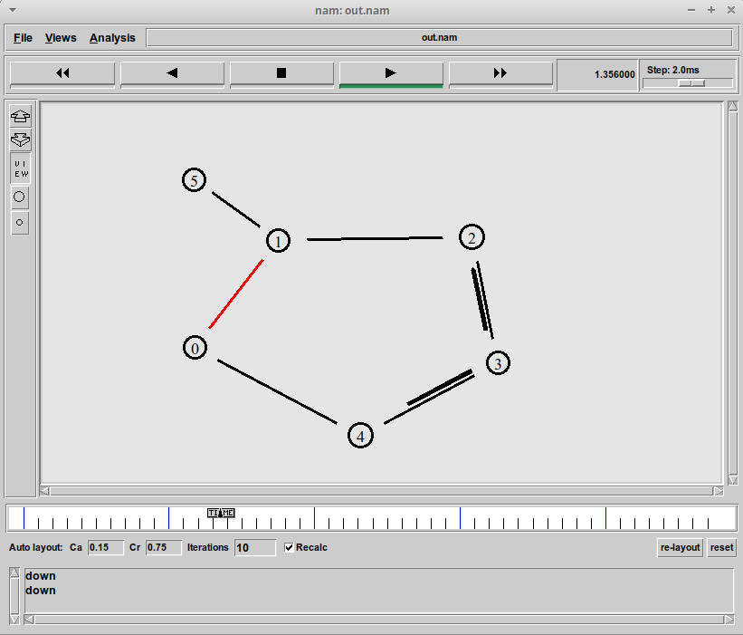{#fig:024 width=70%}

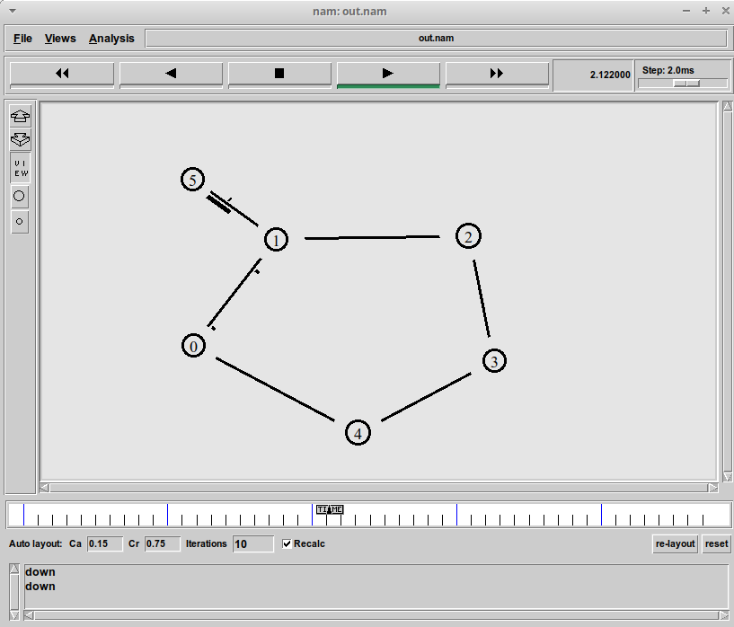{#fig:025 width=70%}

# Выводы

В результате выполнения лабораторной работы я научилась работать со средством ns-2: моделировать пустой процесс и процессы с простыми и сложными топологиями, а также с динамической маршрутизацией и условиями, накладывающимися на передачу данных.

# Список литературы{.unnumbered}

1. Заборовский В. С. Моделирование и анализ сетей связи с коммутацией пакетов. Network Simulator (Сетевой симулятор ns2). — СПб : Изд-во СПбГТУ, 2001. — 108 с.
2. Exercises on ”ns-2” / C. Barakat. — Заявл. 2003.
3. Галкин А. М., Кучерявый Е. А., Молчанов Д. А. Пакет моделирования NS-2: учеб. пособие. — СПб : СПбГУТ, 2007.
4. Заборовский В. С., Мулюха В. А., Подгурский Ю. Е. Моделирование и анализ компьютерных сетей: телематический подход. — СПб: Изд-во СПбГПУ, 2010. — 93 с.

::: {#refs}
:::
