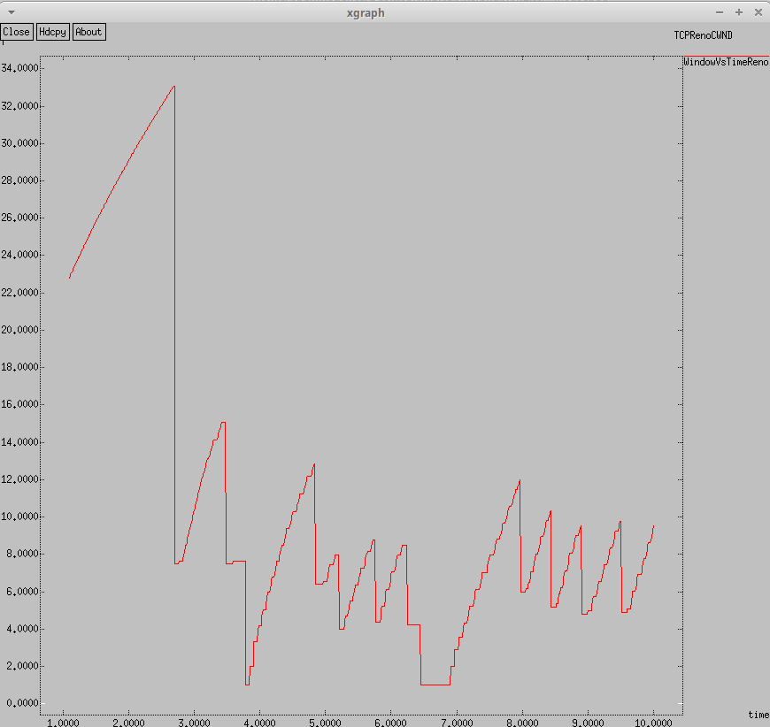
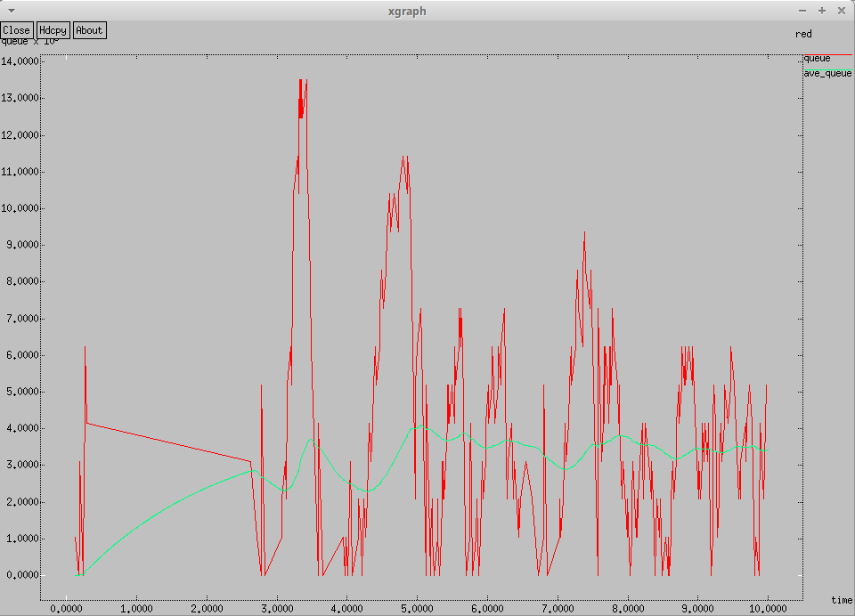
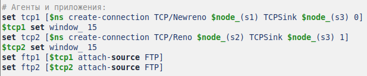
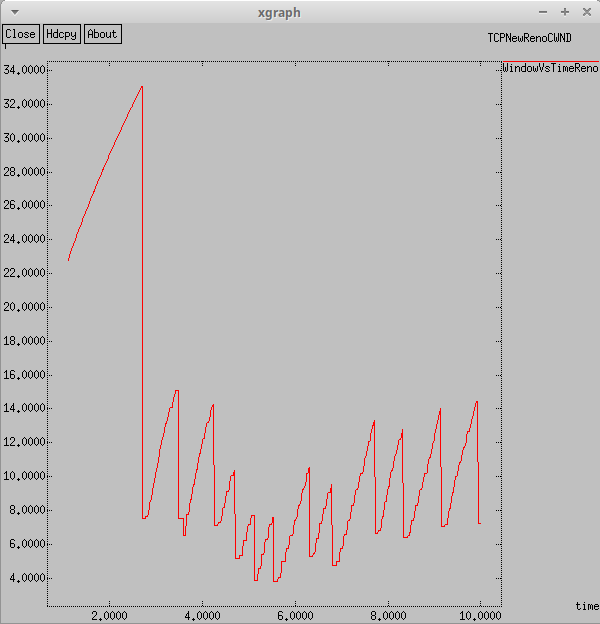
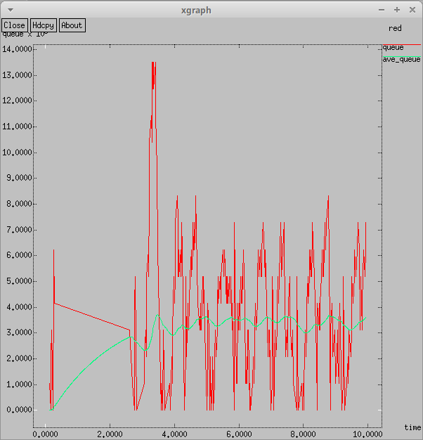
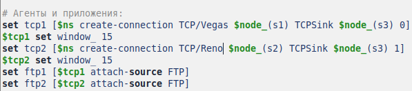
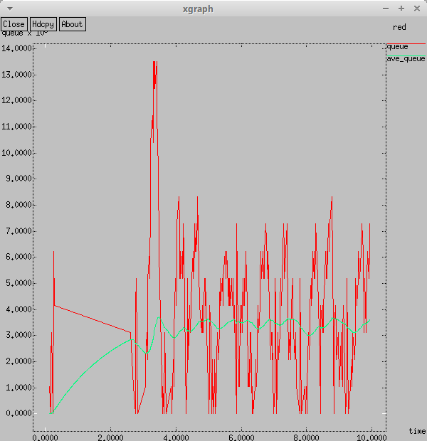
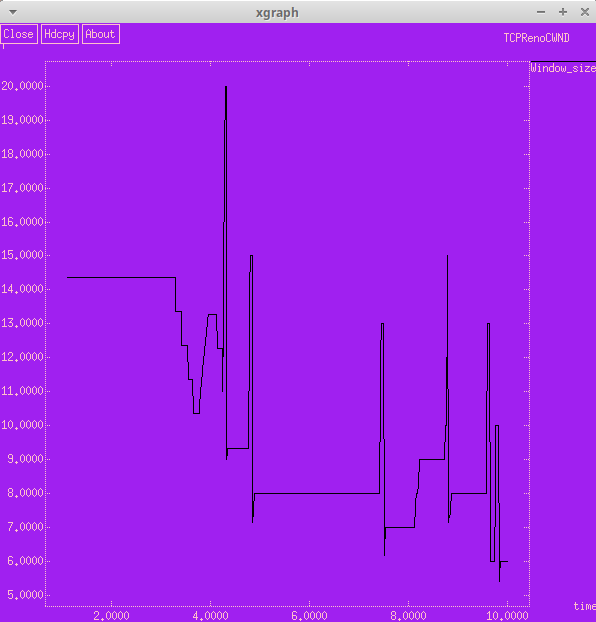
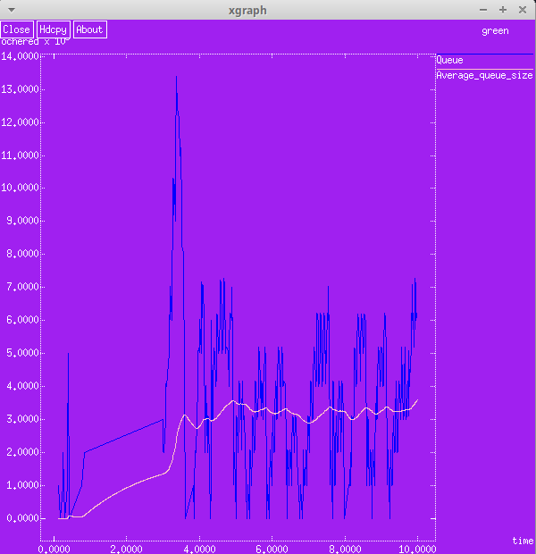

---
## Front matter
lang: ru-RU
title: Презентация по лабораторной работе №2
subtitle: Исследование протокола TCP и алгоритма управления очередью RED
author:
  - Ибатулина Д.Э.
institute:
  - Российский университет дружбы народов, Москва, Россия
date: 21 февраля 2025

## i18n babel
babel-lang: russian
babel-otherlangs: english

## Formatting pdf
toc: false
toc-title: Содержание
slide_level: 2
aspectratio: 169
section-titles: true
theme: metropolis
header-includes:
 - \metroset{progressbar=frametitle,sectionpage=progressbar,numbering=fraction}
---

# Информация

## Докладчик

:::::::::::::: {.columns align=center}
::: {.column width="70%"}

  * Ибатулина дарья эдуардовна
  * студентка группы НФИбд-01-22
  * Российский университет дружбы народов
  * [1132226434@rudn.ru](mailto:1132226434@rudn.ru)
  * <https://deibatulina.github.io>

:::
::: {.column width="30%"}


:::
::::::::::::::

# Вводная часть

## Актуальность

Тема моделирования процессов, происходящих в компьютерных сетях, актуальна, поскольку позволяет найти решения для оптимизации того или иного процесса.

## Объект и предмет исследования

- Информационные процессы
- Программное обеспечение для моделирования (NS-2)

## Цели и задачи

Цель: Исследовать протокол TCP и алгоритм управления очередью RED.

Задачи:

1. Выполнить пример с дисциплиной RED;

2. Изменить в модели на узле s1 тип протокола TCP с Reno на NewReno, затем на Vegas. Сравнить и пояснить результаты;

3. Внести изменения при отображении окон с графиками (изменить цвет фона, цвет траекторий, подписи к осям, подпись траектории в легенде).

# Основная часть

## Теоретическое введение

Network Simulator (NS-2) — один из программных симуляторов моделирования процессов в компьютерных сетях. NS-2 позволяет описать топологию сети, конфигурацию источников и приёмников трафика, параметры соединений (полосу пропускания, задержку, вероятность потерь пакетов и т.д.) и множество других параметров моделируемой системы.

Протокол управления передачей (Transmission Control Protocol, TCP) имеет средства управления потоком и коррекции ошибок, ориентирован на установление соединения.

## Пример с дисциплиной RED (динамика размера окна TCP)

\centering
{width=50%}

## Пример с дисциплиной RED (динамика длины очереди и средней длины очереди)

\centering
{width=50%}

## Упражнение 1.1 (изменение типа протокола TCP с Reno на NewReno)

\centering
{width=100%}

## Результат (динамика размера окна TCP)

\centering
{width=50%}

## Результат (динамика длины очереди и средней длины очереди)

\centering
{width=50%}

## Упражнение 1.2 (изменение типа протокола TCP с Reno на Vegas)

\centering
{width=100%}

## Результат (динамика размера окна TCP)

\centering
{width=50%}

## Результат (динамика длины очереди и средней длины очереди)

\centering
{width=50%}

## Упражнение 2.1 (изменение цветов отображения графиков)

```
set f [open temp.queue w]
  puts $f "TitleText: green"
  puts $f "Device: Postscript"
  puts $f "0.Color: Blue"
  puts $f "1.Color: Pink"
  if { [info exists tchan_] } {
  close $tchan_
  }

# Запуск xgraph с графиками окна TCP и очереди:
  exec xgraph -fg pink -bg purple -bb -tk -x time -t "TCPRenoCWND" WindowVsTimeReno &
  exec xgraph -fg white -bg purple -bb -tk -x time -y ochered temp.queue &
```

## Результат (динамика размера окна TCP)

\centering
{width=50%}

## Результат (динамика длины очереди и средней длины очереди)

\centering
{width=50%}

# Заключительная часть

## Выводы

В результате выполнения лабораторной работы я исследовала протокол TCP и алгоритм управления очередью RED.


