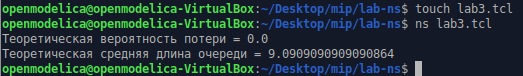
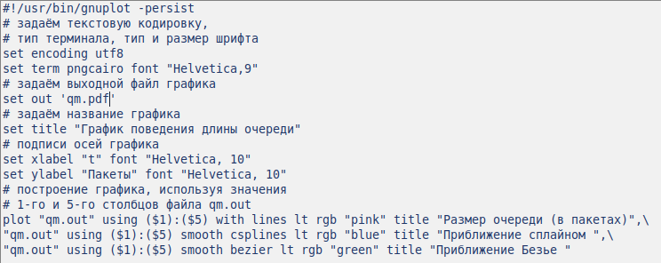
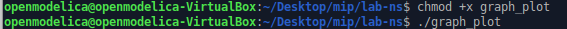
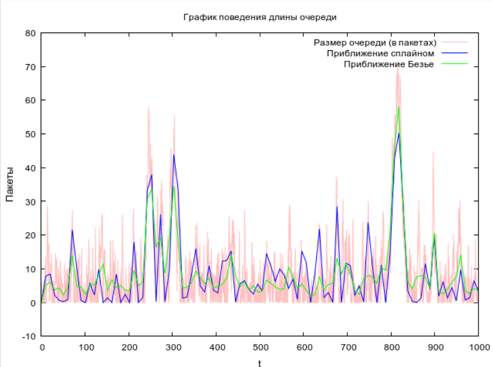

---
## Front matter
lang: ru-RU
title: Презентация по лабораторной работе №3
subtitle: Моделирование стохастических процессов
author:
  - Ибатулина Д.Э.
institute:
  - Российский университет дружбы народов, Москва, Россия
date: 21 февраля 2025

## i18n babel
babel-lang: russian
babel-otherlangs: english

## Formatting pdf
toc: false
toc-title: Содержание
slide_level: 2
aspectratio: 169
section-titles: true
theme: metropolis
header-includes:
 - \metroset{progressbar=frametitle,sectionpage=progressbar,numbering=fraction}
---

# Информация

## Докладчик

:::::::::::::: {.columns align=center}
::: {.column width="70%"}

  * Ибатулина дарья эдуардовна
  * студентка группы НФИбд-01-22
  * Российский университет дружбы народов
  * [1132226434@rudn.ru](mailto:1132226434@rudn.ru)
  * <https://deibatulina.github.io>

:::
::: {.column width="30%"}


:::
::::::::::::::

# Вводная часть

## Актуальность

Тема моделирования процессов, происходящих в компьютерных сетях, актуальна, поскольку позволяет найти решения для оптимизации того или иного процесса.

## Объект и предмет исследования

- Информационные процессы
- Программное обеспечение для моделирования (NS-2)

## Цели и задачи

Цель: Провести моделирование системы массового обслуживания (СМО).

Задачи:

1. Реализовать модель M|M|1;

2. Посчитать загрузку системы и вероятность потери пакетов;

3. Построить график изменения размера очереди.

# Основная часть

## Теоретическое введение

Network Simulator (NS-2) — один из программных симуляторов моделирования процессов в компьютерных сетях. NS-2 позволяет описать топологию сети, конфигурацию источников и приёмников трафика, параметры соединений (полосу пропускания, задержку, вероятность потерь пакетов и т.д.) и множество других параметров моделируемой системы.

$M|M|1$ -- это однолинейная СМО с накопителем бесконечной ёмкости. Поступающий поток заявок — пуассоновский с интенсивностью $\lambda$. Времена обслуживания заявок — независимые в совокупности случайные величины, распределённые по экспоненциальному закону с параметром $\mu$.

## Реализация модели M|M|1 на NS-2 (часть кода)

```
set ns [new Simulator]
set tf [open out.tr w]
$ns trace-all $tf
# задаём значения параметров системы
set lambda 30.0
set mu 33.0
set qsize 100000
set duration 1000.0
# с полосой пропускания 100 Кб/с и задержкой 0 мс,
# очередью с обслуживанием типа DropTail
set n1 [$ns node]
set n2 [$ns node]
```

## Реализация модели M|M|1 на NS-2 (результат выполнения)

\centering
{width=100%}

## Программа для графика в GNUplot

\centering
{width=90%}

## Передача файлу прав на исполнение и компиляция файла

\centering
{width=100%}

## Результат моделирования

\centering
{width=60%}

# Заключительная часть

## Выводы

В результате выполнения лабораторной работы я провела моделирование системы массового обслуживания (СМО).


