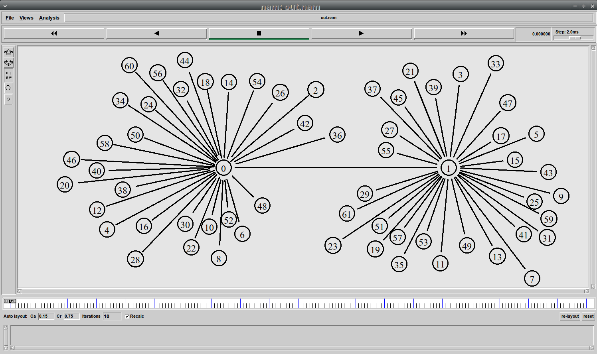
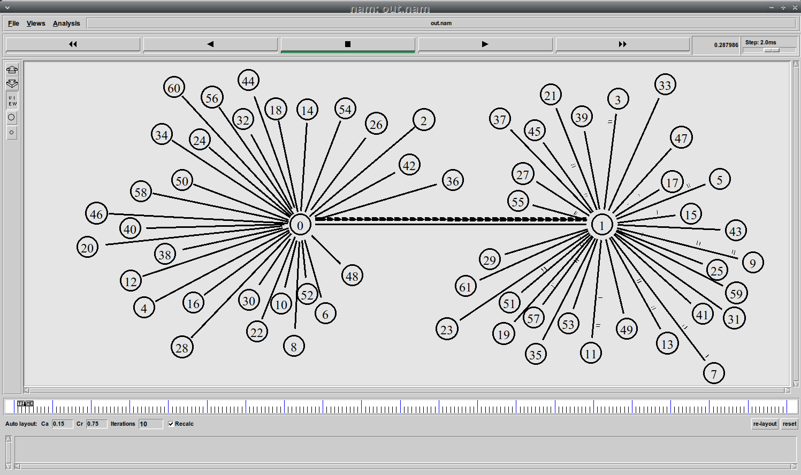
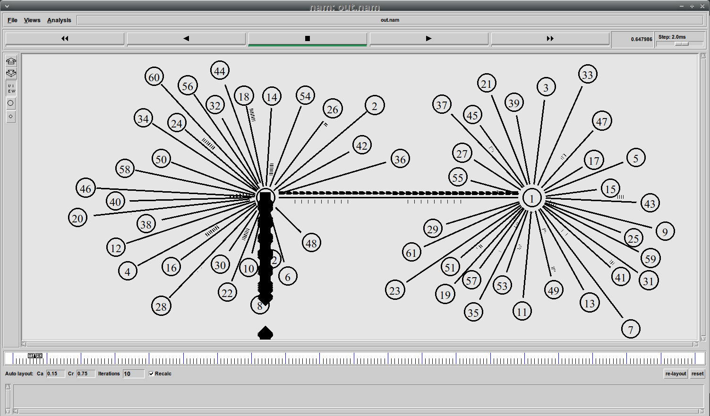
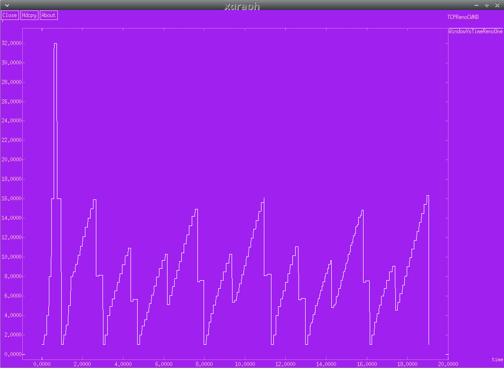
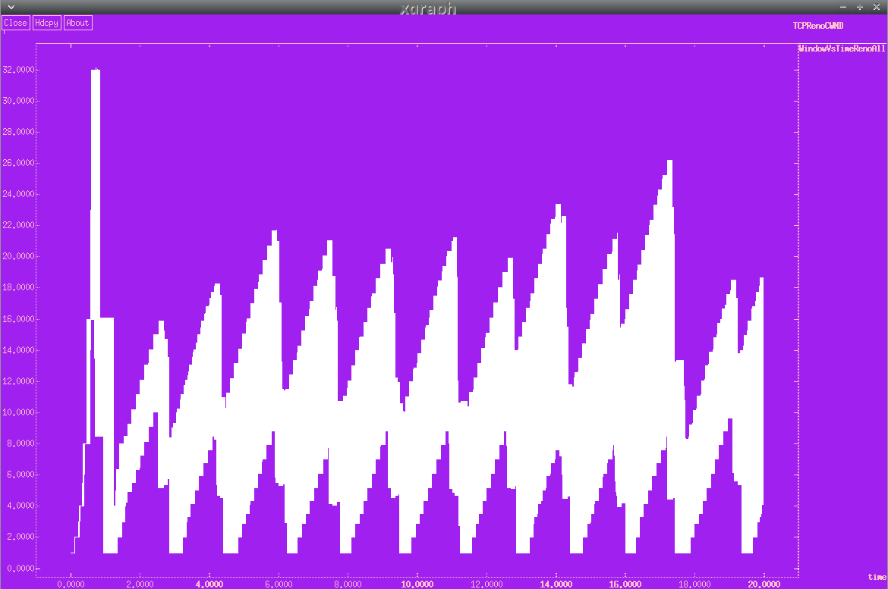
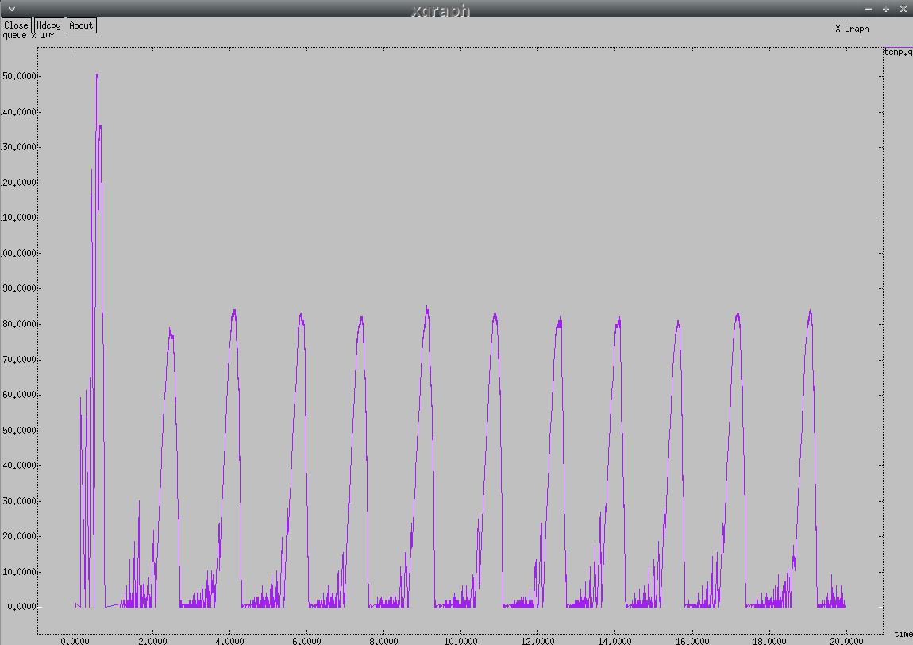
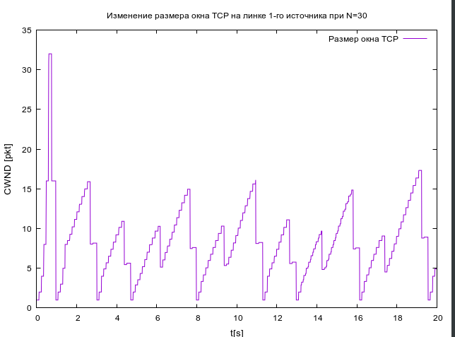
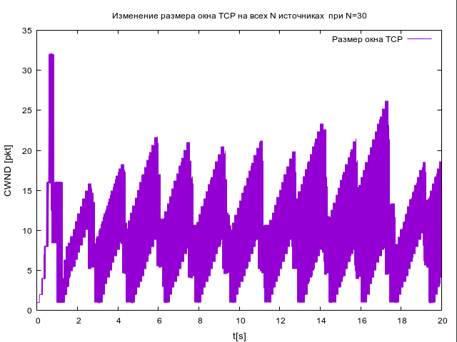
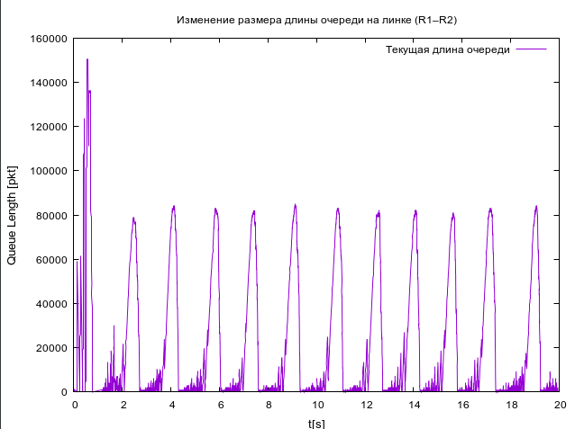
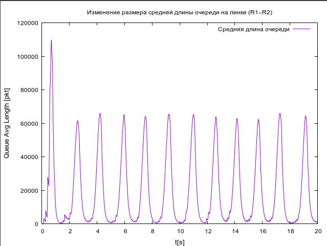

---
## Front matter
lang: ru-RU
title: Презентация по лабораторной работе №4
subtitle: Задания для самостоятельного выполнения
author:
  - Ибатулина Д.Э.
institute:
  - Российский университет дружбы народов, Москва, Россия
date: 28 февраля 2025

## i18n babel
babel-lang: russian
babel-otherlangs: english

## Formatting pdf
toc: false
toc-title: Содержание
slide_level: 2
aspectratio: 169
section-titles: true
theme: metropolis
header-includes:
 - \metroset{progressbar=frametitle,sectionpage=progressbar,numbering=fraction}
---

# Информация

## Докладчик

:::::::::::::: {.columns align=center}
::: {.column width="70%"}

  * Ибатулина дарья эдуардовна
  * студентка группы НФИбд-01-22
  * Российский университет дружбы народов
  * [1132226434@rudn.ru](mailto:1132226434@rudn.ru)
  * <https://deibatulina.github.io>

:::
::: {.column width="30%"}


:::
::::::::::::::

# Вводная часть

## Актуальность

Тема моделирования процессов, происходящих в компьютерных сетях, актуальна, поскольку позволяет найти решения для оптимизации того или иного процесса.

## Объект и предмет исследования

- Информационные процессы
- Программное обеспечение для моделирования (NS-2)

## Цели и задачи

Цель: Продемонстрировать знания о том, как использовать среду моделирования NS-2 и строить графики в GNUplot.
Задачи:

1. Для приведённой схемы разработать имитационную модель в пакете NS-2;

2. Построить график изменения размера окна TCP (в Xgraph и в GNUPlot);

3. Построить график изменения длины очереди и средней длины очереди на первом маршрутизаторе;

4. Оформить отчёт о выполненной работе.

# Основная часть

## Теоретическое введение

Network Simulator (NS-2) — один из программных симуляторов моделирования процессов в компьютерных сетях. NS-2 позволяет описать топологию сети, конфигурацию источников и приёмников трафика, параметры соединений (полосу пропускания, задержку, вероятность потерь пакетов и т.д.) и множество других параметров моделируемой системы.

## Имитационная модель приведенной сети в NS-2 

\centering
{width=100%}

## Передача пакетов в штатном режиме

\centering
{width=100%}

## Передача пакетов в случае перегрузки

\centering
{width=100%}

## График изменения размера TCP-окна  на линке 1-го источника в Xgraph

\centering
{width=60%}

## График изменения размера TCP-окна на всех источниках в Xgraph

\centering
{width=60%}

## График изменения длины очереди в Xgraph

\centering
{width=60%}

## График изменения средней длины очереди в Xgraph

\centering
{width=60%}

## Часть кода, отвечающая за график изменения размера TCP-окна  на линке 1-го источника в GNUplot

```
# построение графика, используя значения
# 1-го и 2-го столбцов файла WindowVsTimeRenoOne
plot "WindowVsTimeRenoOne" using ($1):($2) with lines title "Размер окна TCP"
```

## Часть кода, отвечающая за график изменения длины очереди в GNUplot

```
# построение графика, используя значения
# 1-го и 2-го столбцов файла temp.q
plot "temp.q" using ($1):($2) with lines title "Текущая длина очереди"
```

## График изменения размера TCP-окна  на линке 1-го источника в GNUplot

\centering
{width=60%}

## График изменения размера TCP-окна  на всех источниках в GNUplot

\centering
{width=60%}

## График изменения длины очереди в GNUplot

\centering
{width=60%}

## График изменения средней длины очереди в GNUplot

\centering
{width=60%}

# Заключительная часть

## Выводы

В результате выполнения лабораторной работы я укрепила свои знания о среде NS-2, попрактиковалась в написании программ для построения графиков в Xgraph и GNUplot.


