---
## Front matter
title: "Лабораторная работа №4"
subtitle: "Задания для самостоятельного выполнения"
author: "Ибатулина Дарья Эдуардовна, НФИбд-01-22"

## Generic otions
lang: ru-RU
toc-title: "Содержание"

## Bibliography
bibliography: bib/cite.bib
csl: pandoc/csl/gost-r-7-0-5-2008-numeric.csl

## Pdf output format
toc: true # Table of contents
toc-depth: 2
lof: true # List of figures
lot: false # List of tables
fontsize: 12pt
linestretch: 1.5
papersize: a4
documentclass: scrreprt
## I18n polyglossia
polyglossia-lang:
  name: russian
  options:
	- spelling=modern
	- babelshorthands=true
polyglossia-otherlangs:
  name: english
## I18n babel
babel-lang: russian
babel-otherlangs: english
## Fonts
mainfont: PT Serif
romanfont: PT Serif
sansfont: PT Sans
monofont: PT Mono
mainfontoptions: Ligatures=TeX
romanfontoptions: Ligatures=TeX
sansfontoptions: Ligatures=TeX,Scale=MatchLowercase
monofontoptions: Scale=MatchLowercase,Scale=0.9
## Biblatex
biblatex: true
biblio-style: "gost-numeric"
biblatexoptions:
  - parentracker=true
  - backend=biber
  - hyperref=auto
  - language=auto
  - autolang=other*
  - citestyle=gost-numeric
## Pandoc-crossref LaTeX customization
figureTitle: "Рис."
tableTitle: "Таблица"
listingTitle: "Листинг"
lofTitle: "Список иллюстраций"
lotTitle: "Список таблиц"
lolTitle: "Листинги"
## Misc options
indent: true
header-includes:
  - \usepackage{indentfirst}
  - \usepackage{float} # keep figures where there are in the text
  - \floatplacement{figure}{H} # keep figures where there are in the text
---

# Цель работы

Выполнить задание, указанное в лабораторной работе. Продемонстрировать знания о том, как использовать среду моделирования NS-2 и строить графики в GNUplot.

# Задание

1. Для приведённой схемы разработать имитационную модель в пакете NS-2;
2. Построить график изменения размера окна TCP (в Xgraph и в GNUPlot);
3. Построить график изменения длины очереди и средней длины очереди на первом маршрутизаторе;
4. Оформить отчёт о выполненной работе.

# Теоретическое введение

Network Simulator (NS-2) — один из программных симуляторов моделирования процессов в компьютерных сетях. NS-2 позволяет описать топологию сети, конфигурацию источников и приёмников трафика, параметры соединений (полосу пропускания, задержку, вероятность потерь пакетов и т.д.) и множество других параметров моделируемой системы. Данные о динамике трафика, состоянии соединений и объектов сети, а также информация о работе протоколов фиксируются в генерируемом trace-файле.

NS-2 является объектно-ориентированным программным обеспечением. Его ядро реализовано на языке С++. В качестве интерпретатора используется язык скриптов (сценариев) OTcl (Object oriented Tool Command Language). NS-2 полностью поддерживает иерархию классов С++ и подобную иерархию классов интерпретатора OTcl.

Обе иерархии обладают идентичной структурой, т.е. существует однозначное соответствие между классом одной иерархии и таким же классом другой. Объединение для совместного функционирования С++ и OTcl производится при помощи TclCl (Classes Tcl). В случае, если необходимо реализовать какую-либо специфическую функцию, не реализованную в NS-2 на уровне ядра, для этого используется код на С++.

Процесс создания модели сети для NS-2 состоит из нескольких этапов:
1. Создание нового объекта класса Simulator, в котором содержатся методы, необ
ходимые для дальнейшего описания модели (например, методы new и delete
 используются для создания и уничтожения объектов соответственно);
2. Описание топологии моделируемой сети с помощью трёх основных функциональ
ных блоков: узлов (nodes), соединений (links) и агентов (agents);
3. Задание различных действий, характеризующих работу сети.

Для создания узла используется метод node. При этом каждому узлу автоматически присваивается уникальный адрес. Для построения однонаправленных и двунаправленных линий соединения узлов используют методы simplex-link и duplex-link соответственно.

Важным объектом NS-2являются агенты,которые могут рассматриваться как процессы и/или как транспортные единицы, работающие на узлах моделируемой сети.

Агенты могут выступать в качестве источников трафика или приёмников, а также как динамические маршрутизирующие и протокольные модули. Агенты создаются с помощью методов общего класса Agent и являются объектами его подкласса, т.е. Agent/type, где type определяет тип конкретного объекта. Например, TCP-агент может быть создан с помощью команды:
`set tcp [ new Agent/TCP ]`

Для закрепления агента за конкретным узлом используется метод attach-agent.
Каждому агенту присваивается уникальный адрес порта для заданного узла (аналогично портам tcp и udp). Чтобы за конкретным агентом закрепить источник, используют методы attach-source и attach-traffic. Например, можно прикрепить ftp или telnet источники к TCP-агенту. Есть агенты, которые генерируют свои собственные данные, например, CBR-агент (Constant Bit-Rate) — источник трафика с постоянной интенсивностью.

Действия разных агентов могут быть назначены планировщиком событий (Event Scheduler) в определённые моменты времени (также в определённые моменты времени могут бытьзадействованы или отключены те или иные источники данных, запись  и т.д.). Для этого может использоваться метод at. Моделирование начинается при помощи метода run.

В качестве дополнения к NS-2 часто используют средство визуализации nam (network animator) для графического отображения свойств моделируемой системы и проходящего через неё трафика и пакет Xgraph для графического представления результатов моделирования.

Запуск сценария NS-2 осуществляется в командной строке с помощью команды:
`ns [tclscript]`

Здесь [tclscript] — имя файла скрипта Tcl, который определяет сценарий моделирования (т.е. топологию и различные события).
Nam можно запустить с помощью команды
`nam [nam-file]`
Здесь [nam-file] — имя nam trace-файла, сгенерированного с помощью ns.

Протокол управления передачей (Transmission Control Protocol, TCP) имеет средства управления потоком и коррекции ошибок, ориентирован на установление соединения.

* Флаг Указатель срочности (Urgent Pointer, URG) устанавливается в 1 в случае использования поля Указатель на срочные данные.

* Флаг Подтверждение (Acknowledgment, ACK) устанавливается в 1 в случае, если поле Номер подтверждения (Acknowledgement Number) содержит данные. В противном случае это поле игнорируется.

* Флаг Выталкивание (Push, PSH) означает, что принимающий стек TCP должен немедленно информировать приложение о поступивших данных, а не ждать, пока буфер заполнится.

* Флаг Сброс (Reset, RST) используется для отмены соединения из-за ошибки приложения, отказа от неверного сегмента, попытки создать соединение при отсутствии затребованного сервиса.

* Флаг Синхронизация (Synchronize, SYN) устанавливается при инициировании соединения и синхронизации порядкового номера.

* Флаг Завершение (Finished, FIN) используется для разрыва соединения. Он указывает, что отправитель закончил передачу данных.

Управление потоком в протоколе TCP осуществляется при помощи скользящего окна переменного размера: поле Размер окна (Window) (длина 16 бит) содержит количество байт, которое может быть послано после байта, получение которого уже подтверждено; еслизначениеэтогополяравнонулю,этоозначает,чтовсебайты,вплоть до байта с номером Номер подтверждения - 1, получены, но получатель отказывается принимать дальнейшие данные; разрешение на дальнейшую передачу может быть выдано отправкой сегмента с таким же значением поля Номер подтверждения и ненулевым значением поля Размер окна.

Регулирование трафика в TCP: контроль доставки — отслеживает заполнение входного буфера получателя с помощью параметра Размер окна (Window); контроль перегрузки — регистрирует перегрузку канала и связанные с этим
 потери, а также понижает интенсивность трафика с помощью Окна перегрузки (Congestion Window, CWnd) и Порога медленного старта (Slow Start Threshold, SSThreth).

В ns-2 поддерживает следующие TCP-агенты односторонней передачи:

- Agent/TCP

- Agent/TCP/Reno

- Agent/TCP/Newreno

- Agent/TCP/Sack1 — TCP с выборочным повтором (RFC2018)

- Agent/TCP/Vegas

- Agent/TCP/Fack — Reno TCP с «последующим подтверждением»

- Agent/TCP/Linux — TCP-передатчик с поддержкой SACK, который использует TCP сперезагрузкой контрольных модулей из ядра Linux

Односторонние агенты приёма:

- Agent/TCPSink

- Agent/TCPSink/DelAck

- Agent/TCPSink/Sack1

- Agent/TCPSink/Sack1/DelAck

Двунаправленный агент:

- Agent/TCP/FullTcp

TCPReno:
- медленный старт (Slow-Start);

- контроль перегрузки (Congestion Avoidance);

- быстрый повтор передачи (Fast Retransmit);

- процедура быстрого восстановления (Fast Recovery);

- метод оценки длительности цикла передачи (Round Trip Time, RTT), используемой для установки таймера повторной передачи (Retransmission TimeOut, RTO).

Схема работы TCP Reno:

- размер окна увеличивается до тех пор, пока не произойдёт потеря сегмента (аналогично TCP Tahoe) – фаза медленного старта и фаза избежания перегрузки;

- алгоритм не требует освобождения канала и его медленного (slow-start) заполнения после потери одного пакета;

- отправитель переходит в режим быстрого восстановления, после получения некоторого предельного числа дублирующих подтверждений — отправитель повторяет передачу одного пакета и уменьшает окно перегрузки (cwnd) в два раза и устанавливает ssthresh_ в соответствии с этим значением.

# Выполнение лабораторной работы

## Моделирование сети в NS-2 и построение графиков изменения размера TCP-окна,  длины очереди и средней длины очереди на первом маршрутизаторе в Xgraph

**Постановка задачи**

Описание моделируемой сети:

- сеть состоит из N (в данном случае я взяла значение 30) TCP-источников, N TCP-приёмников, двух маршрутизаторов R1 и R2 между источниками и приёмниками (N — не менее 20);
- между TCP-источниками и первым маршрутизатором установлены дуплексные соединения с пропускной способностью 100 Мбит/с и задержкой 20 мс очередью типа DropTail;
- между TCP-приёмниками и вторым маршрутизатором установлены дуплексные соединения с пропускной способностью 100 Мбит/с и задержкой 20 мс очередью типа DropTail;
- между маршрутизаторами установлено симплексное соединение (R1–R2) с пропускной способностью 20 Мбит/с и задержкой 15 мс очередью типа RED, размером буфера 300 пакетов; в обратную сторону — симплексное соединение (R2–R1) с пропускной способностью 15 Мбит/с и задержкой 20 мс очередью типа DropTail;
- данные передаются по протоколу FTP поверх TCPReno;
- параметры алгоритма RED: q_min = 75, q_max = 150, q_w = 0002, p_max = 0,1;
- максимальный размер TCP-окна: 32; размер передаваемого пакета 500 байт; время моделирования — не менее 20 единиц модельного времени.

Для приведённой схемы разработать имитационную модель в пакете NS-2, построить в Xgraph графики изменения размера TCP-окна  на линке 1-го источника и на всех источниках, график изменения длины очереди и средней длины очереди. Запускаю скрипт, выполняющий данную задачу. Открывается nam-файл со схемой полученной сети, запускаю процесс моделирования. Можно увидеть, как передаются и отбрасываются пакеты (рис. [-@fig:001], [-@fig:002], [-@fig:003]). 

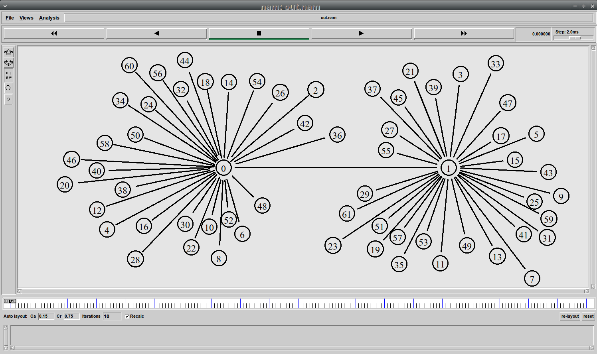{#fig:001 width=70%}

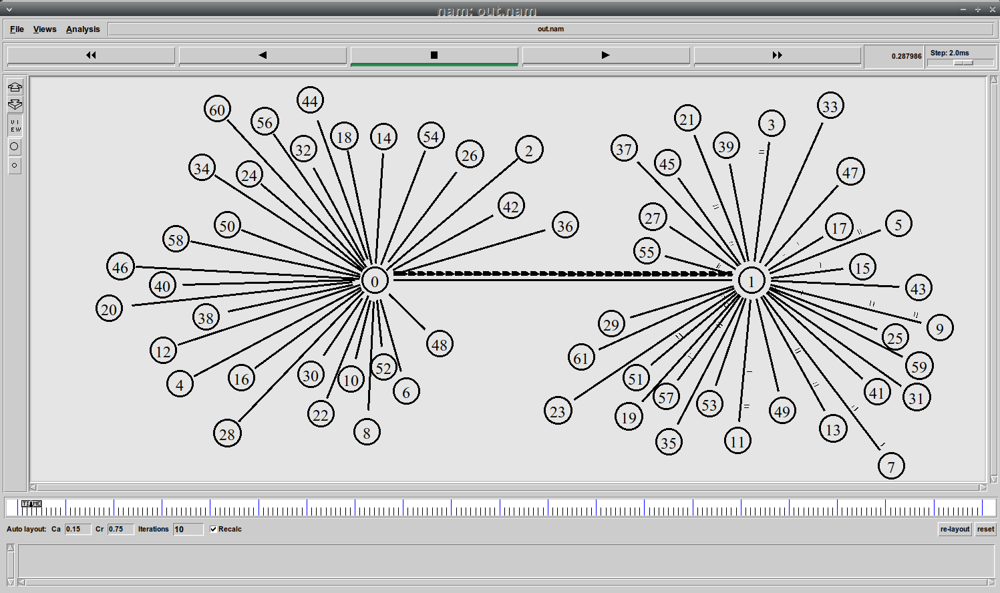{#fig:002 width=70%}

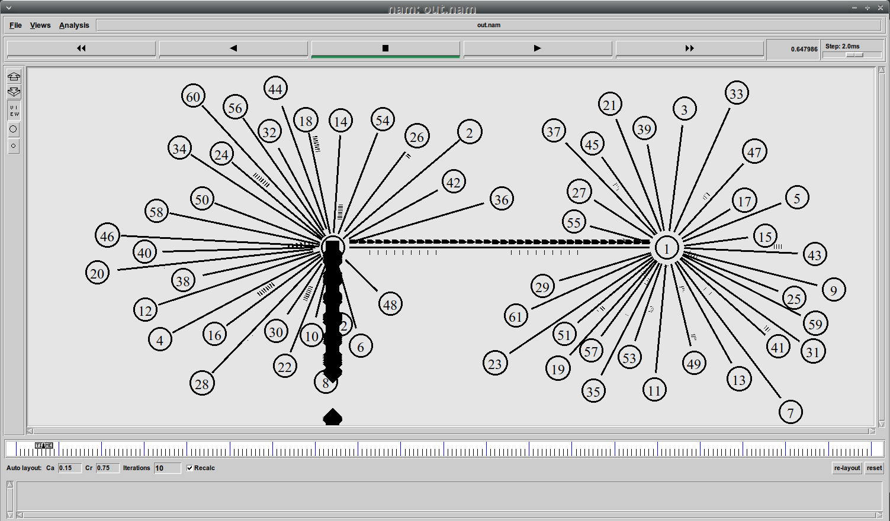{#fig:003 width=70%}


Получаю так же 4 графика (рис. [-@fig:004], [-@fig:005], [-@fig:006], [-@fig:007]).

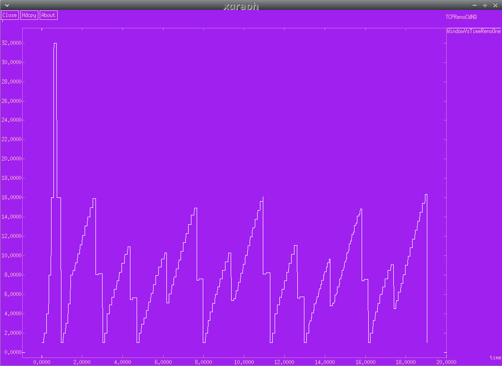{#fig:004 width=70%}

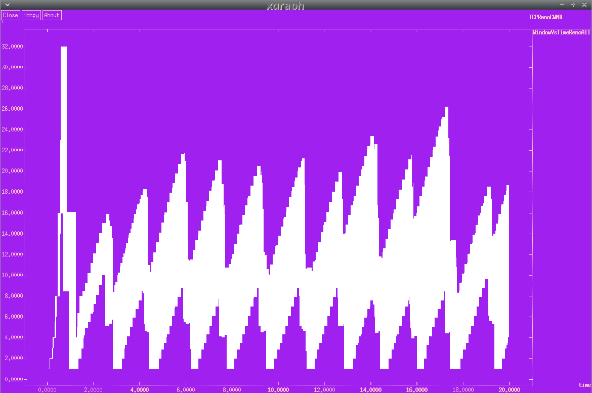{#fig:005 width=70%}

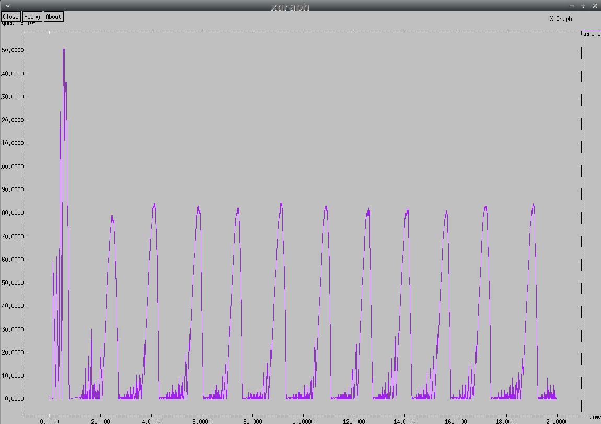{#fig:006 width=70%}

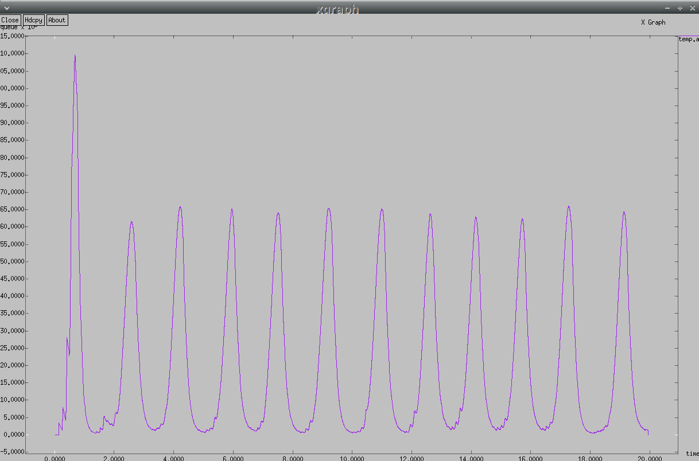{#fig:007 width=70%}

Скрипт приведен ниже:

```
# Создание объекта симулятора
# В среде NS-2 для проведения сетевых симуляций используется объект Simulator
set ns [new Simulator]

# Открытие файла out.nam для записи событий визуализации в формате NAM
set nf [open out.nam w]

# Настройка симулятора на запись всех событий визуализации в файл out.nam
$ns namtrace-all $nf

# Открытие файла out.tr для записи всех событий трассировки сети
set f [open out.tr w]

# Настройка симулятора на запись всех трассировок в файл out.tr
$ns trace-all $f

# Установка параметров TCP-соединения
Agent/TCP set window_ 32   # Размер окна TCP по умолчанию — 32 сегмента
Agent/TCP set pktSize_ 500 # Размер пакета данных — 500 байт

# Процедура завершения симуляции
proc finish {} {
  global tchan_

  # Подключение кода AWK для анализа данных очереди
  set awkCode {
  {
    # Если первая колонка (поле $1) содержит символ 'Q' (queue),
    # то берем временную метку ($2) и длину очереди ($3)
   # и записываем в файл temp.q
    if ($1 == "Q" && NF>2) {
      print $2, $3 >> "temp.q";
      set end $2
    }
    # Если событие 'a' (arrival — прибытие пакета),
    # то аналогично сохраняем временную метку и длину очереди в temp.a
    else if ($1 == "a" && NF>2)
      print $2, $3 >> "temp.a";
  }
}

  # Удаление старых временных файлов (если были)
  exec rm -f temp.q temp.a
  # Создание новых временных файлов для записи данных очереди
  exec touch temp.a temp.q

  # Запись начального цвета графика для окна TCP
  set f [open temp.q w]
  puts $f "0.Color: Purple"
  close $f

  set f [open temp.a w]
  puts $f "0.Color: Purple"
  close $f

  # Выполнение awk-скрипта для обработки файла all.q
  exec awk $awkCode all.q

  # Построение графиков с помощью xgraph:
  # График изменения размера окна TCP Reno
  exec xgraph -fg pink -bg purple -bb -tk -x time -t\
  "TCPRenoCWND" WindowVsTimeRenoOne &
  exec xgraph -fg pink -bg purple -bb -tk -x time -t\
   "TCPRenoCWND" WindowVsTimeRenoAll &
  # Графики длины очереди в зависимости от времени
  exec xgraph -bb -tk -x time -y queue temp.q &
  exec xgraph -bb -tk -x time -y queue temp.a &
  # Запуск визуализатора nam
  exec nam out.nam &

  # Завершение симуляции
  exit 0
}

# Процедура для отслеживания изменения размера окна TCP
proc plotWindow {tcpSource file} {
  global ns
  # Интервал времени для измерений (10 мс)
  set time 0.01                       
  # Получение текущего времени симуляции
  set now [$ns now]                   
  # Получение текущего размера окна TCP
  set cwnd [$tcpSource set cwnd_]     
  # Запись временной метки и размера окна в файл
  puts $file "$now $cwnd"            
  # Перезапуск процедуры через заданный интервал
  $ns at [expr $now+$time] "plotWindow $tcpSource $file" 
}

# Создание узлов маршрутизаторов
set r1 [$ns node]
set r2 [$ns node]

# Настройка симплексных каналов между маршрутизаторами
# Прямое соединение (20 Мбит/с, 15 мс) с очередью RED
$ns simplex-link $r1 $r2 20Mb 15ms RED     
# Обратное соединение (15 Мбит/с, 20 мс) с очередью DropTail
$ns simplex-link $r2 $r1 15Mb 20ms DropTail 

# Установка предела длины очереди
$ns queue-limit $r1 $r2 300

# Создание 30 пар узлов (источник и приемник)
set N 30
for {set i 0} {$i < $N} {incr i} {
# Источник данных
  set n1($i) [$ns node]                            
  # Дуплексный канал от источника к маршрутизатору r1
  $ns duplex-link $n1($i) $r1 100Mb 20ms DropTail 
  # Приемник данных
  set n2($i) [$ns node]                            
  # Дуплексный канал от маршрутизатора r2 к приемнику
  $ns duplex-link $n2($i) $r2 100Mb 20ms DropTail 

  # Создание TCP-соединений
  set tcp($i) [$ns create-connection TCP/Reno $n1($i) TCPSink $n2($i) $i]
  # Привязка FTP-источника к TCP-соединению
  set ftp($i) [$tcp($i) attach-source FTP]         
}

# Мониторинг размера окна TCP
set windowVsTimeOne [open WindowVsTimeRenoOne w]
puts $windowVsTimeOne "0.Color: White"
set windowVsTimeAll [open WindowVsTimeRenoAll w]
puts $windowVsTimeAll "0.Color: White"

# Мониторинг очереди
set qmon [$ns monitor-queue $r1 $r2 [open qm.out w] 0.1]
[$ns link $r1 $r2] queue-sample-timeout;

# Настройка RED-очереди
set redq [[$ns link $r1 $r2] queue]
# Порог минимальной длины очереди
$redq set thresh_ 75      
# Порог максимальной длины очереди
$redq set maxthresh_ 150  
# Вес для экспоненциального среднего
$redq set q_weight_ 0.002 
# Линейный интервал для вероятности отбрасывания пакетов
$redq set linterm_ 10     

# Подключение очереди к файлу для трассировки
set tchan_ [open all.q w]
# Текущая длина очереди
$redq trace curq_          
# Средняя длина очереди
$redq trace ave_          
# Привязка файлового дескриптора 
$redq attach $tchan_      

# Запуск FTP-трафика и мониторинга окна TCP
for {set i 0} {$i < $N} {incr i} {
  $ns at 0.0 "$ftp($i) start"
  $ns at 0.0 "plotWindow $tcp($i) $windowVsTimeAll"
}

$ns at 0.0 "plotWindow $tcp(1) $windowVsTimeOne"

# Завершение симуляции через 20 секунд
$ns at 20.0 "finish"

# Запуск симуляции
$ns run
```

**Объяснение различий графиков**

**Графики изменения размера TCP-окна**

*WindowVsTimeRenoOne*: показывает, как изменяется размер окна перегрузки (cwnd) для только одного TCP-источника (того, который обозначен как tcp(1)).

График отображает динамику окна этого конкретного источника:

* Как оно увеличивается при успешной передаче пакетов (согласно алгоритму TCP Reno — медленный старт и увеличение по правилу AIMD).
* Как уменьшается при обнаружении перегрузки (потеря пакета или превышение очереди).

На этом графике проще разглядеть поведение одного потока TCP и, например, увидеть типичные "зубцы" из-за периодической перегрузки и падений окна.

*WindowVsTimeRenoAll*: показывает совокупное поведение всех TCP-источников (в коде их 30).

График отразит наложение всех окон:

* Когда одни соединения сбрасывают окно из-за перегрузки, другие могут продолжать расти.
* Будет видно, как общая нагрузка влияет на конкуренцию за пропускную способность.
* График станет более "шумным" из-за множества пересекающихся линий, но это наглядно показывает общую динамику TCP в условиях конкурентного трафика.

*Ключевые различия:*

*График одного источника:* четче видно поведение TCP Reno, легче анализировать реакцию на потери.
*График всех источников:* показывает общую картину и как источники "делят" канал связи, реагируя на перегрузку по-разному.

**Графики изменения очереди:**

*График изменения текущей длины очереди (curq_)*

Этот график отображает, сколько пакетов (или байтов, в зависимости от настроек) находится в очереди маршрутизатора в каждый момент времени.

Что показывает:

* Мгновенное количество пакетов в очереди.
* Если длина очереди достигает лимита, пакеты начинают отбрасываться (в случае DropTail) или маркироваться (в случае RED).
* Резкие скачки вверх или вниз показывают приход крупных порций данных или уменьшение нагрузки.

Как это выглядит: График с острыми пиками и провалами.
Сильно реагирует на всплески нагрузки, потому что отражает моментальное состояние.
Пример: при резком всплеске трафика длина очереди может мгновенно вырасти до лимита, а потом резко упасть, если отправка пакетов ускорится.

*График изменения средней длины очереди (ave_)*

Этот график показывает сглаженную, усреднённую длину очереди за некоторый промежуток времени. Он полезен для оценки общей загрузки маршрутизатора, без учёта коротких всплесков.

Что показывает:

* Долгосрочную тенденцию загрузки очереди.
* Помогает увидеть, не перегружен ли маршрутизатор в среднем.
* В RED-очередях средняя длина влияет на вероятность отбрасывания пакетов.

Как это выглядит: Более плавная кривая по сравнению с текущей длиной очереди. Может медленно расти или снижаться в зависимости от нагрузки.
Пример: если трафик периодически скачет, средняя длина очереди будет показывать более стабильную линию, отражая общий уровень загрузки.

*Важные моменты:*

Почему это важно: Средняя длина очереди важна для алгоритмов активного управления очередями (например, RED), потому что помогает заранее реагировать на перегрузку, предотвращая глобальное затопление сети.
Пороговые значения: В коде есть пороги `thresh_` и `maxthresh_`, которые определяют, при какой средней длине начнётся вероятностное отбрасывание пакетов.

В реальности:
Текущая длина очереди показывает острые всплески и спад трафика в реальном времени.
Средняя длина показывает более стабильную картину нагрузки, помогая понять долгосрочное состояние маршрутизатора.

## Построение графиков изменения размера TCP-окна,  длины очереди и средней длины очереди на первом маршрутизаторе в GNUplot

Теперь напишу программу для построения тех же четырёх графиков в GNUplot. Все 4 графика будут находиться в отдельных png-картинках в той же директории, где находится файл со скриптом (рис. [-@fig:008], [-@fig:009], [-@fig:010], [-@fig:011]).

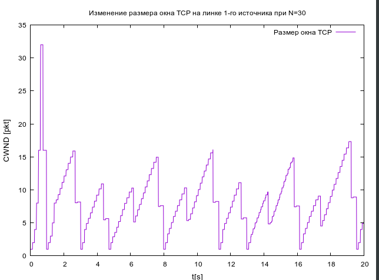{#fig:008 width=70%}

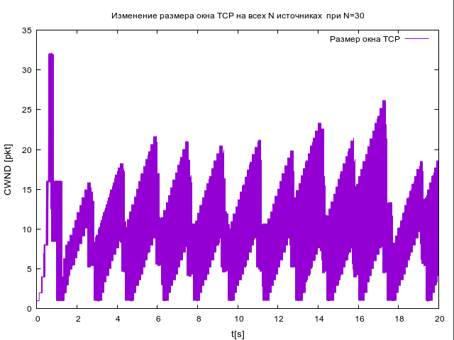{#fig:009 width=70%}

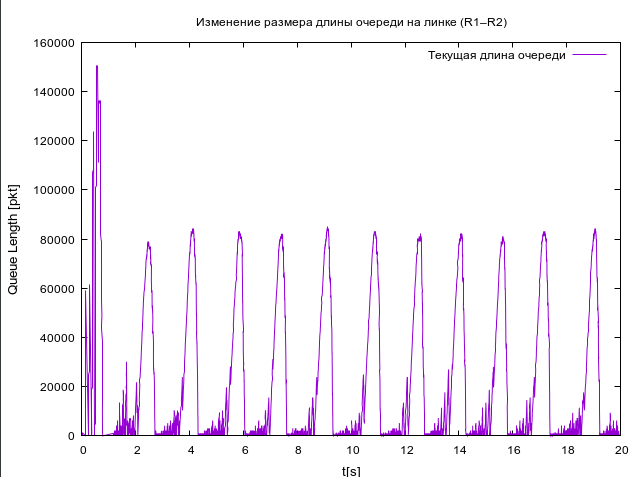{#fig:010 width=70%}

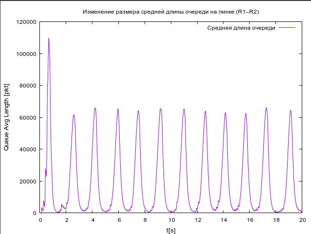{#fig:011 width=70%}

Скрипт:

```
#!/usr/bin/gnuplot -persist
# задаём текстовую кодировку,
# тип терминала, тип и размер шрифта

set encoding utf8
set term pngcairo font "Helvetica,9"

# задаём выходной файл графика
set out 'window_1.png'

# задаём название графика
set title "Изменение размера окна TCP на линке 1-го источника при N=30"

# подписи осей графика
set xlabel "t[s]" font "Helvetica, 10"
set ylabel "CWND [pkt]" font "Helvetica, 10"

# построение графика, используя значения
# 1-го и 2-го столбцов файла WindowVsTimeRenoOne
plot "WindowVsTimeRenoOne" using ($1):($2) with lines title "Размер окна TCP"

# задаём выходной файл графика
set out 'window_2.png'

# задаём название графика
set title "Изменение размера окна TCP на всех N источниках  при N=30"

# построение графика, используя значения
# 1-го и 2-го столбцов файла WindowVsTimeRenoAll
plot "WindowVsTimeRenoAll" using ($1):($2) with lines title "Размер окна TCP"

# задаём выходной файл графика
set out 'queue.png'

# задаём название графика
set title "Изменение размера длины очереди на линке (R1–R2)"

# подписи осей графика
set xlabel "t[s]" font "Helvetica, 10"
set ylabel "Queue Length [pkt]" font "Helvetica, 10"

# построение графика, используя значения
# 1-го и 2-го столбцов файла temp.q
plot "temp.q" using ($1):($2) with lines title "Текущая длина очереди"

# задаём выходной файл графика
set out 'av_queue.png'

# задаём название графика
set title "Изменение размера средней длины очереди на линке (R1–R2)"

# подписи осей графика
set xlabel "t[s]" font "Helvetica, 10"
set ylabel "Queue Avg Length [pkt]" font "Helvetica, 10"

# построение графика, используя значения
# 1-го и 2-го столбцов файла temp.a
plot "temp.a" using ($1):($2) with lines title "Средняя длина очереди"
```

Графики идентичны друг другу, поэтому и выводы для них сделаны аналогичные предыдущим.

# Выводы

В результате выполнения лабораторной работы я укрепила свои знания о среде NS-2, попрактиковалась в написании программ для построения графиков в Xgraph и GNUplot.

# Список литературы{.unnumbered}

1. Королькова А.В., Кулябов Д.С. Руководство к лабораторной работе №4. Моделирование информационных процессов. - 2025. — 4 с.

::: {#refs}
:::
