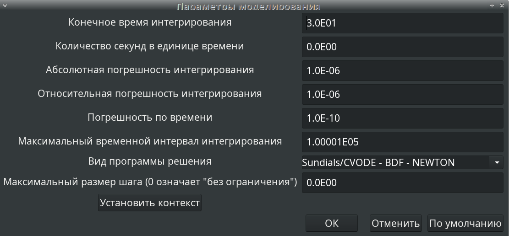

---
## Front matter
title: "Лабораторная работа №5"
subtitle: "Модель эпидемии (SIR)"
author: "Ибатулина Дарья Эдуардовна, НФИбд-01-22"

## Generic otions
lang: ru-RU
toc-title: "Содержание"

## Bibliography
bibliography: bib/cite.bib
csl: pandoc/csl/gost-r-7-0-5-2008-numeric.csl

## Pdf output format
toc: true # Table of contents
toc-depth: 2
lof: true # List of figures
lot: false # List of tables
fontsize: 12pt
linestretch: 1.5
papersize: a4
documentclass: scrreprt
## I18n polyglossia
polyglossia-lang:
  name: russian
  options:
	- spelling=modern
	- babelshorthands=true
polyglossia-otherlangs:
  name: english
## I18n babel
babel-lang: russian
babel-otherlangs: english
## Fonts
mainfont: PT Serif
romanfont: PT Serif
sansfont: PT Sans
monofont: PT Mono
mainfontoptions: Ligatures=TeX
romanfontoptions: Ligatures=TeX
sansfontoptions: Ligatures=TeX,Scale=MatchLowercase
monofontoptions: Scale=MatchLowercase,Scale=0.9
## Biblatex
biblatex: true
biblio-style: "gost-numeric"
biblatexoptions:
  - parentracker=true
  - backend=biber
  - hyperref=auto
  - language=auto
  - autolang=other*
  - citestyle=gost-numeric
## Pandoc-crossref LaTeX customization
figureTitle: "Рис."
tableTitle: "Таблица"
listingTitle: "Листинг"
lofTitle: "Список иллюстраций"
lotTitle: "Список таблиц"
lolTitle: "Листинги"
## Misc options
indent: true
header-includes:
  - \usepackage{indentfirst}
  - \usepackage{float} # keep figures where there are in the text
  - \floatplacement{figure}{H} # keep figures where there are in the text
---

# Цель работы

Научиться работать со средствами моделирования xcos, Modelica и OpenModelica.

# Задание

1. Реализовать имитационную модель эпидемии в xcos;
2. Реализовать имитационную модель эпидемии в Modelica;
3. Реализовать имитационную модель эпидемии в OpenModelica;
4. Выполнить задание для самостоятельной работы.

# Теоретическое введение

Предполагается, что особи популяции размера N могут находиться в трёх различных состояниях:

- S(susceptible, уязвимые) — здоровые особи, которые находятся в группе риска и могут подхватить инфекцию;

- I(infective, заражённые, распространяющие заболевание) — заразившиеся переносчики болезни;

- R(recovered/removed, вылечившиеся) — те, кто выздоровел и перестал распространять болезнь (в эту категорию относят, например, приобретших иммунитет или умерших). Внутри каждой из выделенных групп особи считаются неразличимыми по свойствам. Типичная эволюция особи популяции описывается следующей диаграммой:

*S->I->R*

Считаем, что система замкнута, т.е. N=S+I+R.

# Выполнение лабораторной работы

## Реализация модели эпидемии в xcos

Для начала настроим xcos: зайдём в него из меню *Пуск*, введём в поиск название и нажимаем *выполнить*. Необходимо произвести настройку параметров моделируемой среды (рис. [-@fig:001], [-@fig:002], [-@fig:003]).

{#fig:001 width=70%}

{#fig:002 width=70%}

{#fig:003 width=70%}

Каждому блоку необходимо задать его характеритиски (количество входов, например, или значения констант 
$\beta$ и $\nu$) (рис. [-@fig:004], [-@fig:005], [-@fig:006], [-@fig:007], [-@fig:008]).

{#fig:004 width=70%}

{#fig:005 width=70%}

{#fig:006 width=70%}

{#fig:007 width=70%}

{#fig:008 width=70%}

Для красоты и аккуратности соединений между блоками используем метод редактирования их параметров (рис. [-@fig:009]). 

{#fig:009 width=70%}

Продолжаем добавлять на модель новые блоки, отвечающие за суммирование и умножение и задавать параметры блоков (рис. [-@fig:010], [-@fig:011], [-@fig:012]).

{#fig:010 width=70%}

{#fig:011 width=70%}

{#fig:012 width=70%}

В результате получилась такая модель (рис. [-@fig:013]). Запустим ее (рис. [-@fig:014]) и получим результат моделирования - график, на котором изображены кривые для значений s, i, r (рис. [-@fig:015].)

{#fig:013 width=70%}

{#fig:014 width=70%}

{#fig:015 width=70%}

## Реализация модели с помощью блока Modelica в xcos

Для того, чтобы модель выглядела более просто, а не так громоздко, как в первом случае, мы используем единый блок Modelica, благодаря которому не нужно задавать параметры каждому из блоков отдельно, а просто задать их этому блоку, а уравнения прописать в окошке для кода. Задаём схему и параметры блоку Modelica (рис. [-@fig:016]), открывается окошко с кодом, в которое мы прописываем наши уравнения и начальные условия для s, i, r и то, какие переменные на входе и выходе (рис. [-@fig:017]). Устанавливаем контекст (рис. [-@fig:018]), значения констант на схеме (рис. [-@fig:019], [-@fig:020]) и параметры моделирования (рис. [-@fig:021]).

{#fig:016 width=70%}

{#fig:017 width=70%}

{#fig:018 width=70%}

{#fig:019 width=70%}

{#fig:020 width=70%}

{#fig:021 width=70%}

Получилась следующая (рис. [-@fig:022]) схема и при запуске симуляции соответствующий график (рис. [-@fig:023]).

{#fig:022 width=70%}

{#fig:023 width=70%}

Результаты (графики) в этих двух случаях совпадают. Графики идентичны.

## Упражнение. Реализация модели SIR в OpenModelica

Открываем программу OMEdit, создаём новый класс: заходим во вкладку *Файл* -> *Создать* -> *Класс*, вводим его имя (рис. [-@fig:024]).

{#fig:024 width=70%}

Прописываем в открывшийся файл код, задающий нашу модель эпидемии: значения констант, начальные условия и уравнения системы (рис. [-@fig:025]).

{#fig:025 width=70%}

При запуске симуляции задаём параметры симуляции (в данном случае время, равное 30) (рис. [-@fig:026]).

{#fig:026 width=70%}

В результате получаем график, идентичный тем двум, которые создали в предыдущих пунктах работы (рис. [-@fig:027]). Чтобы график не был пустым, справа на панели необходимо поставить галочки напротив тех переменных, значения которых мы хотим увидеть на графике - это s, i, r.

{#fig:027 width=70%}

## Задание для самостоятельного выполнения

Теперь необходимо так же создать модель демографических процессов, уравнения и значения констант для которого приведены в указаниях к работе. Помимо $\beta$ и $\nu$ добавляется новая константа - $\mu$.

### Реализация модели SIR с учётом демографических процессов в xcos

Так же, как обычно, задаем все параметры блоков и располагаем их в правильном порядке и корректно соединяя между собой (рис. [-@fig:028], [-@fig:029], [-@fig:030]).

{#fig:028 width=70%}

{#fig:029 width=70%}

{#fig:030 width=70%}

При запуске симуляции получается такой график (рис. [-@fig:031]). Также, как сказано в задании, построю графики с различными значениями параметра $\mu$. Значения указаны на подписях к рисункам (рис. [-@fig:032], [-@fig:033], [-@fig:034], [-@fig:035]).

{#fig:031 width=70%}

{#fig:032 width=70%}

{#fig:033 width=70%}

{#fig:034 width=70%}

{#fig:035 width=70%}

Получаем, что В системе уравнений параметр $\mu$ учитывает как рождаемость, так и смертность. Разберём закономерности при разных значениях $\mu$:

* При $\mu$=0.5 (средняя рождаемость и смертность):

Популяция стабилизируется: число восприимчивых, инфицированных и выздоровевших выходит на равновесные значения. Инфекция не исчезает полностью, но колебания уменьшаются со временем.

* При $\mu$=0.3 (умеренная рождаемость и смертность):

Инфекция медленно затухает, так как рождается меньше здоровых людей, но и меньше людей умирает. Доля выздоровевших постепенно растёт, а доля инфицированных уменьшается.

* При $\mu$=1 (высокая рождаемость и смертность):

Быстрая смена поколений: инфекция не успевает затухнуть, потому что в популяции постоянно появляются новые восприимчивые индивиды. Инфекция остаётся на стабильно высоком уровне.

* При $\mu$=0.2 (низкая рождаемость и смертность):
Инфекция постепенно исчезает, так как новых восприимчивых людей почти не появляется. Доля выздоровевших возрастает, и система стремится к состоянию без инфекции.

Если $\beta$=5, $\nu$=0.3, $\mu$=0.2, то зараженность будет вести себя довольно резко:

Быстрое начальное распространение инфекции: Поскольку $\beta$ (скорость заражения) очень большая, число инфицированных людей резко вырастет. Это происходит из-за высокой вероятности передачи инфекции при контакте восприимчивых и инфицированных людей.

Пик заражения: Из-за сильного заражения инфекция быстро достигает максимума. Пик может быть довольно высоким, потому что инфицированные передают вирус почти лавинообразно.

Спад после пика: Постепенно число инфицированных начнет снижаться, потому что выздоровление ($\nu$) и демографические процессы ($\mu$) начнут играть свою роль. Люди либо выздоравливают, либо уходят из популяции, а новые рождённые индивиды изначально здоровы.

Низкий уровень инфекции в долгосрочной перспективе: Поскольку $\mu$ не слишком высокое, смертность не сильно выравнивает рождаемость, но инфекция постепенно угаснет, и число заболевших стабилизируется на низком уровне.

Колебания или затухание: Возможно, зараженность будет немного колебаться, но со временем инфекция почти исчезнет из популяции.

Закономерности, которые я выявила при анализе графиков:

1. Чем выше $\mu$, тем сильнее инфекция закрепляется в популяции из-за постоянного притока новых восприимчивых людей.
2. При низком $\mu$ инфекция исчезает, так как инфицированные люди либо выздоравливают, либо умирают, и здоровых новорождённых мало.
3. Чем выше значение любого из параметров, тем быстрее система достигает стационарного состояния. При высоком коэффициенте заражения $\beta$ система быстро проходит через пик развития эпидемии и достигает стационарного состояния.

### Реализация модели SIR с учётом демографических процессов с помощью блока Modelica в xcos

Теперь снова привычным способом настроим необходимые параметры (рис. [-@fig:036], [-@fig:037], [-@fig:038]). В результате получим такой график (рис. [-@fig:039]).

{#fig:036 width=70%}

{#fig:037 width=70%}

{#fig:038 width=70%}

{#fig:039 width=70%}

График полностью совпадает с построенным в xcos без блока Modelica (рис. [-@fig:031]).

### Реализация модели SIR с учётом демографических процессов в OpenModelica

Привычным способом задаём нашу модель в OpenModelica (рис. [-@fig:040], [-@fig:041], [-@fig:042]).

{#fig:040 width=70%}

{#fig:041 width=70%}

{#fig:042 width=70%}

График так же идентичен тем, что получены в результате предыдущих двух симуляций (рис. [-@fig:031]).

# Выводы

В результате выполнения лабораторной работы я научилась работать со средствами моделирования xcos, xcos с блоком Modelica и OpenModelica.

# Список литературы{.unnumbered}

1. Королькова А.В., Кулябов Д.С. Руководство к лабораторной работе №5. Моделирование информационных процессов. - 2025. — 6 с.

::: {#refs}
:::
