---
## Front matter
lang: ru-RU
title: Презентация по лабораторной работе №6
subtitle: Модель «хищник–жертва»
author:
  - Ибатулина Д.Э.
institute:
  - Российский университет дружбы народов, Москва, Россия
date: 11 марта 2025

## i18n babel
babel-lang: russian
babel-otherlangs: english

## Formatting pdf
toc: false
toc-title: Содержание
slide_level: 2
aspectratio: 169
section-titles: true
theme: metropolis
header-includes:
 - \metroset{progressbar=frametitle,sectionpage=progressbar,numbering=fraction}
---

# Информация

## Докладчик

:::::::::::::: {.columns align=center}
::: {.column width="70%"}

  * Ибатулина дарья эдуардовна
  * студентка группы НФИбд-01-22
  * Российский университет дружбы народов
  * [1132226434@rudn.ru](mailto:1132226434@rudn.ru)
  * <https://deibatulina.github.io>

:::
::: {.column width="30%"}

:::
::::::::::::::

# Вводная часть

## Актуальность

Тема моделирования различных процессов, происходящих в мире, актуальна, поскольку позволяет найти решения для их оптимизации.

## Объект и предмет исследования

- Модель «хищник–жертва»
- Программное обеспечение для моделирования (xcos, OpenModelica)

## Цели и задачи

Цель: Научиться работать со средствами моделирования xcos, Modelica и OpenModelica.
Задачи:

1. Реализовать имитационную модель «хищник–жертва» в xcos;
2. Реализовать имитационную модель «хищник–жертва» в xcos с использованием блока Modelica;
3. Реализовать имитационную модель «хищник–жертва» в OpenModelica;

# Основная часть

## Теоретическое введение

Модель «хищник–жертва» (модель Лотки — Вольтерры) представляет собой модель межвидовой конкуренции. Имеет вид:

$$
\begin{cases}
  \dot x = ax - bxy; \\
  \dot y = cxy - dy,
\end{cases}
$$

## Реализация модели в xcos

\centering
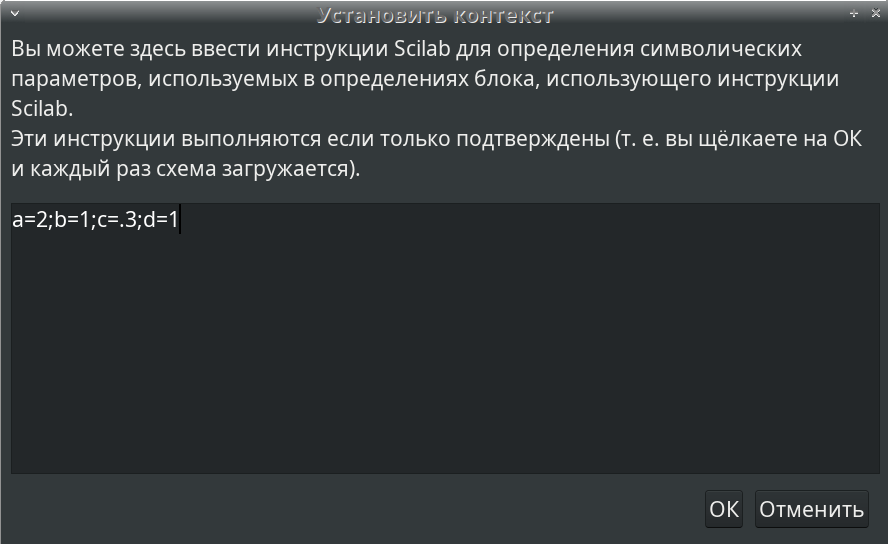{width=100%}

## Реализация модели в xcos

\centering
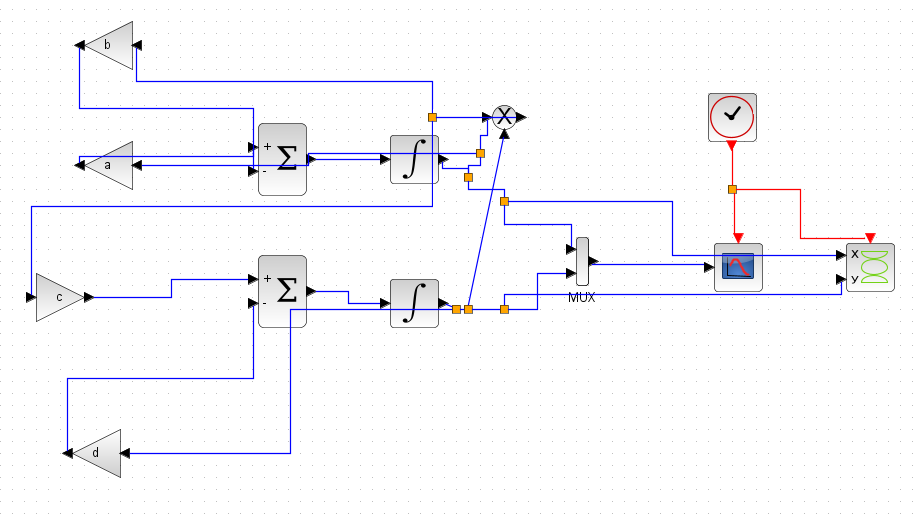{width=100%}

## Реализация модели в xcos

\centering
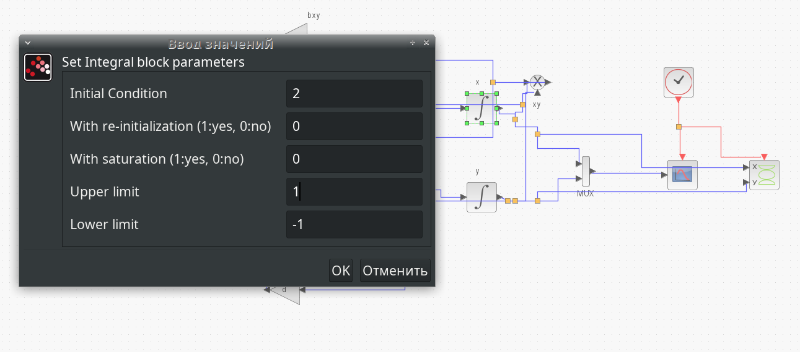{width=100%}

## Реализация модели в xcos

\centering
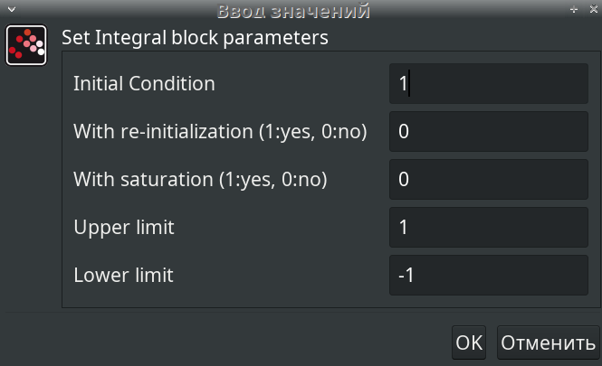{width=60%}

## Реализация модели в xcos

\centering
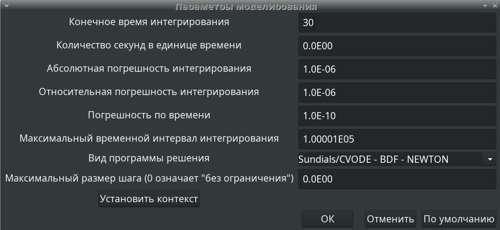{width=60%}

## Реализация модели в xcos

\centering
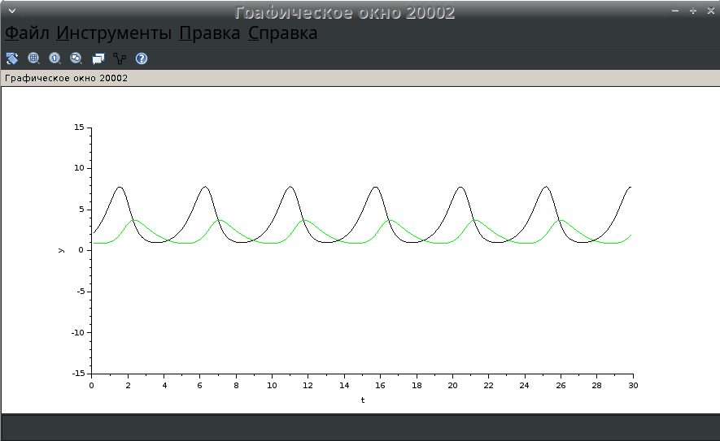{width=60%}

## Реализация модели в xcos

\centering
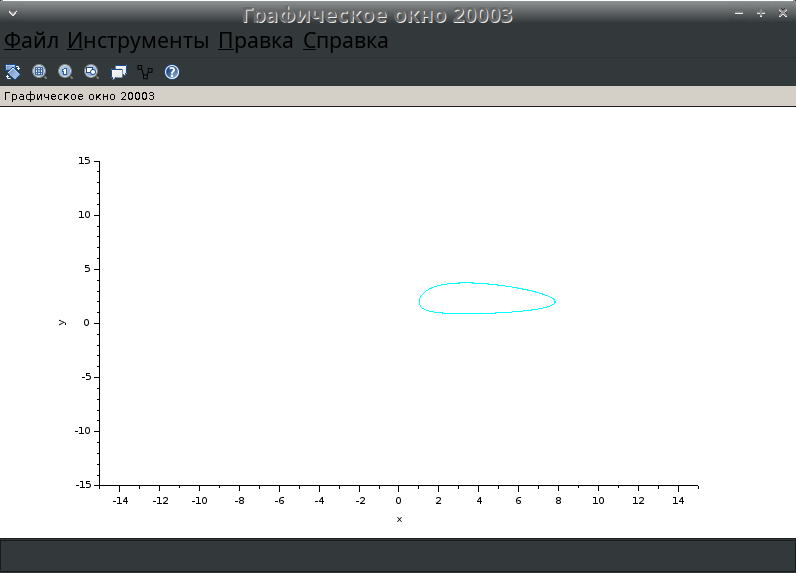{width=60%}

## Реализация модели с помощью блока Modelica в xcos

\centering
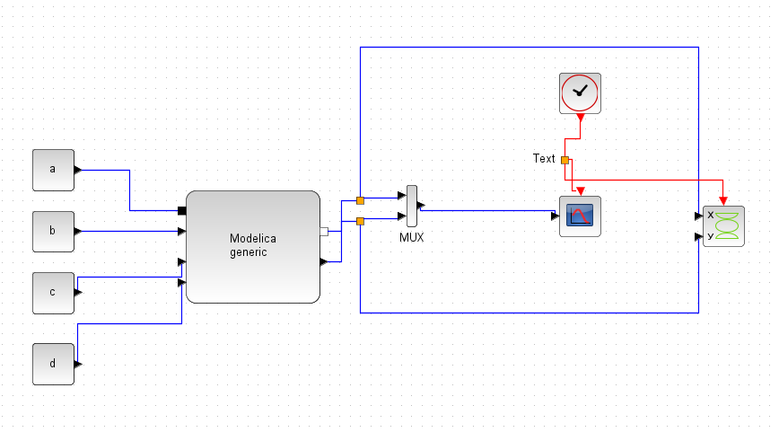{width=60%}

## Реализация модели с помощью блока Modelica в xcos

\centering
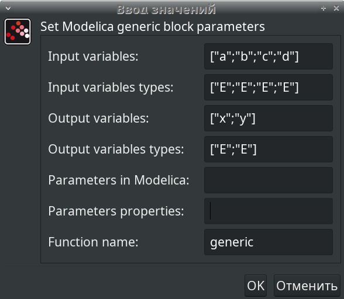{width=60%}

## Реализация модели с помощью блока Modelica в xcos

\centering
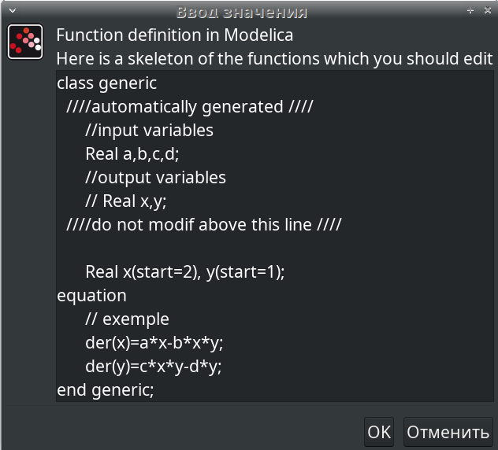{width=60%}

## Упражнение. Реализация модели в OpenModelica

\centering
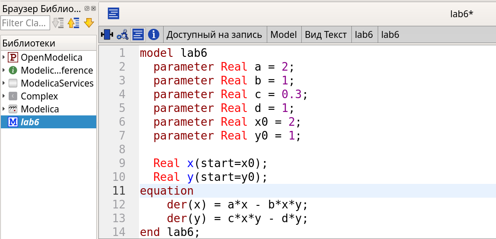{width=90%}

## Упражнение. Реализация модели в OpenModelica

\centering
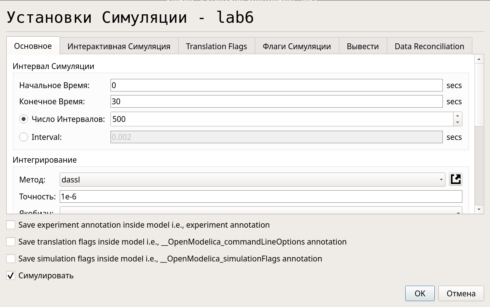{width=90%}

## Упражнение. Реализация модели в OpenModelica

\centering
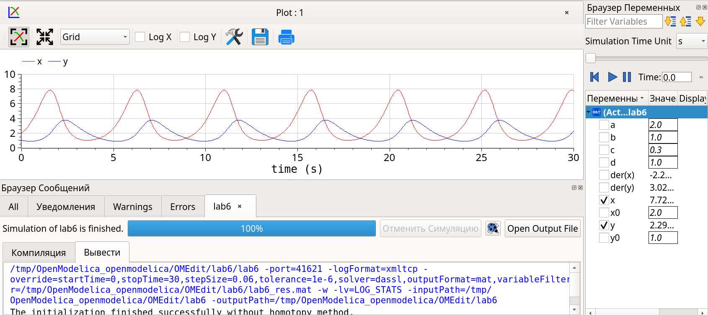{width=90%}

## Упражнение. Реализация модели в OpenModelica

\centering
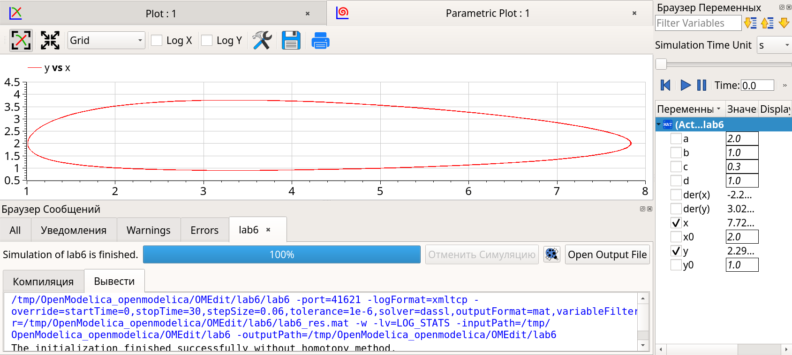{width=90%}

## Выводы по модели "Хищник-жертва"

- **Колебания численности** 
  - Популяции хищников и жертв изменяются циклически. 
  - Рост численности жертв приводит к увеличению популяции хищников, затем численность жертв падает из-за хищников. 

- **Тип динамики** 
  - Возможны устойчивые циклы или затухающие колебания (в зависимости от параметров). 

- **Фазовый портрет** 
  - Замкнутые траектории указывают на цикличность системы. 
  - Поведение системы можно менять, корректируя параметры модели. 

# Заключительная часть

## Выводы

В процессе выполнения данной лабораторной реализована модель "хищник-жертва" в *xcos*, в *xcos* с использованием блока Modelica, и в *OpenModelica*.

