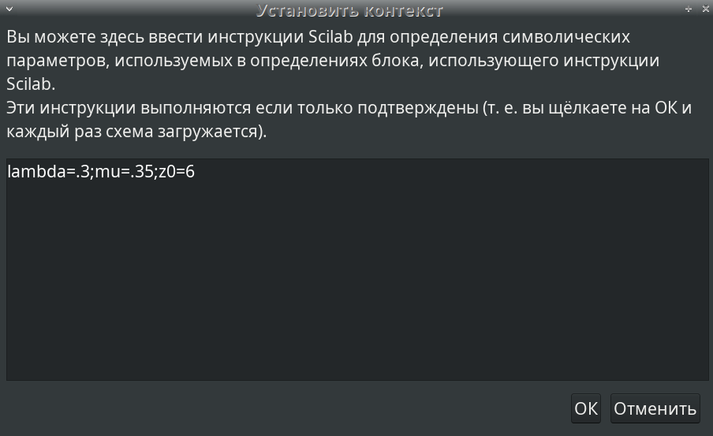
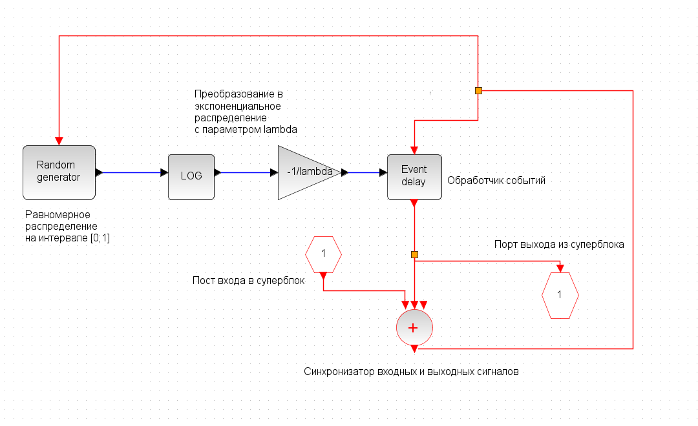
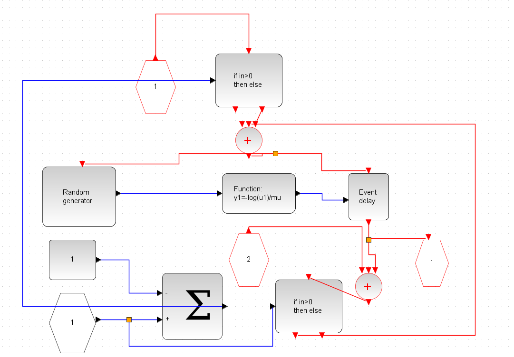
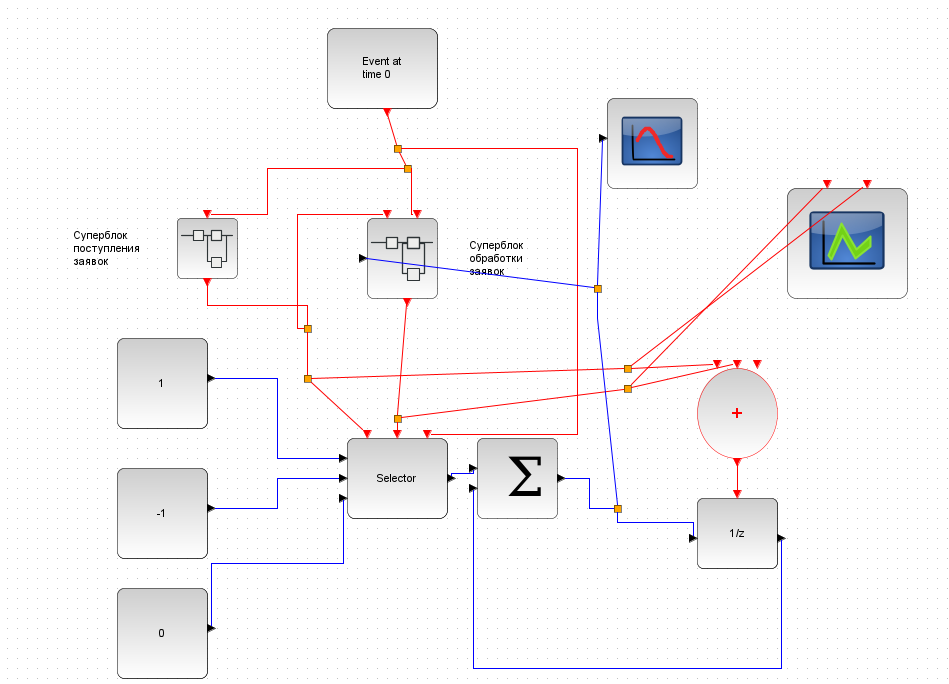
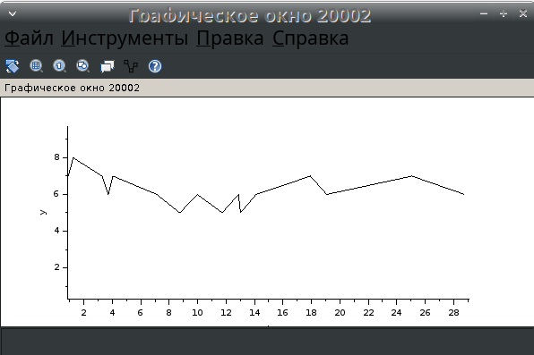
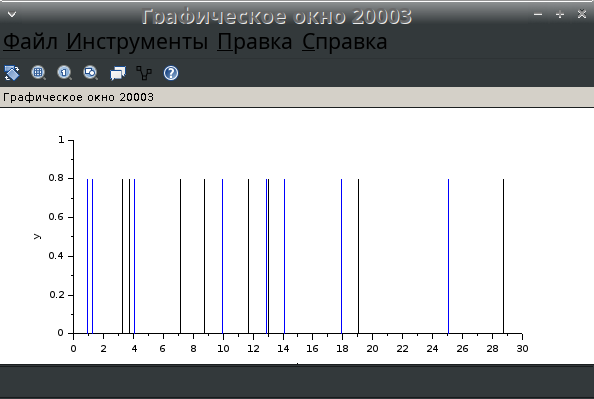

---
## Front matter
lang: ru-RU
title: Презентация по лабораторной работе №7
subtitle: Модель системы массового обслуживания типа $M|M|1|\infty$
author:
  - Ибатулина Д.Э.
institute:
  - Российский университет дружбы народов, Москва, Россия
date: 18 марта 2025

## i18n babel
babel-lang: russian
babel-otherlangs: english

## Formatting pdf
toc: false
toc-title: Содержание
slide_level: 2
aspectratio: 169
section-titles: true
theme: metropolis
header-includes:
 - \metroset{progressbar=frametitle,sectionpage=progressbar,numbering=fraction}
---

# Информация

## Докладчик

:::::::::::::: {.columns align=center}
::: {.column width="70%"}

  * Ибатулина дарья эдуардовна
  * студентка группы НФИбд-01-22
  * Российский университет дружбы народов
  * [1132226434@rudn.ru](mailto:1132226434@rudn.ru)
  * <https://deibatulina.github.io>

:::
::: {.column width="30%"}

:::
::::::::::::::

# Вводная часть

## Актуальность

Тема моделирования различных процессов, происходящих в мире, актуальна, поскольку позволяет найти решения для их оптимизации.

## Объект и предмет исследования

- Модель системы массового обслуживания типа $M|M|1|\infty$
- Программное обеспечение для моделирования (xcos)

## Цели и задачи

Цель: Рассмотреть пример моделирования в *xcos* системы массового обслуживания типа $M|M|1|\infty$.

Задачи:

1. Реализовать модель системы массового обслуживания типа $M|M|1|\infty$;
2. Построить график поступления и обработки заявок;
3. Построить график динамики размера очереди.

# Основная часть

## Теоретическое введение

Теория массового обслуживания (или теория очередей) является разделом теории вероятностей, целью которого является изучение и оптимизация систем массового обслуживания (СМО). СМО представляют собой модели, в которых заявки поступают в систему, где они обслуживаются в соответствии с определенной дисциплиной. Одной из наиболее простых и широко используемых моделей СМО является система типа $M|M|1|\infty$.

## Задание переменных окружения в xcos для модели

\centering
{width=100%}

## Суперблок, моделирующий поступление заявок

\centering
{width=100%}

## Суперблок, моделирующий обработку заявок

\centering
{width=100%}

## Модель $M|M|1|\infty$ в xcos

\centering
{width=60%}

## Динамика размера очереди

\centering
{width=60%}

## Поступление и обработка заявок

\centering
{width=60%}

# Заключительная часть

## Выводы

В процессе выполнения данной лабораторной работы я рассмотрела пример моделирования в `xcos` системы массового обслуживания типа $M|M|1|\infty$.

