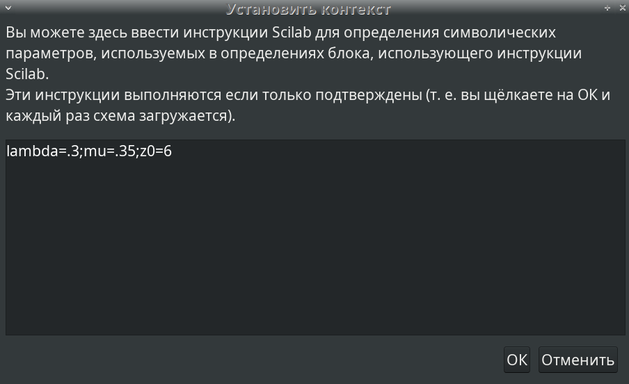
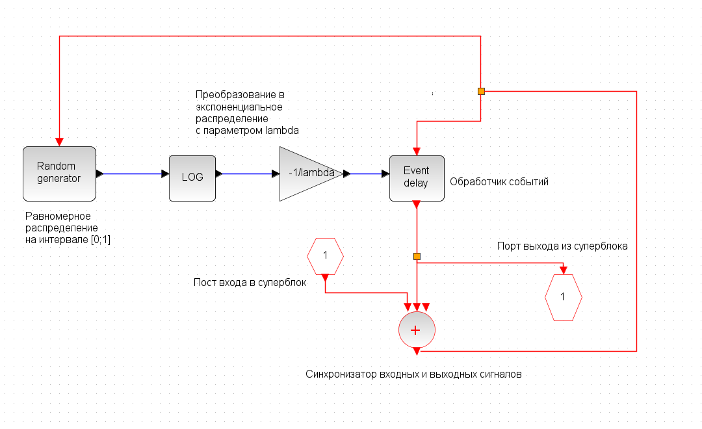
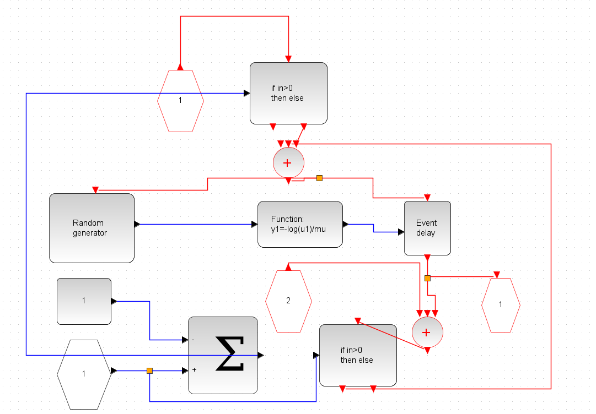
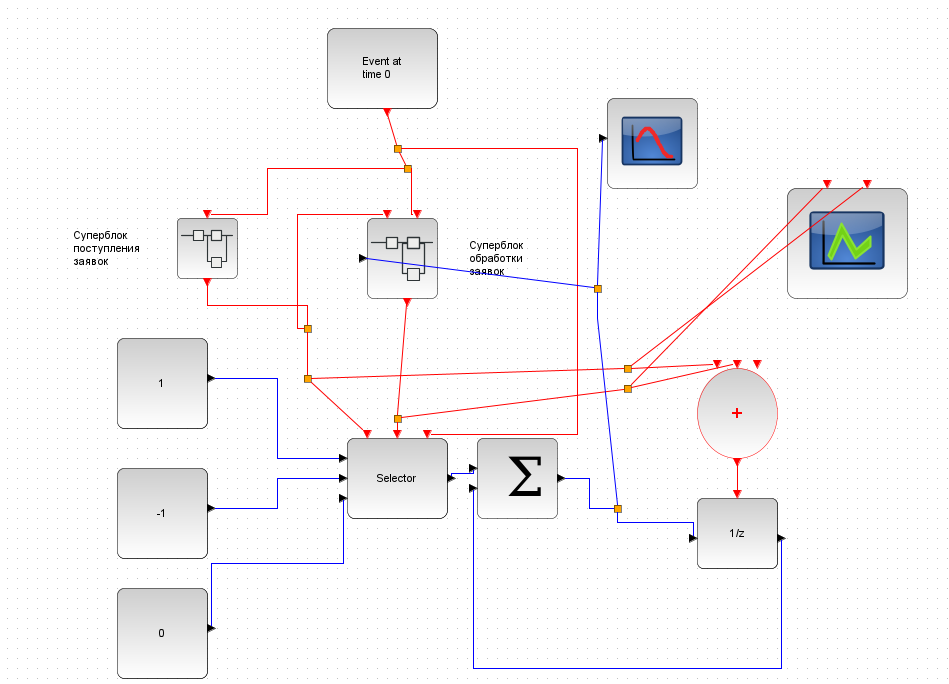
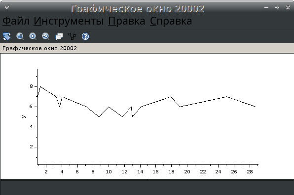
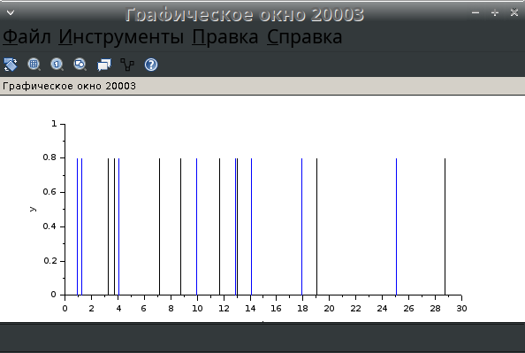

---
## Front matter
title: Лабораторная работа №7
subtitle: Модель системы массового обслуживания типа $M|M|1|\infty$
author: Ибатулина Дарья Эдуардовна, НФИбд-01-22

## Generic otions
lang: ru-RU
toc-title: "Содержание"

## Bibliography
bibliography: bib/cite.bib
csl: pandoc/csl/gost-r-7-0-5-2008-numeric.csl

## Pdf output format
toc: true # Table of contents
toc-depth: 2
lof: true # List of figures
lot: false # List of tables
fontsize: 12pt
linestretch: 1.5
papersize: a4
documentclass: scrreprt
## I18n polyglossia
polyglossia-lang:
  name: russian
  options:
	- spelling=modern
	- babelshorthands=true
polyglossia-otherlangs:
  name: english
## I18n babel
babel-lang: russian
babel-otherlangs: english
## Fonts
mainfont: PT Serif
romanfont: PT Serif
sansfont: PT Sans
monofont: PT Mono
mainfontoptions: Ligatures=TeX
romanfontoptions: Ligatures=TeX
sansfontoptions: Ligatures=TeX,Scale=MatchLowercase
monofontoptions: Scale=MatchLowercase,Scale=0.9
## Biblatex
biblatex: true
biblio-style: "gost-numeric"
biblatexoptions:
  - parentracker=true
  - backend=biber
  - hyperref=auto
  - language=auto
  - autolang=other*
  - citestyle=gost-numeric
## Pandoc-crossref LaTeX customization
figureTitle: "Рис."
tableTitle: "Таблица"
listingTitle: "Листинг"
lofTitle: "Список иллюстраций"
lotTitle: "Список таблиц"
lolTitle: "Листинги"
## Misc options
indent: true
header-includes:
  - \usepackage{indentfirst}
  - \usepackage{float} # keep figures where there are in the text
  - \floatplacement{figure}{H} # keep figures where there are in the text
---

# Теоретическое введение

Теория массового обслуживания (или теория очередей) является разделом теории вероятностей, целью которого является изучение и оптимизация систем массового обслуживания (СМО). СМО представляют собой модели, в которых заявки поступают в систему, где они обслуживаются в соответствии с определенной дисциплиной. Одной из наиболее простых и широко используемых моделей СМО является система типа $M|M|1|\infty$, где:

$M|M|1$: Означает, что заявки поступают в систему по пуассоновскому потоку ($M$), обслуживаются одним сервером ($1$), а время обслуживания также распределено по экспоненциальному закону ($M$).

$\infty$: Указывает на то, что в системе нет ограничений на количество заявок, которые могут находиться в очереди.

Эта модель часто используется для анализа различных характеристик СМО, таких как среднее время ожидания, среднее время пребывания в системе и вероятность наличия заявок в очереди. В лабораторной работе мы будем использовать программное обеспечение `xcos` для моделирования и анализа поведения системы $M|M|1|\infty$. Это позволит нам наглядно продемонстрировать основные принципы теории массового обслуживания и оценить эффективность системы при различных условиях[2],[3].

# Цель работы

Рассмотреть пример моделирования в *xcos* системы массового обслуживания типа $M|M|1|\infty$ [1].

# Задание

1. Реализовать модель системы массового обслуживания типа $M|M|1|\infty$;
2. Построить график поступления и обработки заявок;
3. Построить график динамики размера очереди.

# Выполнение лабораторной работы

Зафиксируем начальные данные: $\lambda = 0.3, \, \mu = 0.35, \, z_0 = 6$ [1]. В меню *Моделирование* -> *Установить контекст* зададим значения коэффициентов (рис. @fig:001) [4].

{#fig:001 width=70%}

Суперблок, моделирующий поступление заявок, представлен на рис. @fig:002. Заявки поступают в систему по пуассоновскому закону[2]. Поступает заявка в суперблок, идет в синхронизатор входных и выходных сигналов, происходит равномерное распределение на интервале $[0; 1]$ (также заявка идет в обработчик событий), далее идет преобразование в экспоненциальное распределение с параметром $\lambda$, затем заявка опять попадает в обработчик событий и выходит из суперблока [4].

{#fig:002 width=70%}

Суперблок, моделирующий процесс обработки заявок, представлен на рис. @fig:003. Тут происходит обработка заявок в очереди по экспоненциальному закону.

{#fig:003 width=70%}

Готовая модель $M|M|1|\infty$ представлена на рис. @fig:004. Здесь имеется селектор, два суперблока, построенных ранее, первоначальное событие на вход в суперблок, суммирование, оператор задержки (имитация очереди), также есть регистрирующие блоки: регистратор размера очереди и регистратор событий [4].

{#fig:004 width=70%}

Результат моделирования представлен на рис. @fig:005 и @fig:006. График динамики размера очереди начинается со значения 6, потому что мы указали $z_0 = 6$ [1].

{#fig:005 width=70%}

{#fig:006 width=70%}

# Выводы

В процессе выполнения данной лабораторной работы я рассмотрела пример моделирования в `xcos` системы массового обслуживания типа $M|M|1|\infty$.

# Список литературы{.unnumbered}

1. Королькова А.В., Кулябов Д.С. Руководство к лабораторной работе №7. Моделирование информационных процессов. Модель системы массового обслуживания типа $M|M|1|\infty$ - 2025. — 4 с.

2. Плескунов М.А. Теория массового обслуживания : учебное пособие / М‑во науки и высшего образования РФ, Урал. федер. ун‑т. — Екатеринбург : Изд‑во Урал. ун‑та, 2022. — 264 с.

3. Гнеденко Б.В., Коваленко И.Н. Введение в теорию массового обслуживания. — М.: Наука, 2017. — 432 с.

4. Капля В.И., Капля Е.В. [Электронный ресурс] / Министерство науки и высшего образования Российской Федерации, ВПИ (филиал) ФГБОУ ВО ВолгГТУ. — Волжский, 2022. — Режим доступа: [http://lib.volpi.ru:57772/csp/lib/PDF/720548296.pdf](http://lib.volpi.ru:57772/csp/lib/PDF/720548296.pdf) — Загл. с титул. экрана.

::: {#refs}
:::
