---
## Front matter
lang: ru-RU
title: Презентация по лабораторной работе №8
subtitle: Модель *TCP/AQM*
author:
  - Ибатулина Д.Э.
institute:
  - Российский университет дружбы народов, Москва, Россия
date: 25 марта 2025

## i18n babel
babel-lang: russian
babel-otherlangs: english

## Formatting pdf
toc: false
toc-title: Содержание
slide_level: 2
aspectratio: 169
section-titles: true
theme: metropolis
header-includes:
 - \metroset{progressbar=frametitle,sectionpage=progressbar,numbering=fraction}
---

# Информация

## Докладчик

:::::::::::::: {.columns align=center}
::: {.column width="70%"}

  * Ибатулина Дарья Эдуардовна
  * студентка группы НФИбд-01-22
  * Российский университет дружбы народов
  * [1132226434@rudn.ru](mailto:1132226434@rudn.ru)
  * <https://deibatulina.github.io>

:::
::: {.column width="30%"}


:::
::::::::::::::

# Вводная часть

## Актуальность

Тема моделирования различных процессов, происходящих в мире, актуальна, поскольку позволяет найти решения для их оптимизации.

## Объект и предмет исследования

- Модель *TCP/AQM*
- Программное обеспечение для моделирования (xcos), OpenModelica

## Цели и задачи

Цель: Реализовать модель *TCP/AQM* в `xcos` и `OpenModelica`.

Задачи:

1. Построить модель *TCP/AQM* в `xcos`;
2. Построить графики динамики изменения размера *TCP*-окна $W(t)$ и размера очереди $Q(t)$;
3. Построить модель *TCP/AQM* в `OpenModelica`.

# Основная часть

## Теоретическое введение

Система ДУ для описания модели *TCP/AQM*:

$$
\dot{W}(t) = \frac{1}{R} - \frac{W(t)W(t-R)}{2R} K Q(t-R)
$$

$$
\dot{Q}(t) = 
\begin{cases} 
    \frac{NW(t)}{R} - C, & Q(t) > 0, \\
    \max \left( \frac{NW(t)}{R} - C, 0 \right), & Q(t) = 0.
\end{cases}
$$

## Задание переменных окружения в xcos для модели

\centering
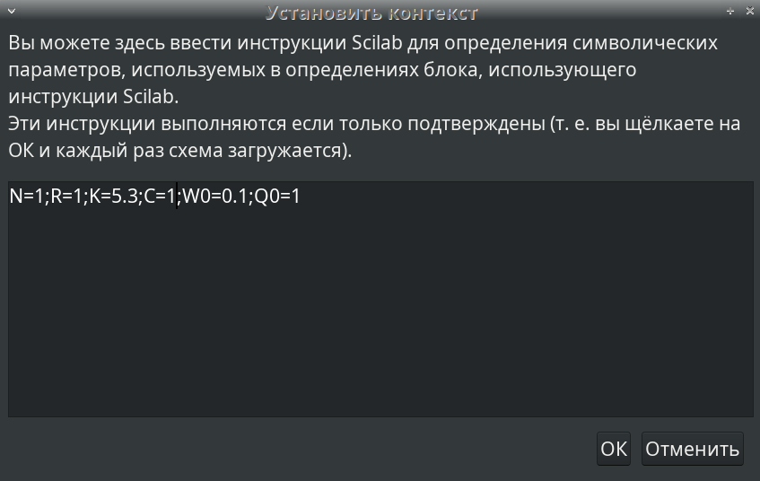{width=70%}

## Задание времени моделирования

\centering
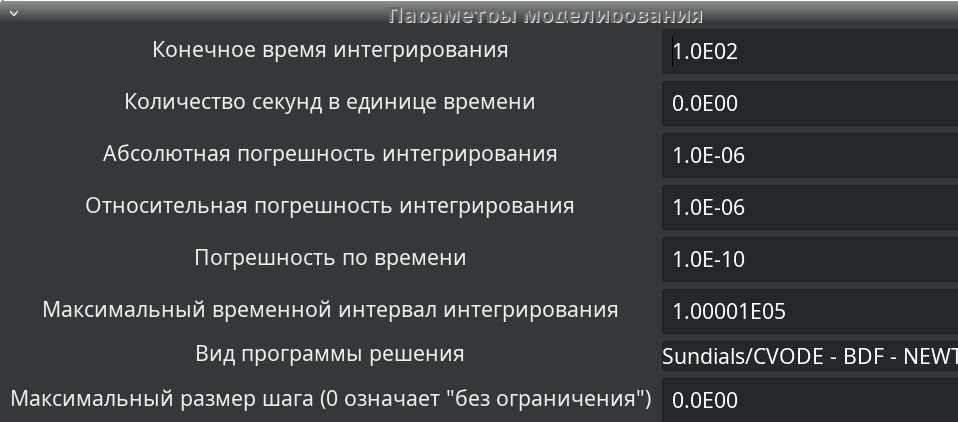{width=90%}

## Модель TCP/AQM в xcos

\centering
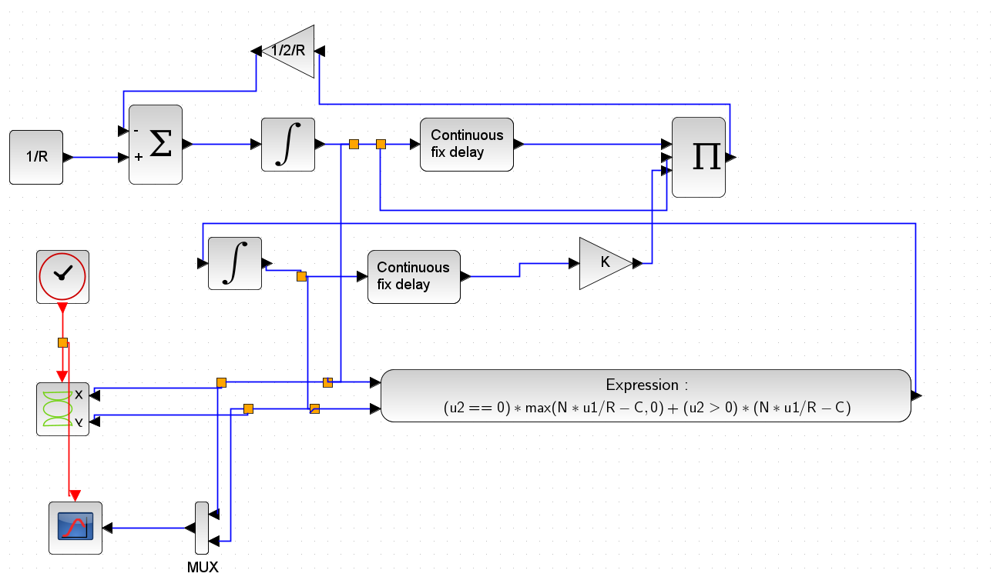{width=90%}

## Динамика изменения размера TCP окна W (t) и размера очереди Q(t)

\centering
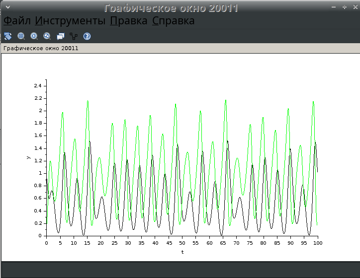{width=60%}

## Фазовый портрет (W, Q)

\centering
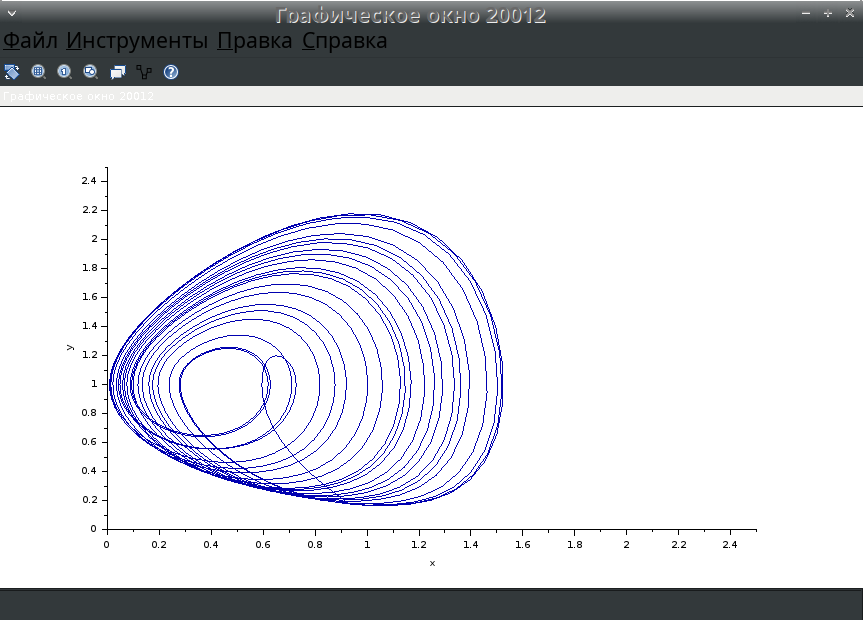{width=60%}

## Изменение параметра С = 0.9

\centering
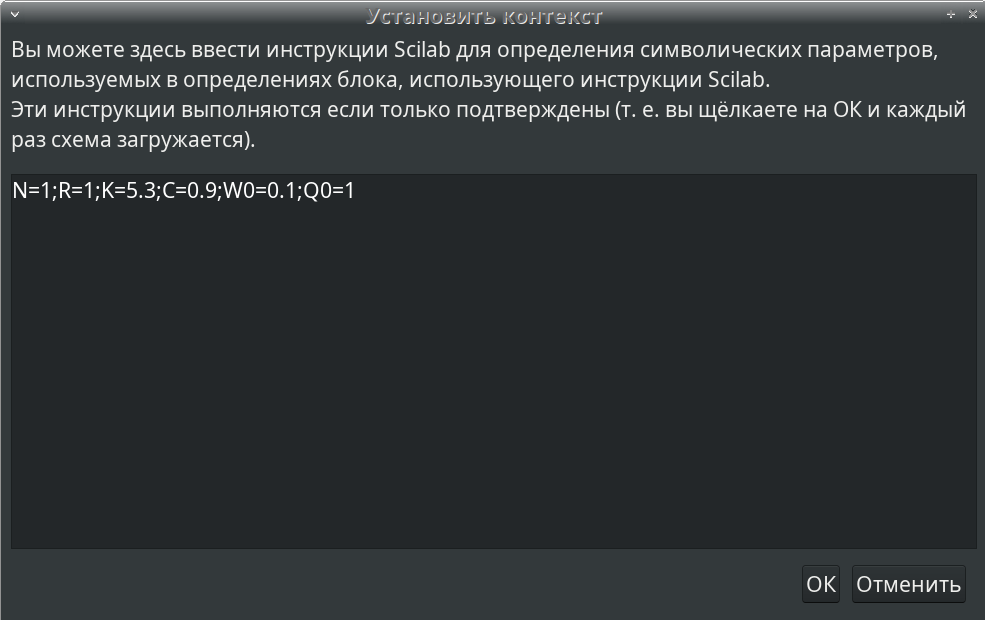{width=60%}

## Динамика изменения размера TCP окна W (t) и размера очереди Q(t)

\centering
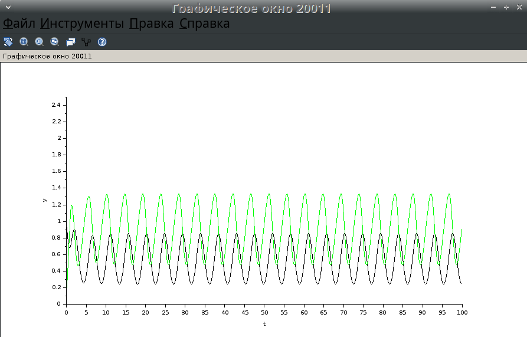{width=60%}

## Фазовый портрет (W, Q)

\centering
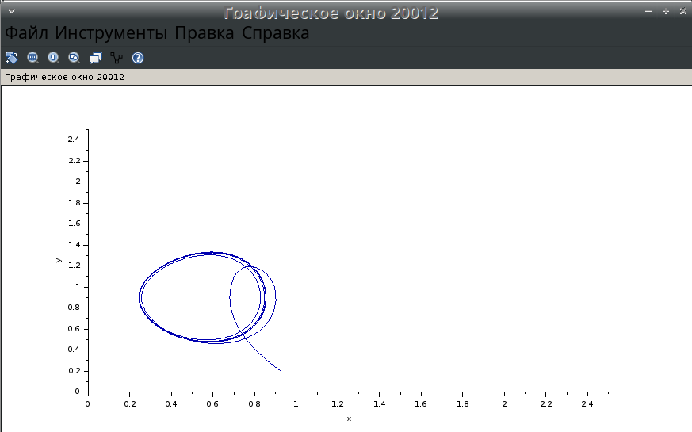{width=60%}

## Модель TCP/AQM в OpenModelica

```modelica
model lab8
parameter Real N=1;
parameter Real R=1;
parameter Real K=5.3;
parameter Real C=1;
parameter Real W0=0.1;
parameter Real Q0=1;
Real W(start=W0);
Real Q(start=Q0);
equation
der(W) = 1 / R - W * delay(W, R) * K * delay(Q,R) / (2 * R);
der(Q) = if (Q > 0) then (N * W / R - C) else max(N * W / R - C, 0);
end lab8;
```

## Задание времени моделирования

\centering
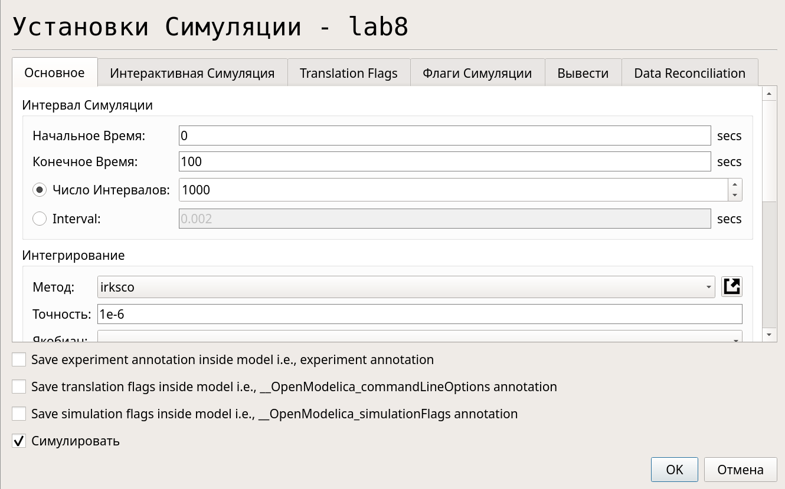{width=60%}

## Динамика изменения размера TCP окна W (t) и размера очереди Q(t)

\centering
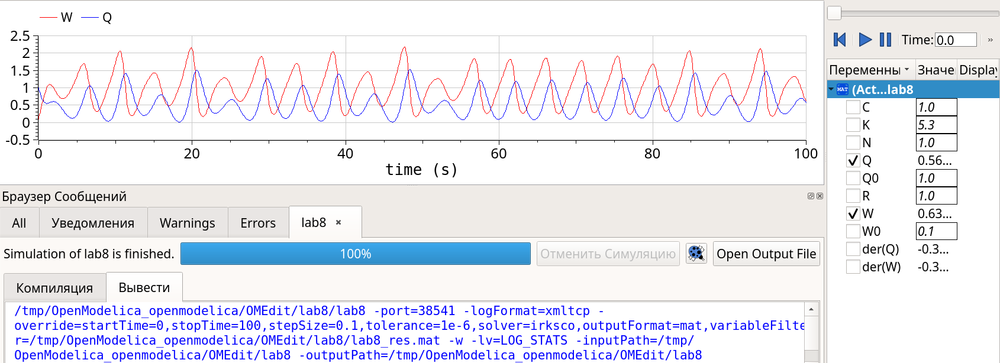{width=90%}

## Фазовый портрет (W, Q)

\centering
{width=90%}

## Модель TCP/AQM в OpenModelica

```modelica
model lab8
parameter Real N=1;
parameter Real R=1;
parameter Real K=5.3;
parameter Real C=0.9;
parameter Real W0=0.1;
parameter Real Q0=1;
Real W(start=W0);
Real Q(start=Q0);
equation
der(W) = 1 / R - W * delay(W, R) * K * delay(Q,R) / (2 * R);
der(Q) = if (Q > 0) then (N * W / R - C) else max(N * W / R - C, 0);
end lab8;
```

## Динамика изменения размера TCP окна W (t) и размера очереди Q(t)

\centering
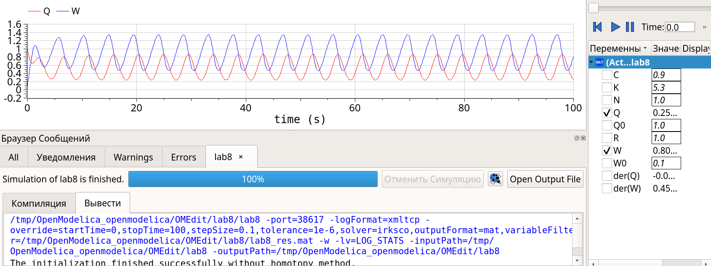{width=90%}

## Фазовый портрет (W, Q)

\centering
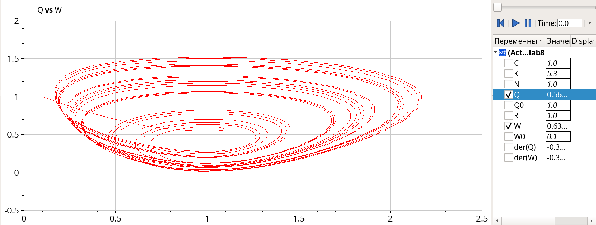{width=90%}

## Выводы по различиям графиков

*При $C=0.9$* система демонстрирует устойчивое равновесие с малыми колебаниями.

*При $C=1$* наблюдается тенденция к нелинейным колебаниям и увеличению амплитуды.

Различие особенно заметно при моделировании переходных процессов.

# Заключительная часть

## Выводы

В процессе выполнения данной лабораторной работы я реализовала модель TCP/AQM в xcos и OpenModelica.


