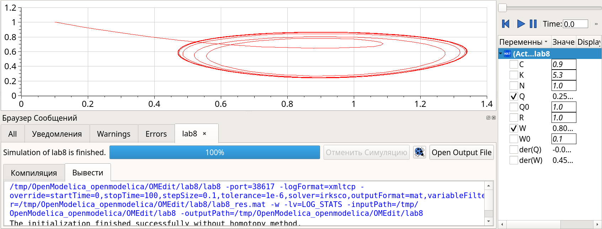

---
## Front matter
title: Лабораторная работа №8
subtitle: Модель *TCP/AQM*
author: Ибатулина Дарья Эдуардовна, НФИбд-01-22

## Generic otions
lang: ru-RU
toc-title: "Содержание"

## Bibliography
bibliography: bib/cite.bib
csl: pandoc/csl/gost-r-7-0-5-2008-numeric.csl

## Pdf output format
toc: true # Table of contents
toc-depth: 2
lof: true # List of figures
lot: false # List of tables
fontsize: 12pt
linestretch: 1.5
papersize: a4
documentclass: scrreprt
## I18n polyglossia
polyglossia-lang:
  name: russian
  options:
	- spelling=modern
	- babelshorthands=true
polyglossia-otherlangs:
  name: english
## I18n babel
babel-lang: russian
babel-otherlangs: english
## Fonts
mainfont: PT Serif
romanfont: PT Serif
sansfont: PT Sans
monofont: PT Mono
mainfontoptions: Ligatures=TeX
romanfontoptions: Ligatures=TeX
sansfontoptions: Ligatures=TeX,Scale=MatchLowercase
monofontoptions: Scale=MatchLowercase,Scale=0.9
## Biblatex
biblatex: true
biblio-style: "gost-numeric"
biblatexoptions:
  - parentracker=true
  - backend=biber
  - hyperref=auto
  - language=auto
  - autolang=other*
  - citestyle=gost-numeric
## Pandoc-crossref LaTeX customization
figureTitle: "Рис."
tableTitle: "Таблица"
listingTitle: "Листинг"
lofTitle: "Список иллюстраций"
lotTitle: "Список таблиц"
lolTitle: "Листинги"
## Misc options
indent: true
header-includes:
  - \usepackage{indentfirst}
  - \usepackage{float} # keep figures where there are in the text
  - \floatplacement{figure}{H} # keep figures where there are in the text
---

# Теоретическое введение

Рассмотрим упрощённую модель поведения *TCP*-подобного трафика с регулируемой некоторым *AQM* алгоритмом динамической интенсивностью потока [@bratus_2010]. 

$W(t)$ -- средний размер TCP-окна (в пакетах, функция положительна),

$Q(t)$ -- средний размер очереди (в пакетах, функция положительна),

$R(t)$ -- время двойного оборота (Round Trip Time, сек.)

$C$ -- скорость обработки пакетов в очереди (пакетов в секунду)

$N(t)$ -- число TCP-сессий

$p(t-R(t))$ -- вероятностная функция сброса (отметки на сброс) пакета, значения которой лежат на интервале $[0,1]$.

Примем $N(t) \equiv N$, $R(t) \equiv R$, т. е. указанные величины положим постоянными, не изменяющимися во времени. Также положим $p(t-R(t))=KQ(t)$, т.е. функция сброса пакетов пропорциональна длине очереди $Q(t)$ [@omoverall_2020;@xcos;@modelica_language;@openmodelica]. 

Тогда получим систему:

$$
\dot{W}(t) = \frac{1}{R} - \frac{W(t)W(t-R)}{2R} K Q(t-R)
$$

$$
\dot{Q}(t) = 
\begin{cases} 
    \frac{NW(t)}{R} - C, & Q(t) > 0, \\
    \max \left( \frac{NW(t)}{R} - C, 0 \right), & Q(t) = 0.
\end{cases}
$$

# Цель работы

Реализовать модель *TCP/AQM* в `xcos` и `OpenModelica`.

# Задание

1. Построить модель *TCP/AQM* в `xcos`;
2. Построить графики динамики изменения размера *TCP*-окна $W(t)$ и размера очереди $Q(t)$;
3. Построить модель *TCP/AQM* в `OpenModelica`.

# Выполнение лабораторной работы

## Реализация в xcos

Построим схему `xcos`, моделирующую нашу систему, с начальными значениями параметров $N = 1, R = 1, K = 5.3, C = 1, W(0) = 0.1, Q(0) = 1$.
Для этого сначала зададим переменные окружения (рис. @fig:001) и зададим конечное время моделирования - 100 (рис. @fig:002).

{#fig:001 width=70%}

{#fig:002 width=70%}

Затем реализуем модель *TCP/AQM*, разместив блоки интегрирования, суммирования, произведения, констант, а также регистрирующие устройства (рис. @fig:003):

{#fig:003 width=70%}

В результате получим динамику изменения размера *TCP*-окна $W(t)$ (зеленая линия) и размера очереди $Q(t)$ (черная линия), а также фазовый портрет, который показывает наличие автоколебаний параметров системы — фазовая траектория осциллирует вокруг своей стационарной точки (рис. @fig:004, @fig:005):

{#fig:004 width=70%}

{#fig:005 width=70%}

Уменьшив скорость обработки пакетов $C$ до $0.9$ (рис. @fig:006) увидим, что автоколебания стали более выраженными (рис. @fig:007, @fig:008).

{#fig:006 width=70%}

{#fig:007 width=70%}

{#fig:008 width=70%}

## Реализация модели в OpenModelica

Перейдем к реализации модели в OpenModelica. Зададим параметры, начальные значения и систему уравнений (рис. @fig:009).

```modelica
model lab8
parameter Real N=1;
parameter Real R=1;
parameter Real K=5.3;
parameter Real C=1;
parameter Real W0=0.1;
parameter Real Q0=1;

Real W(start=W0);
Real Q(start=Q0);

equation

der(W) = 1 / R - W * delay(W, R) * K * delay(Q,R) / (2 * R);
der(Q) = if (Q > 0) then (N * W / R - C) else max(N * W / R - C, 0);

end lab8;
```

{#fig:009 width=70%}

Задав установки симуляции (время моделирования) (рис. @fig:010) и затем выполнив симуляцию, получим динамику изменения размера TCP окна $W(t)$(зеленая линия) и размера очереди $Q(t)$ (черная линия), а также фазовый портрет, который показывает наличие автоколебаний параметров системы — фазовая траектория осциллирует вокруг своей стационарной точки (рис. @fig:011, @fig:012).

{#fig:010 width=70%}

{#fig:011 width=70%}

{#fig:012 width=70%}

Затем выполним построение, задав параметр $С=0.9$ (рис. @fig:013, @fig:014, @fig:015).

```modelica
model lab8
parameter Real N=1;
parameter Real R=1;
parameter Real K=5.3;
parameter Real C=0.9;
parameter Real W0=0.1;
parameter Real Q0=1;

Real W(start=W0);
Real Q(start=Q0);

equation

der(W) = 1 / R - W * delay(W, R) * K * delay(Q,R) / (2 * R);
der(Q) = if (Q > 0) then (N * W / R - C) else max(N * W / R - C, 0);

end lab8;
```

{#fig:013 width=70%}

{#fig:014 width=70%}

{#fig:015 width=70%}

## Выводы по различиям графиков

*При $C=0.9$* система демонстрирует устойчивое равновесие с малыми колебаниями.

*При $C=1$* наблюдается тенденция к нелинейным колебаниям и увеличению амплитуды.

Различие особенно заметно при моделировании переходных процессов.

# Выводы

В процессе выполнения данной лабораторной работы я реализовала модель TCP/AQM в xcos и OpenModelica.

# Список литературы{.unnumbered}

::: {#refs}
:::
