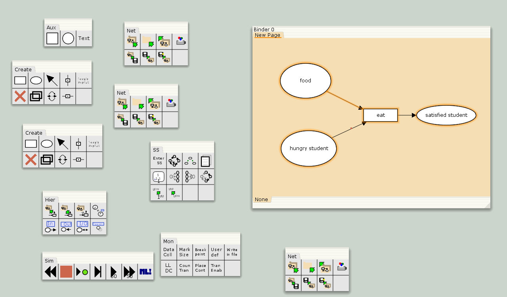
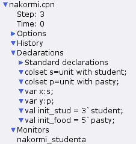
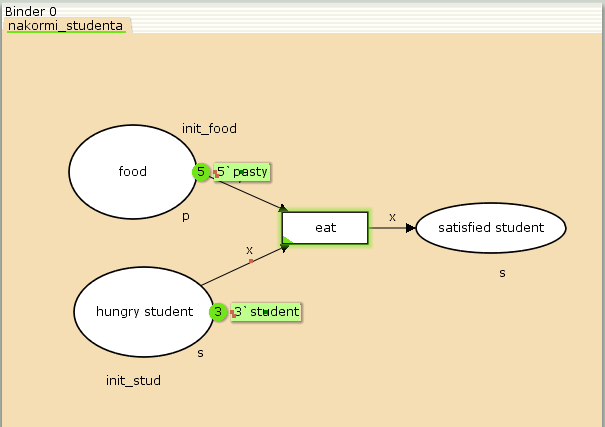
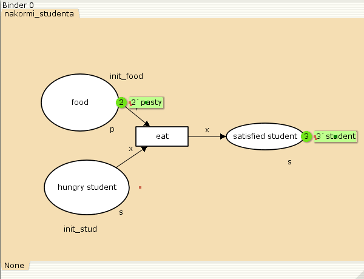
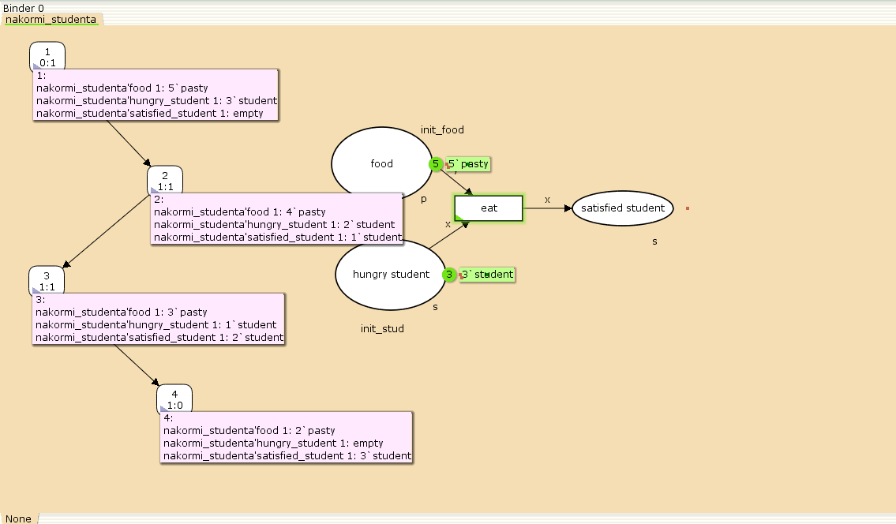

---
## Front matter
lang: ru-RU
title: Лабораторная работа №9
subtitle: Модель "Накорми студентов"
author:
  - Ибатулина Д.Э.
institute:
  - Российский университет дружбы народов, Москва, Россия
date: 4 апреля 2025

## i18n babel
babel-lang: russian
babel-otherlangs: english

## Formatting pdf
toc: false
toc-title: Содержание
slide_level: 2
aspectratio: 169
section-titles: true
theme: metropolis
header-includes:
 - \metroset{progressbar=frametitle,sectionpage=progressbar,numbering=fraction}
---

# Информация

## Докладчик

:::::::::::::: {.columns align=center}
::: {.column width="70%"}

  * Ибатулина Дарья Эдуардовна
  * студентка группы НФИбд-01-22
  * Фундаментальная информатика и информационные технологии
  * Российский университет дружбы народов
  * [1132226434@rudn.ru](mailto:1132226434@rudn.ru)
  * <https://deibatulina.github.io>

:::
::: {.column width="30%"}


:::
::::::::::::::

# Вводная часть

## Теоретическое введение

Рассмотрим пример студентов, обедающих пирогами. Голодный студент становится сытым после того, как съедает пирог.

Таким образом, имеем:

- два типа фишек: «пироги» и «студенты»;
- три позиции: «голодный студент», «пирожки», «сытый студент»;
- один переход: «съесть пирожок».

## Цель и задачи работы

**Цель работы**

Реализовать модель "Накорми студентов" в CPN Tools.

**Задание**

- Реализовать модель "Накорми студентов" в CPN Tools;
- Вычислить пространство состояний, сформировать отчет о нем и построить граф.

# Выполнение лабораторной работы

## Граф сети модели «Накорми студентов»

\centering
{#fig:001 width=70%}

## Декларации модели «Накорми студентов»

\centering
{#fig:002 width=50%}

## Модель «Накорми студентов»

\centering
{#fig:003 width=60%}

## Запуск модели «Накорми студентов»

\centering
{#fig:004 width=70%}

## Упражнение (1/2)

```
 Statistics
------------------------------------------------------------------------
  State Space
     Nodes:  4
     Arcs:   3
     Secs:   0
     Status: Full

  Scc Graph
     Nodes:  4
     Arcs:   3
     Secs:   0
```

## Упражнение (2/2)

```
 Boundedness Properties
------------------------------------------------------------------------
  Best Integer Bounds
                             Upper      Lower
     nakormi_studenta'food 1 5          2
     nakormi_studenta'hungry_student 1
                             3          0
     nakormi_studenta'satisfied_student 1
                             3          0
```

## Пространство состояний для модели «Накорми студентов»

\centering
{#fig:005 width=80%}

# Заключительная часть

## Выводы по отчёту о модели в CPN Tools

Из полученного отчета можно узнать:

- В графе есть 4 узла и 3 дуги (4 состояния и 3 перехода).
- Указаны границы значений для каждого элемента: голодные студенты (максимум - 3, минимум - 0), сытые студенты (максимум - 3, минимум - 0), еда (максимум - 5, минимум - 2, минимальное значение 2, так как в конце симуляции остаются пирожки).
- Также указаны границы мультимножеств.
- Маркировка home равная 4.
- Маркировка dead равная 4.
- В конце указано, что нет бесконечных последовательностей вхождений.

## Выводы

В процессе выполнения данной лабораторной работы я реализовала модель "Накорми студентов" в CPN Tools.

