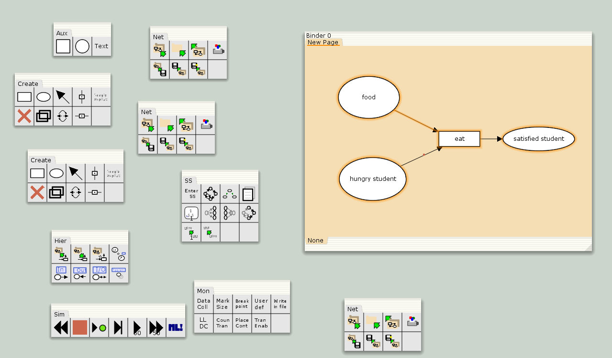
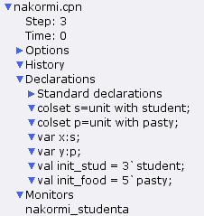
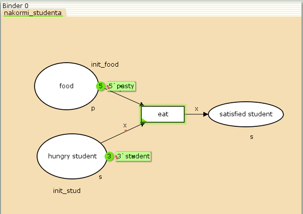
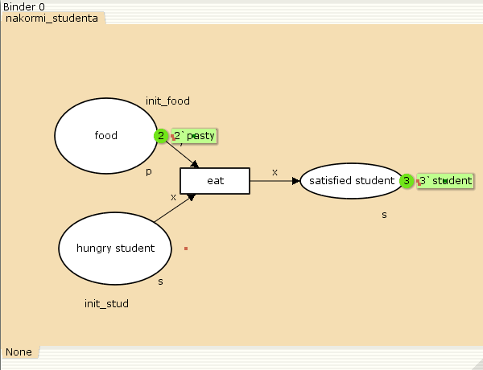
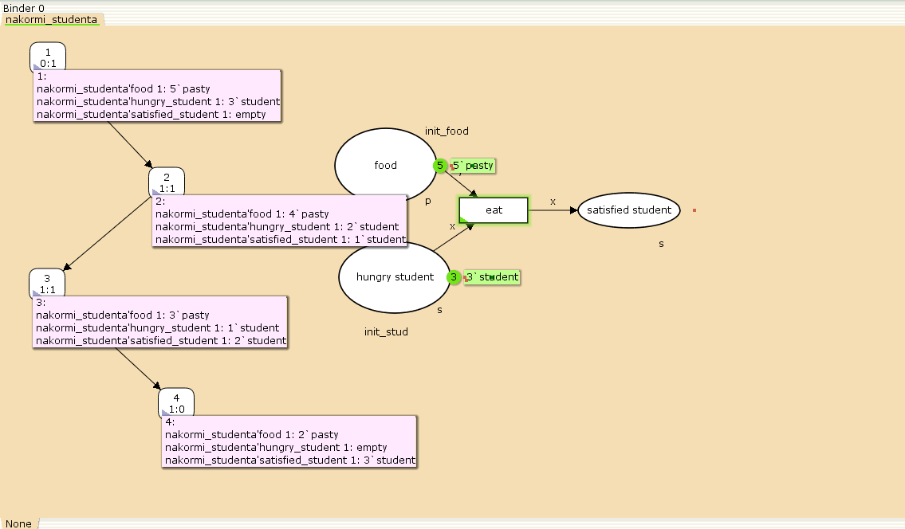

---
## Front matter
title: Лабораторная работа №9
subtitle: Модель «Накорми студентов»
author: Ибатулина Дарья Эдуардовна, НФИбд-01-22

## Generic otions
lang: ru-RU
toc-title: "Содержание"

## Bibliography
bibliography: bib/cite.bib
csl: pandoc/csl/gost-r-7-0-5-2008-numeric.csl

## Pdf output format
toc: true # Table of contents
toc-depth: 2
lof: true # List of figures
lot: false # List of tables
fontsize: 12pt
linestretch: 1.5
papersize: a4
documentclass: scrreprt
## I18n polyglossia
polyglossia-lang:
  name: russian
  options:
	- spelling=modern
	- babelshorthands=true
polyglossia-otherlangs:
  name: english
## I18n babel
babel-lang: russian
babel-otherlangs: english
## Fonts
mainfont: PT Serif
romanfont: PT Serif
sansfont: PT Sans
monofont: PT Mono
mainfontoptions: Ligatures=TeX
romanfontoptions: Ligatures=TeX
sansfontoptions: Ligatures=TeX,Scale=MatchLowercase
monofontoptions: Scale=MatchLowercase,Scale=0.9
## Biblatex
biblatex: true
biblio-style: "gost-numeric"
biblatexoptions:
  - parentracker=true
  - backend=biber
  - hyperref=auto
  - language=auto
  - autolang=other*
  - citestyle=gost-numeric
## Pandoc-crossref LaTeX customization
figureTitle: "Рис."
tableTitle: "Таблица"
listingTitle: "Листинг"
lofTitle: "Список иллюстраций"
lotTitle: "Список таблиц"
lolTitle: "Листинги"
## Misc options
indent: true
header-includes:
  - \usepackage{indentfirst}
  - \usepackage{float} # keep figures where there are in the text
  - \floatplacement{figure}{H} # keep figures where there are in the text
---

# Теоретическое введение

## Краткое теоретическое введение: модель «Накорми студентов» в CPN Tools

### Общее описание модели
  
Модель «Накорми студентов» представляет собой учебный пример **сети Петри**, демонстрирующий базовые принципы дискретного моделирования систем с распределенными ресурсами. Она реализована в среде CPN Tools – специализированном инструменте для работы с раскрашенными сетями Петри (Colored Petri Nets).

### Ключевые компоненты системы  

**Позиции** (места):
1. **Голодный студент** – содержит фишки, представляющие студентов в начальном состоянии

2. **Пирожки** – хранит фишки-ресурсы (пироги)

3. **Сытый студент** – конечное состояние после потребления ресурса

**Переход**:
- **Съесть пирожок** – активируется при наличии фишек в обеих входных позициях

**Типы фишек**:

1. Студенты (идентифицируются уникальными метками)

2. Пироги (могут иметь параметры: тип начинки, вес и т.д.)

### Логика работы

1. Система инициализируется фишками в позициях «Голодный студент» и «Пирожки»

2. При активации перехода:

   - Потребляется по одной фишке из каждой входной позиции
   - Генерируется фишка в позиции «Сытый студент»
   
3. Процесс продолжается до исчерпания ресурсов

```petri
// Пример структуры в нотации CPN Tools
place HungerStudents;
place Pies;
place FedStudents;

trans EatPie {
    from HungerStudents, Pies;
    to FedStudents;
    guard: count(Pies) > 0;
}
```

### Особенности реализации в CPN Tools  

- **Типизация данных** для фишек (студенты как сложные объекты с атрибутами)

- **Визуальное моделирование** состояний системы

- **Автоматическая валидация** корректности переходов

- Возможность анализа **достижимости состояний** и **дедлоков**

### Дидактическая ценность 

Модель иллюстрирует:

- Принцип **конкурентного доступа** к ресурсам

- Механизм **синхронизации процессов**

- Базовые концепции **распределенных систем**

- Методы **верификации** моделей

# Введение

**Цель работы**

Реализовать модель "Накорми студентов" в CPN Tools.

**Задание**

- Реализовать модель "Накорми студентов" в CPN Tools;
- Вычислить пространство состояний, сформировать отчет о нем и построить граф.

# Выполнение лабораторной работы

Рассмотрим пример студентов, обедающих пирогами. Голодный студент становится сытым после того, как съедает пирог.

Таким образом, имеем:
- два типа фишек: «пироги» и «студенты»;
- три позиции: «голодный студент», «пирожки», «сытый студент»;
- один переход: «съесть пирожок».

Сначала нарисуем граф сети. Для этого с помощью контекстного меню создаём новую сеть, добавляем позиции, переход и дуги (рис. @fig:001).

{#fig:001 width=70%}

В меню задаём новые декларации модели: типы фишек, начальные значения позиций, выражения для дуг. Для этого наведя мышку на меню `Standart declarations`, правой кнопкой вызываем контекстное меню и выбираем New Decl (рис. @fig:002).

{#fig:002 width=70%}

После этого задаем тип s фишкам, относящимся к студентам, тип p — фишкам, относящимся к пирогам (1 раз нажать клавишу `Tab`), задаём значения переменных x и y для дуг (нажимая на сами дуги) и начальные значения мультимножеств `init_stud` и `init_food` (2 раза нажать клавишу `Tab`). В результате получаем работающую модель, которая подсвечена зелёным цветом (рис. @fig:003).

{#fig:003 width=70%}

После запуска фишки типа «пирожки» из позиции «еда» и фишки типа «студенты» из позиции «голодный студент», пройдя через переход «кушать», попадают в позицию «сытый студент» и преобразуются в тип «студенты». Изначально голодных студентов - 3 человека, есть 3 пирожка, каждый из них съедает по одному, в результате остается 2 пирожка, 0 голодных студентов и 3 сытых студента (рис. @fig:004).

{#fig:004 width=70%}

## Упражнение

Вычислим пространство состояний. Прежде, чем пространство состояний может быть вычислено и проанализировано, необходимо сформировать код пространства состояний. Этот код создается, когда используется инструмент Войти в пространство состояний. Вход в пространство состояний занимает некоторое время. Затем, если ожидается, что пространство состояний будет небольшим, можно просто применить инструмент Вычислить пространство состояний к листу, содержащему страницу сети. Сформируем отчёт о пространстве состояний и проанализируем его.  Чтобы сохранить отчет, необходимо применить инструмент Сохранить отчет о пространстве состояний к листу, содержащему страницу сети и ввести имя файла отчета.

Из полученного отчета можно узнать:

- В графе есть 4 узла и 3 дуги (4 состояния и 3 перехода).
- Указаны границы значений для каждого элемента: голодные студенты (максимум - 3, минимум - 0), сытые студенты (максимум - 3, минимум - 0), еда (максимум - 5, минимум - 2, минимальное значение 2, так как в конце симуляции остаются пирожки).
- Также указаны границы мультимножеств.
- Маркировка home равная 4.
- Маркировка dead равная 4.
- В конце указано, что нет бесконечных последовательностей вхождений.

Ниже представлен листинг отчёта:

```
CPN Tools state space report for:
/home/openmodelica/nakormi.cpn
Report generated: Fri Apr  4 18:35:45 2025


 Statistics
------------------------------------------------------------------------

  State Space
     Nodes:  4
     Arcs:   3
     Secs:   0
     Status: Full

  Scc Graph
     Nodes:  4
     Arcs:   3
     Secs:   0


 Boundedness Properties
------------------------------------------------------------------------

  Best Integer Bounds
                             Upper      Lower
     nakormi_studenta'food 1 5          2
     nakormi_studenta'hungry_student 1
                             3          0
     nakormi_studenta'satisfied_student 1
                             3          0

  Best Upper Multi-set Bounds
     nakormi_studenta'food 1
                         5`pasty
     nakormi_studenta'hungry_student 1
                         3`student
     nakormi_studenta'satisfied_student 1
                         3`student

  Best Lower Multi-set Bounds
     nakormi_studenta'food 1
                         2`pasty
     nakormi_studenta'hungry_student 1
                         empty
     nakormi_studenta'satisfied_student 1
                         empty


 Home Properties
------------------------------------------------------------------------

  Home Markings
     [4]


 Liveness Properties
------------------------------------------------------------------------

  Dead Markings
     [4]

  Dead Transition Instances
     None

  Live Transition Instances
     None


 Fairness Properties
------------------------------------------------------------------------
     No infinite occurrence sequences.

```

Построим граф пространства состояний (рис. @fig:005):

{#fig:005 width=70%}

# Выводы

В процессе выполнения данной лабораторной работы я реализовала модель "Накорми студентов" в CPN Tools.

# Список литературы{.unnumbered}

1. Олифер, В.Г., Олифер, Н.А. Компьютерные сети: принципы, технологии, протоколы. 2-е изд. Минск: Библиотека БГУИР, 2010.

2. Синтез нейронной сети на основе сети Петри для формирования структуры // Вестник Астраханского государственного технического университета. 2023.

3. Зайцев, Д.А., Шмелева, Т.Р. Моделирование телекоммуникационных систем в CPN Tools: учебное пособие. Министерство образования и науки Российской Федерации, 2015.

4. ГОСТ Р 7.0.100–2018: Библиографическая запись. Библиографическое описание. Общие требования и правила составления. Москва: Стандартинформ, 2018.

5. Westergaard, Michael. CPN Tools 4 Extensions: Advanced Communication and Debugging, 2013.

6. Королькова А.В., Кулябов Д.С. Руководство к лабораторной работе №9. Моделирование информационных процессов. Модель "Накорми студентов" - 2025. — 4 с.

::: {#refs}
:::
