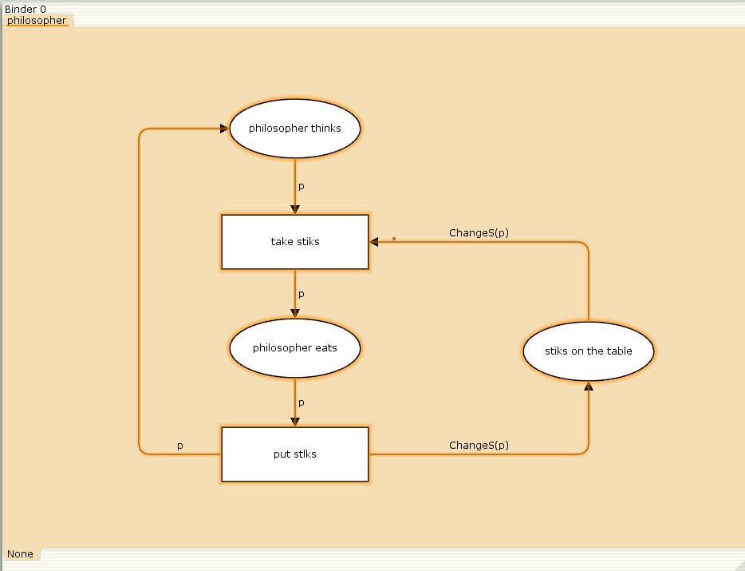
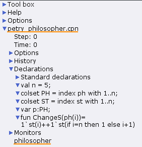
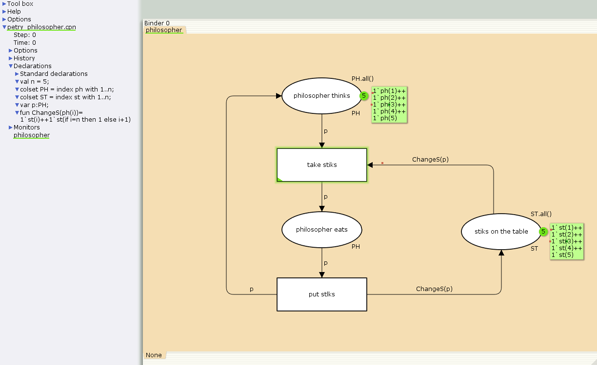
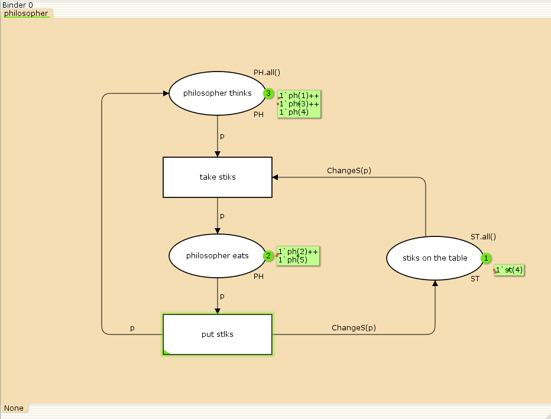
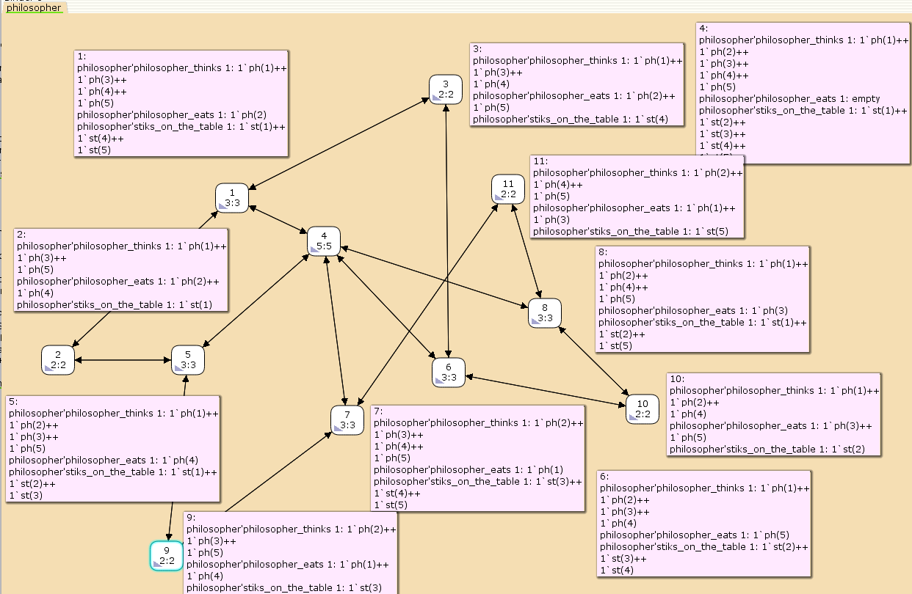

---
## Front matter
lang: ru-RU
title: Лабораторная работа №10
subtitle: Задача об обедающих мудрецах
author:
  - Ибатулина Д.Э.
institute:
  - Российский университет дружбы народов, Москва, Россия
date: 9 апреля 2025

## i18n babel
babel-lang: russian
babel-otherlangs: english

## Formatting pdf
toc: false
toc-title: Содержание
slide_level: 2
aspectratio: 169
section-titles: true
theme: metropolis
header-includes:
 - \metroset{progressbar=frametitle,sectionpage=progressbar,numbering=fraction}
---

# Информация

## Докладчик

:::::::::::::: {.columns align=center}
::: {.column width="70%"}

  * Ибатулина Дарья Эдуардовна
  * студентка группы НФИбд-01-22
  * Фундаментальная информатика и информационные технологии
  * Российский университет дружбы народов
  * [1132226434@rudn.ru](mailto:1132226434@rudn.ru)
  * <https://deibatulina.github.io>

:::
::: {.column width="30%"}


:::
::::::::::::::

# Вводная часть

## Теоретическое введение

Пять мудрецов сидят за круглым столом и могут пребывать в двух состояниях - думать и есть. Между соседями лежит одна палочка для еды. Для приёма пищи необходимы две палочки. Палочки - пересекающийся ресурс. Необходимо синхронизировать процесс еды так, чтобы мудрецы не умерли с голода.

Таким образом, имеем:

- позиции: мудрец размышляет (philosopher thinks), мудрец ест (philosopher eats), палочки находятся на столе (sticks on the table)
- переходы: взять палочки (take sticks), положить палочки (put sticks)

## Цель и задачи работы

**Цель работы**

Реализовать модель задачи об обедающих мудрецах в CPN Tools.

**Задание**

- Реализовать модель задачи об обедающих мудрецах  в CPN Tools;
- Вычислить пространство состояний, сформировать отчет о нем и построить граф.

# Выполнение лабораторной работы

## Граф сети задачи об обедающих мудрецах

\centering
{#fig:001 width=70%}

## Задание деклараций задачи об обедающих мудрецах

\centering
{#fig:002 width=50%}

## Модель задачи об обедающих мудрецах

\centering
{#fig:003 width=80%}

## Запуск модели задачи об обедающих мудрецах

\centering
{#fig:004 width=70%}

## Упражнение (1/2)

```
 Statistics
------------------------------------------------------------------------
   State Space
     Nodes:  11
     Arcs:   30
     Secs:   0
     Status: Full

  Scc Graph
     Nodes:  1
     Arcs:   0
     Secs:   0
```

## Упражнение (2/2)

```
 Boundedness Properties
------------------------------------------------------------------------

  Best Integer Bounds
                             Upper      Lower
     philosopher'philosopher_eats 1
                             2          0
     philosopher'philosopher_thinks 1
                             5          3
     philosopher'stiks_on_the_table 1
                             5          1
```

## Пространство состояний для модели

\centering
{#fig:005 width=70%}

# Заключительная часть

## Выводы по отчёту о модели в CPN Tools

Из полученного отчета можно узнать:

Общая структура пространства состояний:

- Количество состояний: 11 узлов (пронумерованы от 1 до 11);

- У нас всего 15 стрелок, но так как они двунаправленные, получается в итоге 30 переходов. Они представляют собой переходы между состояниями, вызванные срабатыванием переходов take_stiks и put_stiks.

## Выводы по работе

Мною была реализована модель задачи об обедающих мудрецах в CPN Tools, вычислено пространство состояний, сформирован отчет о нем и построен граф.

