---
## Front matter
lang: ru-RU
title: Лабораторная работа №11
subtitle: Модель системы массового обслуживания $M|M|1$
author:
  - Ибатулина Д.Э.
institute:
  - Российский университет дружбы народов, Москва, Россия
date: 18 апреля 2025

## i18n babel
babel-lang: russian
babel-otherlangs: english

## Formatting pdf
toc: false
toc-title: Содержание
slide_level: 2
aspectratio: 169
section-titles: true
theme: metropolis
header-includes:
 - \metroset{progressbar=frametitle,sectionpage=progressbar,numbering=fraction}
---

# Информация

## Докладчик

:::::::::::::: {.columns align=center}
::: {.column width="70%"}

  * Ибатулина Дарья Эдуардовна
  * студентка группы НФИбд-01-22
  * Фундаментальная информатика и информационные технологии
  * Российский университет дружбы народов
  * [1132226434@rudn.ru](mailto:1132226434@rudn.ru)
  * <https://deibatulina.github.io>

:::
::: {.column width="30%"}

:::
::::::::::::::

# Вводная часть

## Теоретическое введение

Модель системы массового обслуживания (СМО) **M|M|1** — одна из базовых моделей теории массового обслуживания, широко применяемая для анализа процессов обслуживания заявок в различных системах (телекоммуникации, вычислительные сети, производственные процессы и др.).

Обозначение **M|M|1** расшифровывается следующим образом:
- Первая буква **M** (Markovian) означает, что время между поступлениями заявок в систему подчиняется экспоненциальному распределению (процесс поступления заявок — пуассоновский).
- Вторая буква **M** указывает, что время обслуживания каждой заявки также экспоненциально распределено.
- Цифра **1** означает, что в системе имеется один обслуживающий канал (один сервер).

## Цель и задачи работы

**Цель работы**

Реализовать модель $M|M|1$ в CPN tools.

**Задание**

- Реализовать в CPN Tools модель системы массового обслуживания M|M|1;
- Настроить мониторинг параметров моделируемой системы и нарисовать графики очереди.

# Выполнение лабораторной работы

## Постановка задачи

В систему поступает поток заявок двух типов, распределённый по пуассоновскому
закону. Заявки поступают в очередь сервера на обработку. Дисциплина очереди -
FIFO. Если сервер находится в режиме ожидания (нет заявок на сервере), то заявка
поступает на обработку сервером.

## Граф сети системы обработки заявок в очереди

\centering
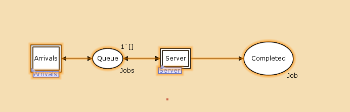{width=60%}

## Декларации системы

\centering
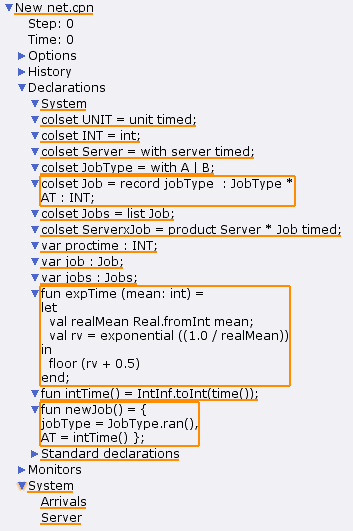{width=60%}

## Граф генератора заявок системы

\centering
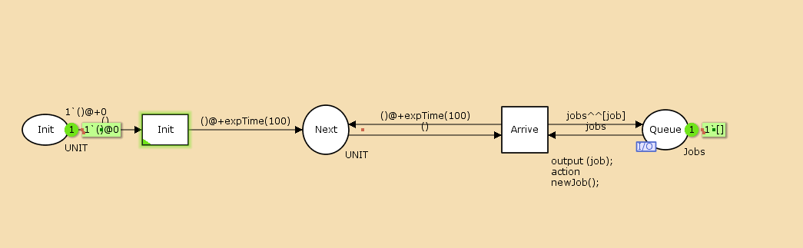{width=60%}

## Граф процесса обработки заявок на сервере системы

\centering
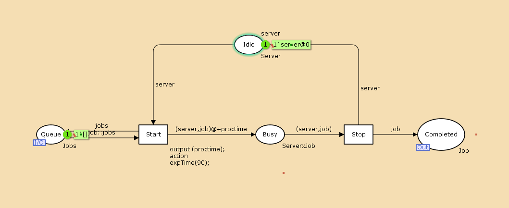{width=60%}

## Множества цветов системы (colorset) (1/2)

- фишки типа `UNIT` определяют моменты времени;
- фишки типа `INT` определяют моменты поступления заявок в систему.
- фишки типа `JobType` определяют 2 типа заявок — A и B;
- кортеж `Job` имеет 2 поля: jobType определяет тип работы
(соответственно имеет тип `JobType`,
поле `AT` имеет тип `INT` и используется для хранения времени
нахождения заявки в системе);
- фишки `Jobs` — список заявок;
- фишки типа `ServerxJob` — определяют состояние сервера, занятого
обработкой заявок.

## Множества цветов системы (colorset) (2/2)

Переменные модели:

- `proctime` — определяет время обработки заявки;
- `job` — определяет тип заявки;
- `jobs` — определяет поступление заявок в очередь.

Определим функции системы:

- функция `expTime` описывает генерацию целочисленных значений
через интервалы времени, распределённые по экспоненциальному закону;
- функция `intTime` преобразует текущее модельное время в целое число;
- функция `newJob` возвращает значение из набора `Job` — случайный выбор
типа заявки (A или B).

## Граф сети системы обработки заявок в очереди

\centering
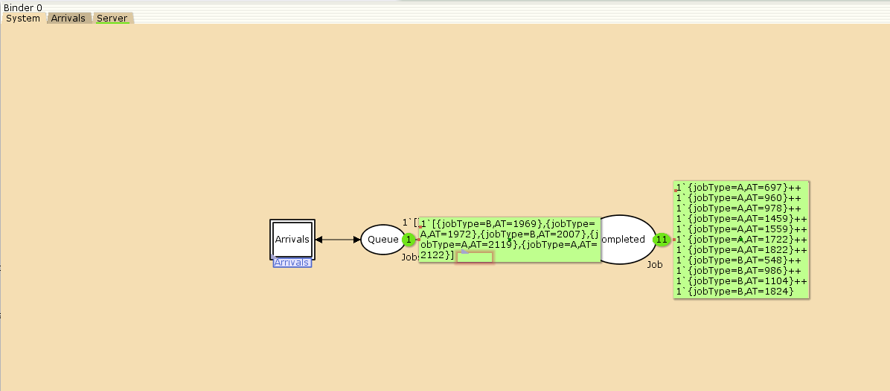{width=60%}

## Граф генератора заявок системы

\centering
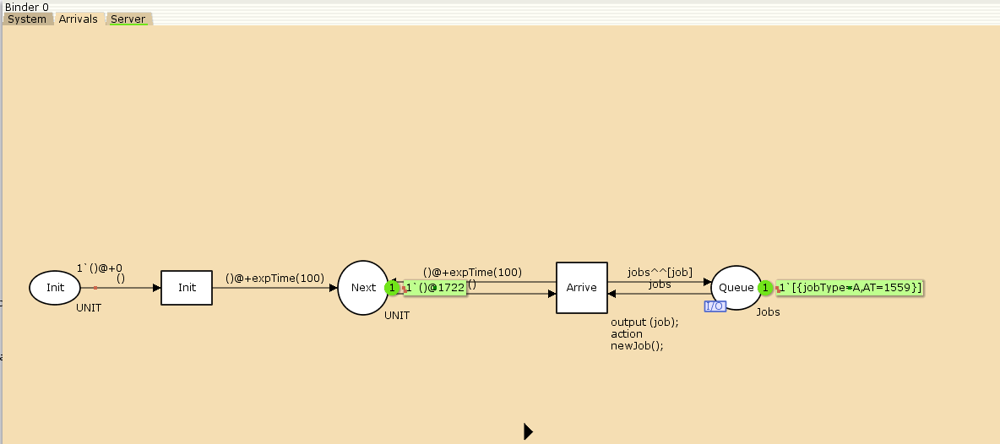{width=60%}

## Граф процесса обработки заявок на сервере системы

\centering
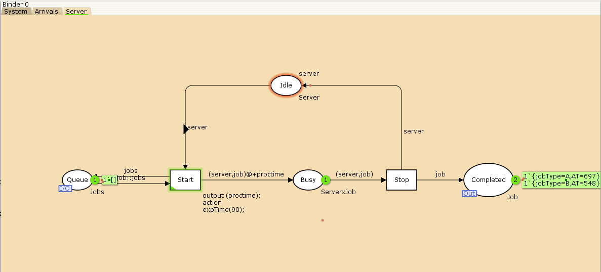{width=60%}

## Функция Predicate монитора Ostanovka

\centering
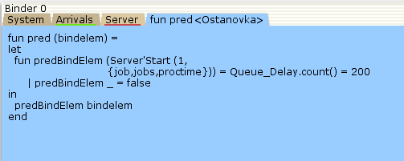{width=60%}

## Функция Observer монитора Queue Delay

\centering
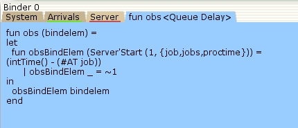{width=60%}

## Файл Queue_Delay.log

\centering
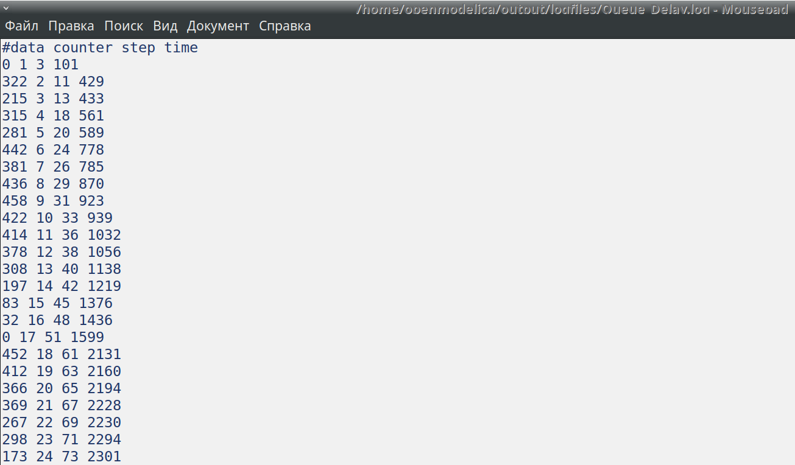{width=60%}

## График изменения задержки в очереди

\centering
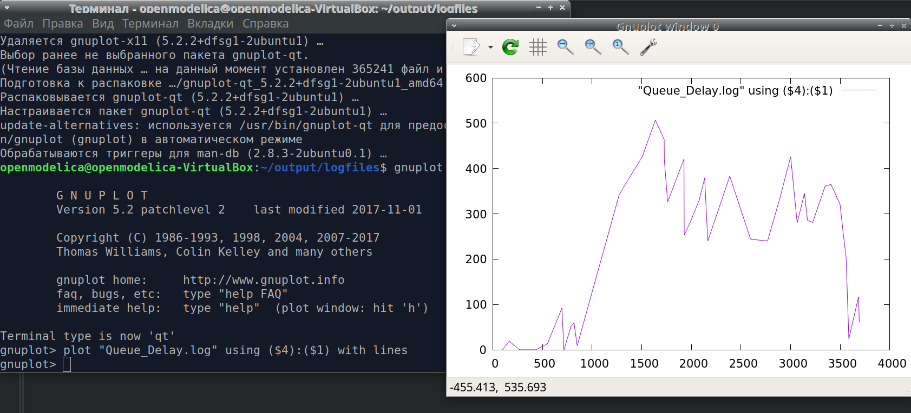{width=60%}

## Функция Observer монитора Queue Delay Real

\centering
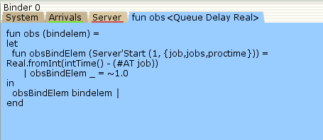{width=60%}

## Содержимое Queue_Delay_Real.log

\centering
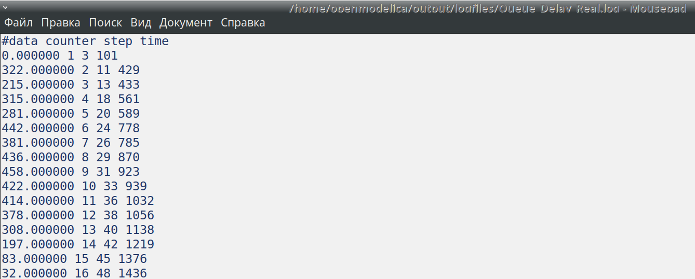{width=60%}

## Функция Observer монитора Long Delay Time

\centering
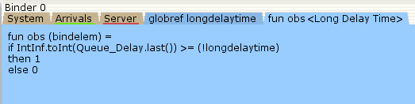{width=60%}

## Определение longdelaytime в декларациях

\centering
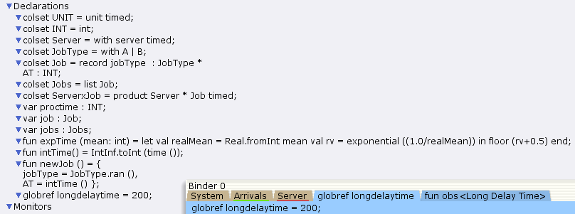{width=60%}

## Содержимое Long_Delay_Time.log

\centering
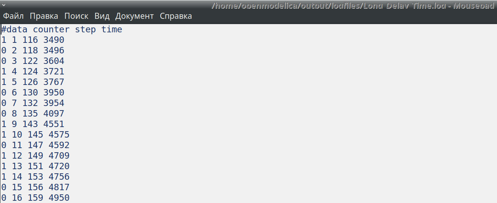{width=60%}

## Периоды времени, когда значения задержки в очереди превышали 200

\centering
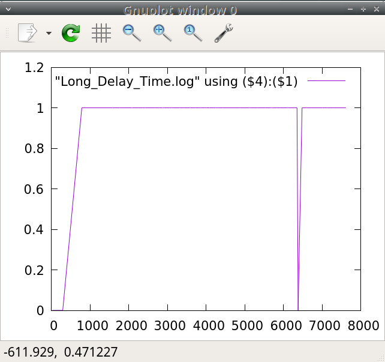{width=60%}

# Заключительная часть

## Выводы по работе

В процессе выполнения данной лабораторной работы я реализовала модель системы массового обслуживания $M|M|1$ в CPN Tools.

