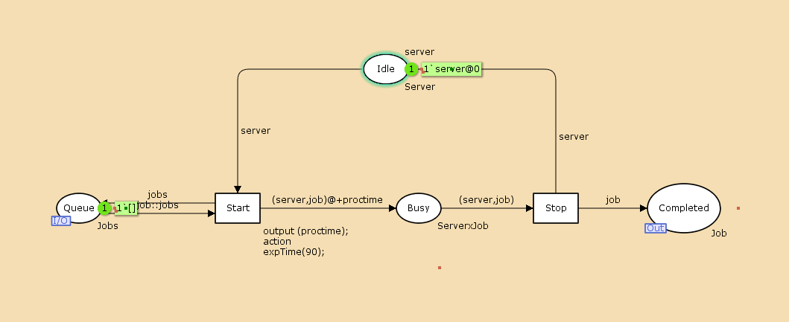
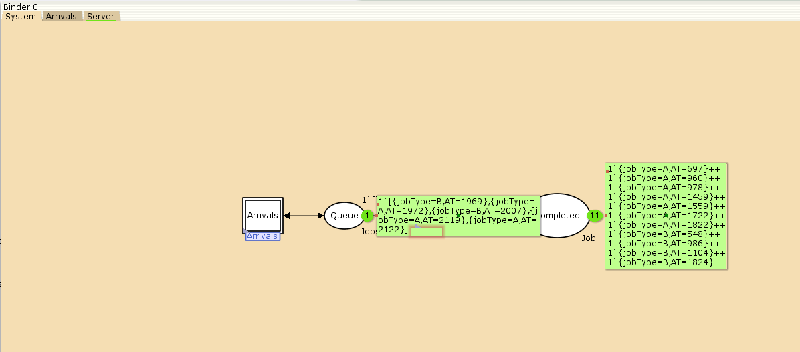
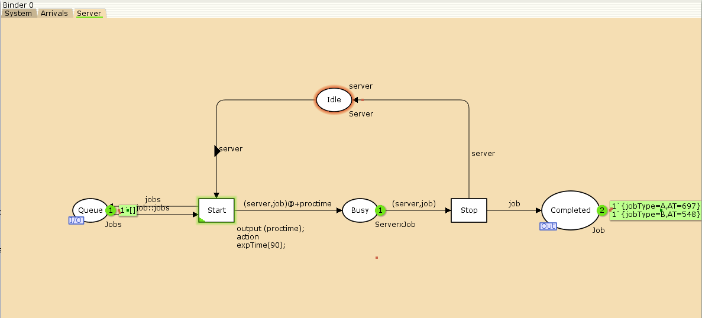
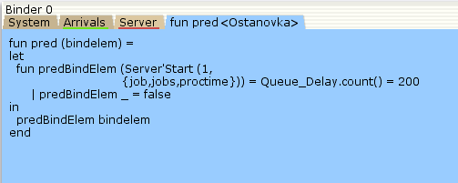
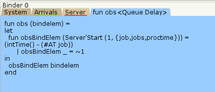
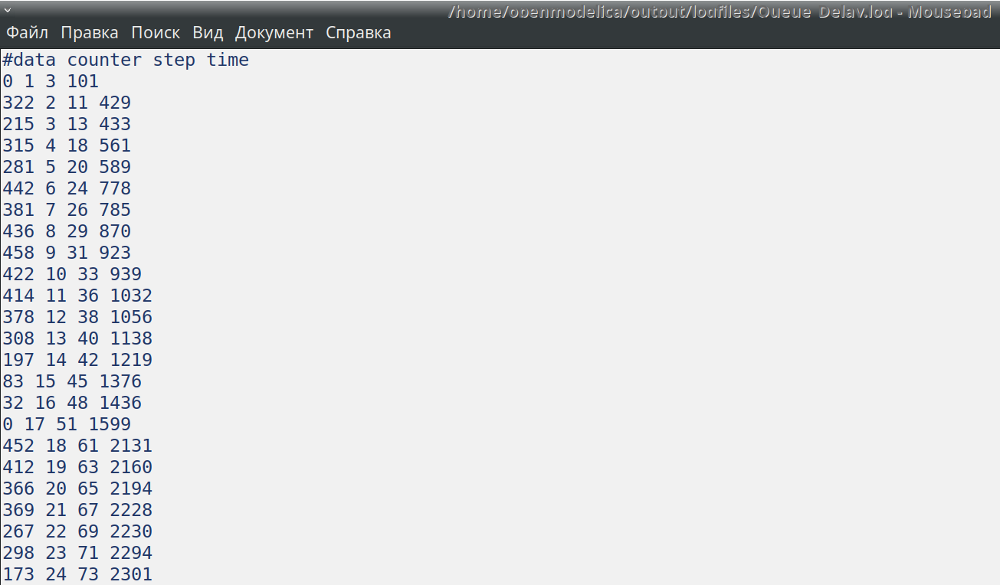

---
## Front matter
title: "Модель системы массового обслуживания $M|M|1$"
subtitle: "Отчёт по лабораторной работе №11"
author: "Ибатулина Дарья Эдуардовна"

## Generic otions
lang: ru-RU
toc-title: "Содержание"

## Bibliography
bibliography: bib/cite.bib
csl: pandoc/csl/gost-r-7-0-5-2008-numeric.csl

## Pdf output format
toc: true # Table of contents
toc-depth: 2
lof: true # List of figures
lot: false # List of tables
fontsize: 12pt
linestretch: 1.5
papersize: a4
documentclass: scrreprt
## I18n polyglossia
polyglossia-lang:
  name: russian
  options:
	- spelling=modern
	- babelshorthands=true
polyglossia-otherlangs:
  name: english
## I18n babel
babel-lang: russian
babel-otherlangs: english
## Fonts
mainfont: PT Serif
romanfont: PT Serif
sansfont: PT Sans
monofont: PT Mono
mainfontoptions: Ligatures=TeX
romanfontoptions: Ligatures=TeX
sansfontoptions: Ligatures=TeX,Scale=MatchLowercase
monofontoptions: Scale=MatchLowercase,Scale=0.9
## Biblatex
biblatex: true
biblio-style: "gost-numeric"
biblatexoptions:
  - parentracker=true
  - backend=biber
  - hyperref=auto
  - language=auto
  - autolang=other*
  - citestyle=gost-numeric
## Pandoc-crossref LaTeX customization
figureTitle: "Рис."
tableTitle: "Таблица"
listingTitle: "Листинг"
lofTitle: "Список иллюстраций"
lotTitle: "Список таблиц"
lolTitle: "Листинги"
## Misc options
indent: true
header-includes:
  - \usepackage{indentfirst}
  - \usepackage{float} # keep figures where there are in the text
  - \floatplacement{figure}{H} # keep figures where there are in the text
---

# Введение

**Цель работы**

Реализовать модель $M|M|1$ в CPN tools.

**Задание**

- Реализовать в CPN Tools модель системы массового обслуживания M|M|1.
- Настроить мониторинг параметров моделируемой системы и нарисовать графики очереди [@korolkova_lab_work].

# Теоретическое введение

Модель системы массового обслуживания (СМО) **M|M|1** — одна из базовых моделей теории массового обслуживания, широко применяемая для анализа процессов обслуживания заявок в различных системах (телекоммуникации, вычислительные сети, производственные процессы и др.).

Обозначение **M|M|1** расшифровывается следующим образом:
- Первая буква **M** (Markovian) означает, что время между поступлениями заявок в систему подчиняется экспоненциальному распределению (процесс поступления заявок — пуассоновский).
- Вторая буква **M** указывает, что время обслуживания каждой заявки также экспоненциально распределено.
- Цифра **1** означает, что в системе имеется один обслуживающий канал (один сервер) [@Kuznetsov2021;@Cherusheva2021].

## Основные характеристики модели M|M|1

- **Интенсивность потока заявок** — ${\lambda}$, среднее число заявок, поступающих в систему за единицу времени.
- **Интенсивность обслуживания** — ${\mu}$, среднее число заявок, которые может обслужить сервер за единицу времени.
- **Коэффициент загрузки сервера** — $${\rho} = \frac{\lambda}{\mu}$$, характеризует степень загруженности системы. Для устойчивой работы системы необходимо, чтобы выполнялось условие: $${\rho} < 1.$$

## Основные параметры системы

- Среднее число заявок в системе:  

$$
L = \frac{\rho}{1 - \rho}
$$

- Среднее время пребывания заявки в системе:  

$$
W = \frac{1}{\mu - \lambda}
$$

- Среднее число заявок в очереди:  

$$
L_q = \frac{\rho^2}{1 - \rho}
$$

- Среднее время ожидания в очереди:

$$
W_q = \frac{\rho}{\mu - \lambda}
$$

Модель **M|M|1** является классической и служит основой для построения более сложных моделей систем массового обслуживания [@Pleskunov2022;@Romanenko2021;@Belyi2014].

# Выполнение лабораторной работы

**Постановка задачи**

В систему поступает поток заявок двух типов, распределённый по пуассоновскому
закону. Заявки поступают в очередь сервера на обработку. Дисциплина очереди -
FIFO. Если сервер находится в режиме ожидания (нет заявок на сервере), то заявка
поступает на обработку сервером.

Будем использовать три отдельных листа: на первом листе опишем граф системы (рис. @fig:001) и параллельно зададим декларации системы (рис. @fig:002), на втором — генератор заявок (рис. @fig:003), на третьем — сервер обработки заявок (рис. @fig:004).

Сеть имеет 2 позиции (очередь — `Queue`, обслуженные заявки — `Completed`)
и два перехода (генерировать заявку — `Arrivals`, передать заявку на обработку сер-
веру — `Server`). Переходы имеют сложную иерархическую структуру, задаваемую
на отдельных листах модели (с помощью соответствующего инструмента меню —
Hierarchy).

Между переходом `Arrivals` и позицией `Queue`, а также между позицией `Queue`
и переходом `Server` установлена дуплексная связь. Между переходом `Server` и позицией `Completed` — односторонняя связь.

{#fig:001 width=80%}

{#fig:002 width=80%}

Граф генератора заявок имеет 3 позиции (текущая заявка — `Init`, следующая
заявка — `Next`, очередь — `Queue` из листа `System`) и 2 перехода (`Init` — определяет
распределение поступления заявок по экспоненциальному закону с интенсивностью
100 заявок в единицу времени, `Arrive` — определяет поступление заявок в очередь).

{#fig:003 width=80%}

Граф процесса обработки заявок на сервере имеет 4 позиции (`Busy` — сервер
занят, `Idle` — сервер в режиме ожидания, `Queue` и `Completed` из листа `System`) и 2
перехода (`Start` — начать обработку заявки, `Stop` — закончить обработку заявки).

{#fig:004 width=80%}

Зададим декларации системы (рис. [-@fig:004]).

Определим множества цветов системы (colorset):

- фишки типа `UNIT` определяют моменты времени;
- фишки типа `INT` определяют моменты поступления заявок в систему.
- фишки типа `JobType` определяют 2 типа заявок — A и B;
- кортеж `Job` имеет 2 поля: jobType определяет тип работы (соответственно имеет тип `JobType`, поле `AT` имеет тип `INT` и используется для хранения времени нахождения заявки в системе);
- фишки `Jobs` — список заявок;
- фишки типа `ServerxJob` — определяют состояние сервера, занятого обработкой
заявок.

Переменные модели:

- `proctime` — определяет время обработки заявки;
- `job` — определяет тип заявки;
- `jobs` — определяет поступление заявок в очередь.

Определим функции системы:

- функция `expTime` описывает генерацию целочисленных значений через интервалы времени, распределённые по экспоненциальному закону;
- функция `intTime` преобразует текущее модельное время в целое число;
- функция `newJob` возвращает значение из набора `Job` — случайный выбор типа
заявки (A или B).

Задание деклараций приведено выше (рис. @fig:002)

Параметры модели на графах сети.

На листе `System` (рис. @fig:001):

- у позиции Queue множество цветов фишек — `Jobs`; начальная маркировка `1[]`
определяет, что изначально очередь пуста.
- у позиции `Completed` множество цветов фишек — `Job`.

На листе Arrivals (рис. @fig:003):

- у позиции `Init`: множество цветов фишек — `UNIT`; начальная маркировка `1``()@0`
определяет, что поступление заявок в систему начинается с нулевого момента
времени;
- у позиции `Next`: множество цветов фишек — `UNIT`;
- на дуге от позиции `Init` к переходу `Init` выражение () задаёт генерацию заявок;
- на дуге от переходов `Init` и Arrive к позиции Next выражение
`()@+expTime(100)` задаёт экспоненциальное распределение времени между
поступлениями заявок;
- на дуге от позиции `Next` к переходу `Arrive` выражение () задаёт перемещение
фишки;
- на дуге от перехода `Arrive` к позиции Queue выражение `jobs^^[job]` задает
поступление заявки в очередь;
- на дуге от позиции `Queue` к переходу `Arrive` выражение `jobs` задаёт обратную
связь.

На листе Server (рис. @fig:004):

- у позиции `Busy`: множество цветов фишек — `Server`, начальное значение маркировки — `server` определяет, что изначально на сервере нет заявок на обслуживание;
- у позиции `Idle`: множество цветов фишек — `ServerxJob`;
- переход `Start` имеет сегмент кода
`output (proctime); action expTime(90);` определяющий, что время обслуживания заявки распределено по экспоненциальному закону со средним
временем обработки в 90 единиц времени;
- на дуге от позиции `Queue` к переходу `Start` выражение `job::jobs` определяет,
что сервер может начать обработку заявки, если в очереди есть хотя бы одна
заявка;
- на дуге от перехода `Start` к позиции Busy выражение
`(server,job)@+proctime` запускает функцию расчёта времени обработки заявки на сервере;
- на дуге от позиции `Busy` к переходу `Stop` выражение `(server,job)` говорит
о завершении обработки заявки на сервере;
- на дуге от перехода `Stop` к позиции `Completed` выражение `job` показывает, что
заявка считается обслуженной;
- выражение server на дугах от и к позиции `Idle` определяет изменение состояние
сервера (обрабатывает заявки или ожидает);
- на дуге от перехода `Start` к позиции `Queue` выражение `jobs` задаёт обратную
связь.

## Запуск модели

Запускаем модель, добавляя, как сказано в руководстве, по 30 секунд после нажатия кнопки запуска (рис. @fig:005, @fig:006, @fig:007).

{#fig:005 width=80%}

{#fig:006 width=80%}

{#fig:007 width=80%}

## Мониторинг параметров моделируемой системы

Потребуется палитра Monitoring. Выбираем Break Point (точка останова) и устанавливаем её на переход Start. После этого в разделе меню Monitor появится новый подраздел, который назовём Ostanovka. В этом подразделе необходимо внести изменения в функцию Predicate, которая будет выполняться при запуске монитора. Зададим число шагов, через которое будем останавливать мониторинг. Для этого true заменим на *Queue_Delay.count()=200*. 

В результате функция примет вид (рис. @fig:008):

{#fig:008 width=80%}

Необходимо определить конструкцию Queue_Delay.count(). С помощью палитры Monitoring выбираем Data Call и устанавливаем на переходе Start. Появившийся в меню монитор называем Queue Delay (без подчеркивания). Функция Observer выполняется тогда, когда функция предикатора выдаёт значение true. По умолчанию функция выдаёт 0 или унарный минус (~1), подчёркивание обозначает произвольный аргумент. Изменим её так, чтобы получить значение задержки в очереди. Для этого необходимо из текущего времени intTime() вычесть временную метку AT , означающую приход заявки в очередь.

В результате функция примет вид (рис. @fig:009):

{#fig:009 width=80%}

После запуска программы на выполнение в каталоге с кодом программы появится файл Queue_Delay.log (рис. @fig:010), содержащий в первой колонке — значение задержки очереди, во второй — счётчик, в третьей — шаг, в четвёртой — время. 

{#fig:010 width=80%}

С помощью gnuplot можно построить график значений задержки в очереди (рис. @fig:011), выбрав по оси x время, а по оси y — значения задержки:

{#fig:011 width=80%}

Посчитаем задержку в действительных значениях. С помощью палитры Monitoring выбираем Data Call и устанавливаем на переходе Start. Появившийся в меню монитор называем Queue Delay Real. Функцию Observer изменим следующим образом (рис. @fig:012):

{#fig:012 width=80%}

По сравнению с предыдущим описанием функции добавлено преобразование значения функции из целого в действительное, при этом obsBindElem _ принимает значение ~1.0. После запуска программы на выполнение в каталоге с кодом программы появится файл Queue_Delay_Real.log с содержимым, аналогичным содержимому файла Queue_Delay.log, но значения задержки имеют действительный тип (рис. @fig:013):

{#fig:013 width=80%}

Посчитаем, сколько раз задержка превысила заданное значение. С помощью палитры Monitoring выбираем Data Call и устанавливаем на переходе Start. Монитор называем Long Delay Time.
Функцию Observer изменим следующим образом (рис. [-@fig:014]):

{#fig:014 width=80%}

При этом необходимо в декларациях задать глобальную переменную
(в форме ссылки на число 200): longdelaytime (рис. [-@fig:015]).

{#fig:015 width=80%}

После запуска программы на выполнение в каталоге с кодом программы появится файл Long_Delay_Time.log (рис. [-@fig:016])

{#fig:016 width=80%}

С помощью gnuplot можно построить график (рис. [-@fig:017]), демонстрирующий, в какие периоды времени значения задержки в очереди превышали заданное значение 200.

{#fig:017 width=80%}

# Выводы

В процессе выполнения данной лабораторной работы я реализовала модель системы массового обслуживания $M|M|1$ в CPN Tools.

# Список литературы{.unnumbered}

::: {#refs}
:::
