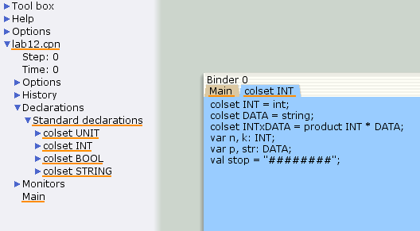
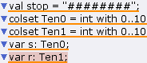
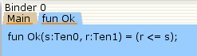
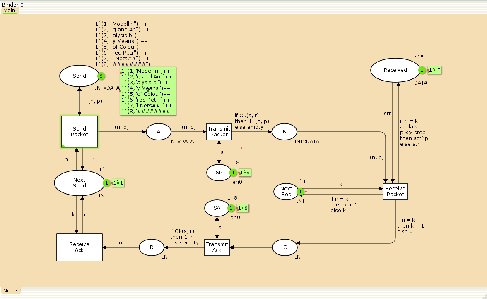
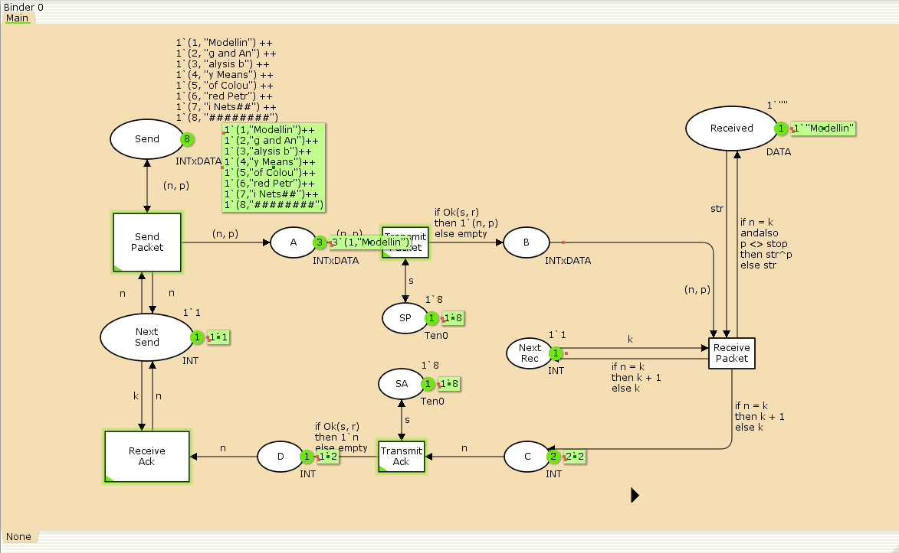
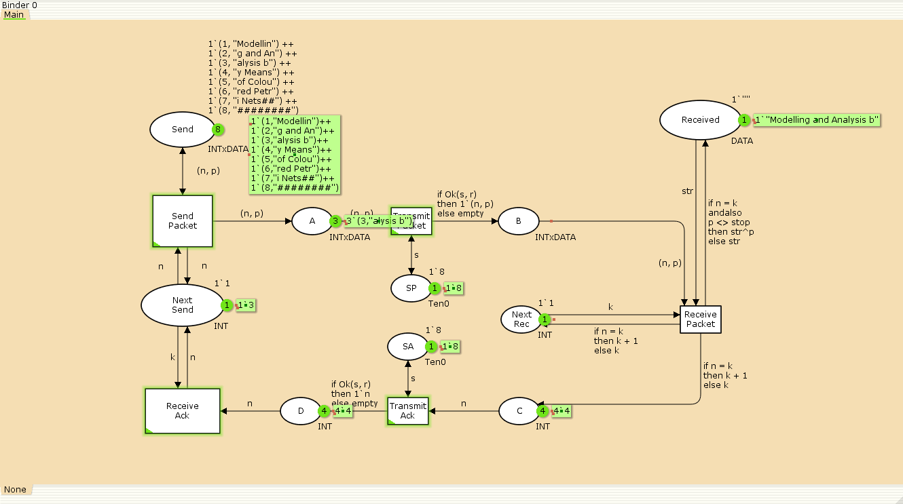
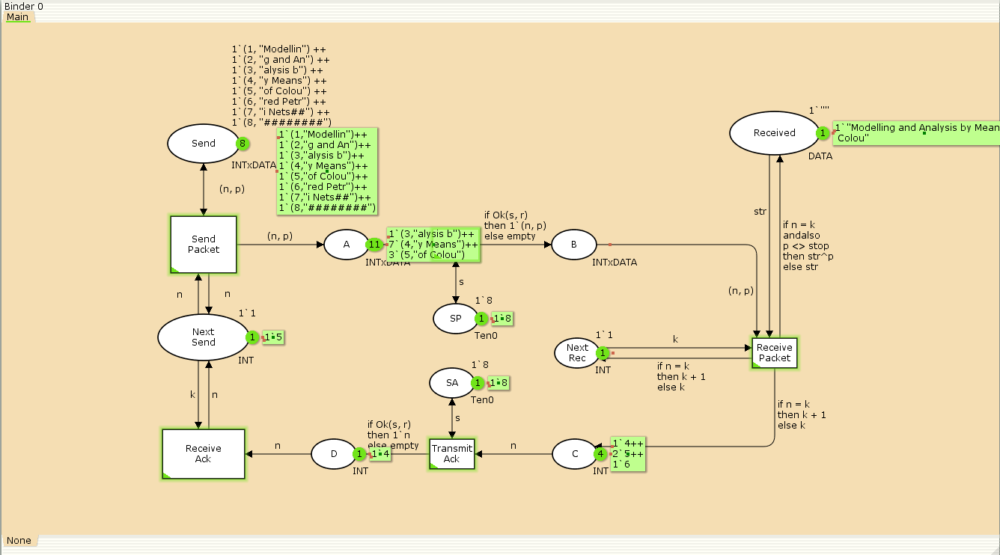
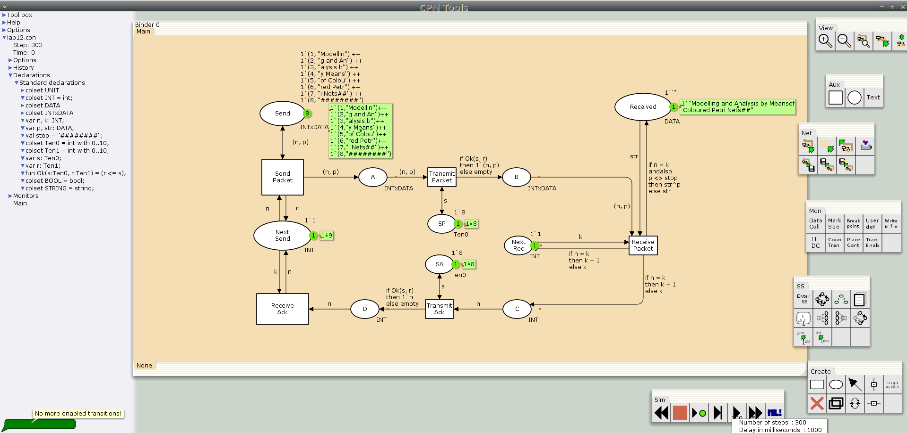
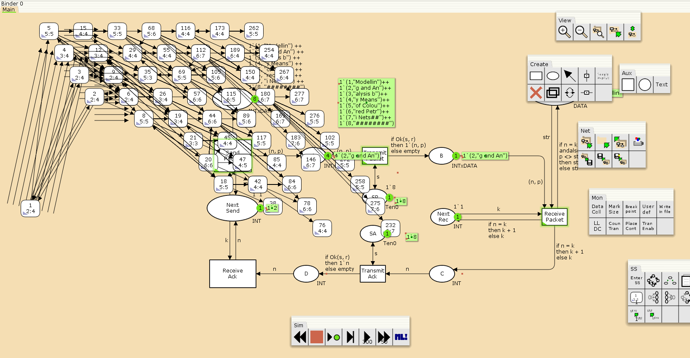

---
## Front matter
lang: ru-RU
title: Лабораторная работа №12
subtitle: Сети Петри — Простой протокол
author:
  - Ибатулина Д.Э.
institute:
  - Российский университет дружбы народов, Москва, Россия
date: 25 апреля 2025

## i18n babel
babel-lang: russian
babel-otherlangs: english

## Formatting pdf
toc: false
toc-title: Содержание
slide_level: 2
aspectratio: 169
section-titles: true
theme: metropolis
header-includes:
 - \metroset{progressbar=frametitle,sectionpage=progressbar,numbering=fraction}
---

# Информация

## Докладчик

:::::::::::::: {.columns align=center}
::: {.column width="70%"}

  * Ибатулина Дарья Эдуардовна
  * студентка группы НФИбд-01-22
  * Фундаментальная информатика и информационные технологии
  * Российский университет дружбы народов
  * [1132226434@rudn.ru](mailto:1132226434@rudn.ru)
  * <https://deibatulina.github.io>

:::
::: {.column width="30%"}


:::
::::::::::::::

# Вводная часть

## Теоретическое введение (1)

Протоколы передачи данных - это наборы правил, определяющих порядок и способы обмена информацией между участниками вычислительных или телекоммуникационных систем. 

Реальные протоколы передачи данных часто имеют сложную структуру, что затрудняет их анализ и отладку. Для исследования их свойств и выявления возможных ошибок широко применяется моделирование, в частности, с помощью сетей Петри и их расширений - раскрашенных сетей Петри (Coloured Petri Nets, CPN).

## Цель и задачи работы

**Цель работы**

Реализовать простой протокол передачи данных в CPN Tools.

**Задание**

- Реализовать простой протокол передачи данных в CPN Tools.
- Вычислить пространство состояний, сформировать отчет о нем и построить граф.

# Выполнение лабораторной работы

## Постановка задачи

Рассматривается простейший протокол передачи данных в ненадёжной сети. Передача осуществляется по следующему принципу: отправитель разбивает исходное сообщение на части (пакеты) и отправляет их получателю, ожидая подтверждения (ACK) о доставке каждого пакета перед отправкой следующего. Если подтверждение не получено, пакет передаётся повторно.

Модель протокола строится в среде CPN Tools с использованием раскрашенных сетей Петри, что позволяет формально описать все возможные состояния системы и переходы между ними, а также смоделировать случайные потери пакетов и подтверждений. Анализ полученной модели даёт возможность оценить корректность работы протокола, выявить возможные тупиковые состояния и оптимизировать алгоритмы передачи данных.

## Задание деклараций

\centering
{width=70%}

## Задание значений переменных

\centering
{width=90%}

## Задание функции Ok

\centering
{width=90%}

## Полученная модель

\centering
{width=70%}

## Запуск модели простого протокола передачи данных (1)

\centering
{width=70%}

## Запуск модели простого протокола передачи данных (2)

\centering
{width=70%}

## Запуск модели простого протокола передачи данных (3)

\centering
{width=70%}

## Завершение моделирования простого протокола передачи данных

\centering
{width=80%}

## Пространство состояний для модели простого протокола передачи данных

\centering
{width=70%}

## Отчёт о пространстве состояний

```
 Statistics
------------------------------------------------------------------------

  State Space
     Nodes:  13341
     Arcs:   206461
     Secs:   300
     Status: Partial

  Scc Graph
     Nodes:  6975
     Arcs:   170859
     Secs:   14
```

## Пояснение отчёта о пространстве состояний

- 13341 состояний и 206461 переходов между ними.
- Указаны границы значений для каждого элемента: промежуточные состояния A, B, C (наибольшая верхняя граница у A, так как после него пакеты отбрасываются. Так как мы установили максимум 10, то у следующего состояния B верхняя граница -- 10), вспомогательные состояния SP, SA, NextRec, NextSend, Receiver (в них может находиться только один пакет) и состояние Send (в нем хранится только 8 элементов, так как мы задали их в начале и с ними никаких изменений не происходит).
- Указаны границы в виде мультимножеств.
- Маркировка home для всех состояний (в любую позицию можно попасть из любой другой маркировки).
- Маркировка dead равная 4675 [9999,9998,9997,9996,9995,...] -- это состояния, в которых нет включенных переходов.

# Заключительная часть

## Выводы по работе

В процессе выполнения данной лабораторной работы я реализовала простой протокол передачи данных в CPN Tools и провела анализ его пространства состояний.

