---
## Front matter
lang: ru-RU
title: Лабораторная работа №14
subtitle: Модель обработки заказов. GPSS
author:
  - Ибатулина Д.Э.
institute:
  - Российский университет дружбы народов, Москва, Россия
date: 8 мая 2025

## i18n babel
babel-lang: russian
babel-otherlangs: english

## Formatting pdf
toc: false
toc-title: Содержание
slide_level: 2
aspectratio: 169
section-titles: true
theme: metropolis
header-includes:
 - \metroset{progressbar=frametitle,sectionpage=progressbar,numbering=fraction}
---

# Информация

## Докладчик

:::::::::::::: {.columns align=center}
::: {.column width="70%"}

  * Ибатулина Дарья Эдуардовна
  * студентка группы НФИбд-01-22
  * Фундаментальная информатика и информационные технологии
  * Российский университет дружбы народов
  * [1132226434@rudn.ru](mailto:1132226434@rudn.ru)
  * <https://deibatulina.github.io>

:::
::: {.column width="30%"}

:::
::::::::::::::

# Вводная часть

## Теоретическое введение

Одной из наиболее распространённых задач, решаемых с помощью моделирования, является анализ и оптимизация процессов обработки заказов, возникающих в различных сферах деятельности - от промышленности и логистики до сферы услуг.

Процесс обработки заказов, как правило, характеризуется случайным поступлением заявок, наличием очередей, ограниченными ресурсами и различными правилами обслуживания. Такие системы принято называть системами массового обслуживания (СМО). Классические задачи теории массового обслуживания включают определение времени ожидания, длины очереди, степени загрузки обслуживающих устройств и других характеристик, важных для принятия управленческих решений. Одним из наиболее популярных языков для имитационного моделирования СМО является GPSS (General Purpose Simulation System).

## Цель и задачи работы

Реализовать с помощью `gpss`:

- модель оформления заказов клиентов одним оператором;
- построение гистограммы распределения заявок в очереди;
- модель обслуживания двух типов заказов от клиентов в интернет-магазине;
- модель оформления заказов несколькими операторами.

# Выполнение лабораторной работы

## Постановка задачи (1/3)

Порядок блоков в модели соответствует порядку фаз обработки заказа в реальной системе:

1. клиент оставляет заявку на заказ в интернет-магазине;
2. если необходимо, заявка от клиента ожидает в очереди освобождения оператора для оформления заказа;
3. заявка от клиента принимается оператором для оформления заказа;
4. оператор оформляет заказ;
5. клиент получает подтверждение об оформлении заказа (покидает систему).

## Постановка задачи (2/3)

Для задания равномерного распределения поступления заказов используем блок `GENERATE`, для задания равномерного времени обслуживания (задержки в системе) -- `ADVANCE`. Для моделирования ожидания заявок клиентов в очереди используем блоки `QUEUE` и `DEPART`, в которых в качестве имени очереди укажем `operator_q` Для моделирования поступления заявок для оформления заказов к оператору используем блоки `SEIZE` и `RELEASE` с параметром `operator` — имени «устройства обслуживания».

## Постановка задачи (3/3)

Требуется, чтобы модельное время было 8 часов. Соответственно, параметр блока `GENERATE` -- 480 (8 часов по 60 минут, всего 480 минут). Работа программы начинается с оператора `START` с начальным значением счётчика завершений, равным 1; заканчивается -- оператором `TERMINATE` с параметром 1, что задаёт ординарность потока в модели.

## Модель оформления заказов клиентов одним оператором

\centering
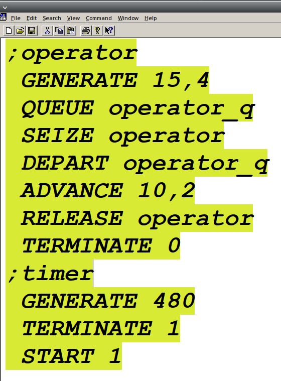{width=55%}

## Отчёт по модели оформления заказов в интернет-магазине

\centering
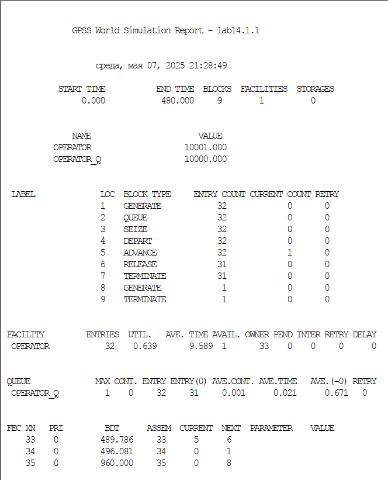{width=40%}

## Модель оформления заказов клиентов одним оператором с измененными интервалами заказов и времени оформления клиентов

\centering
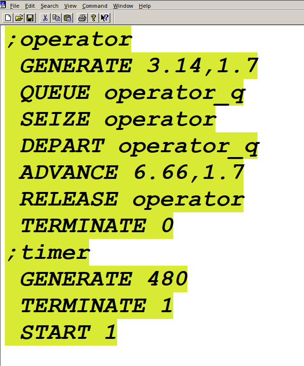{width=45%}

## Отчёт по модели оформления заказов в интернет-магазине с измененными интервалами заказов и времени оформления клиентов

\centering
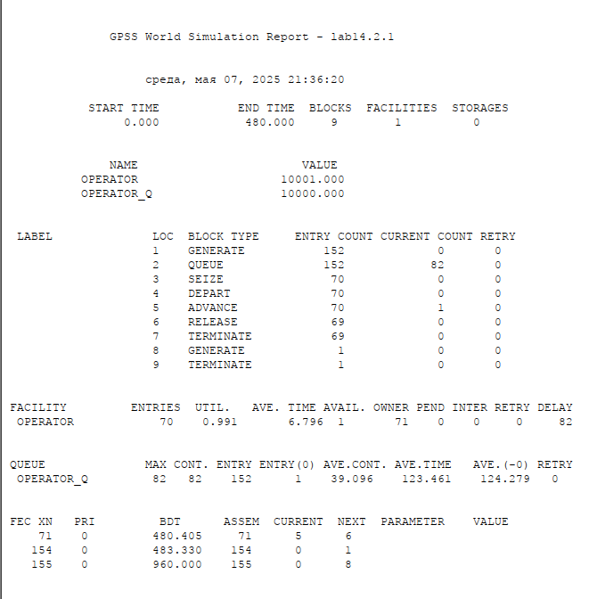{width=50%}

## Построение гистограммы распределения заявок в очереди

\centering
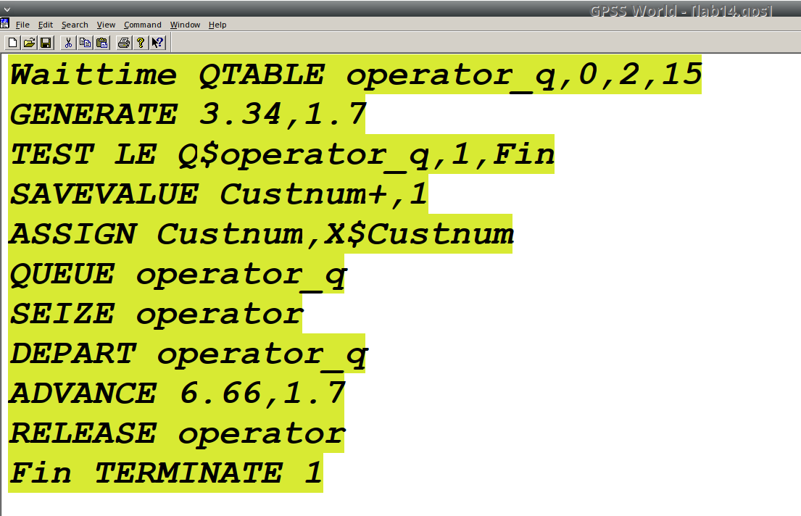{width=65%}

## Отчёт по модели оформления заказов в интернет-магазине при построении гистограммы распределения заявок в очереди (1/2)

\centering
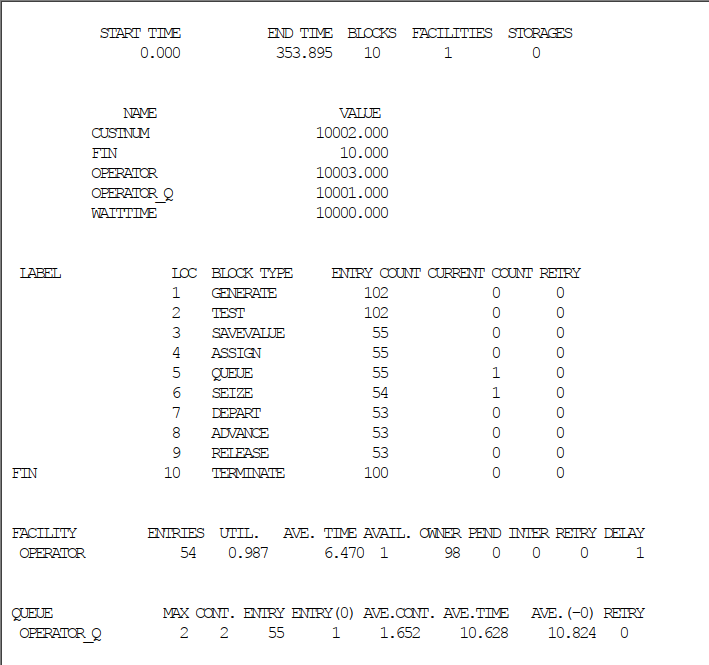{width=55%}

## Отчёт по модели оформления заказов в интернет-магазине при построении гистограммы распределения заявок в очереди (2/2)

\centering
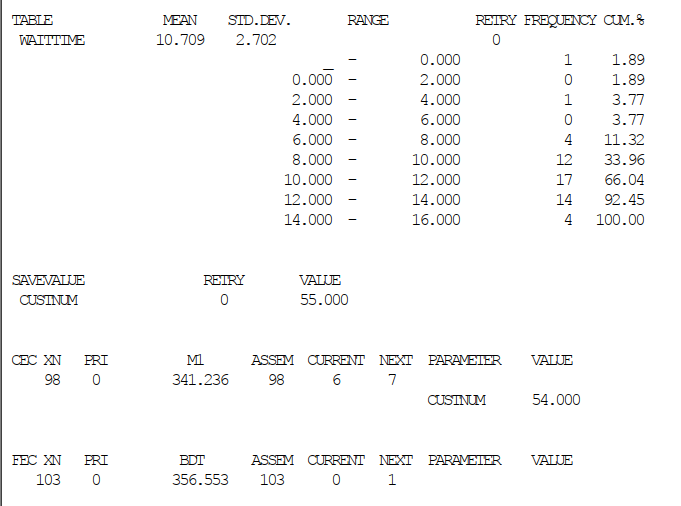{width=60%}

## Гистограмма распределения заявок в очереди

\centering
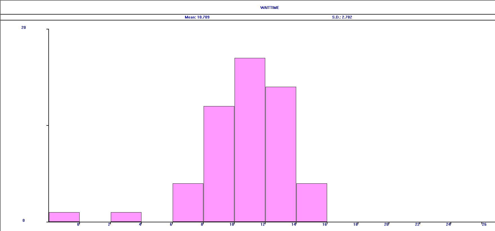{width=85%}

## Модель обслуживания двух типов заказов от клиентов в интернет-магазине

\centering
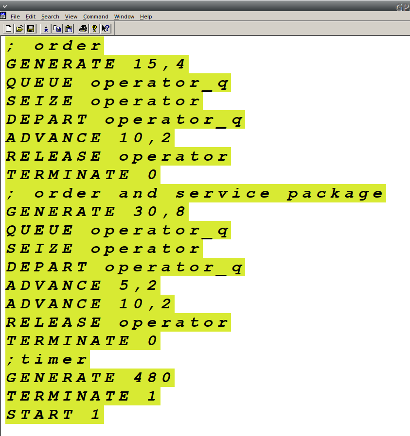{width=70%}

## Отчёт по модели оформления заказов двух типов

\centering
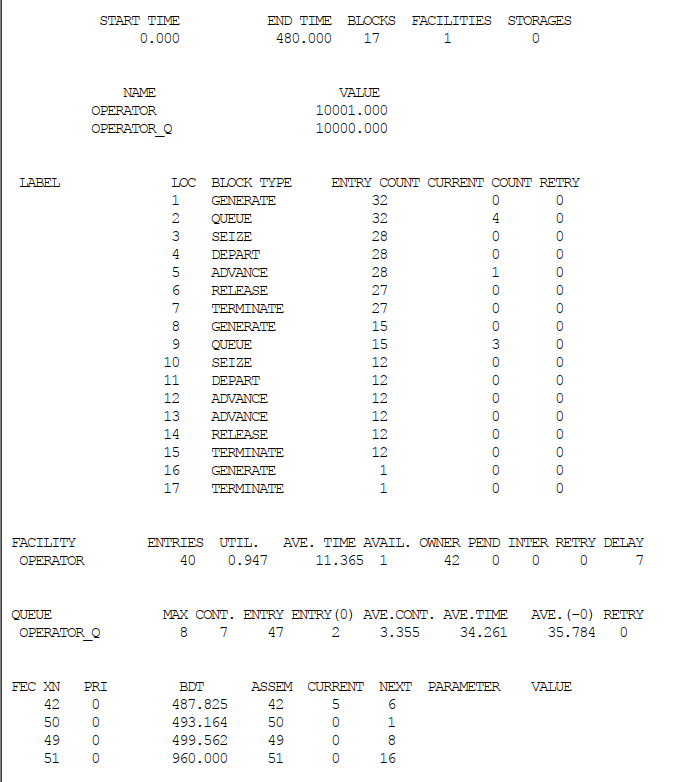{width=50%}

## Модель обслуживания двух типов заказов с условием, что число заказов с дополнительным пакетом услуг составляет 30% от общего числа заказов

\centering
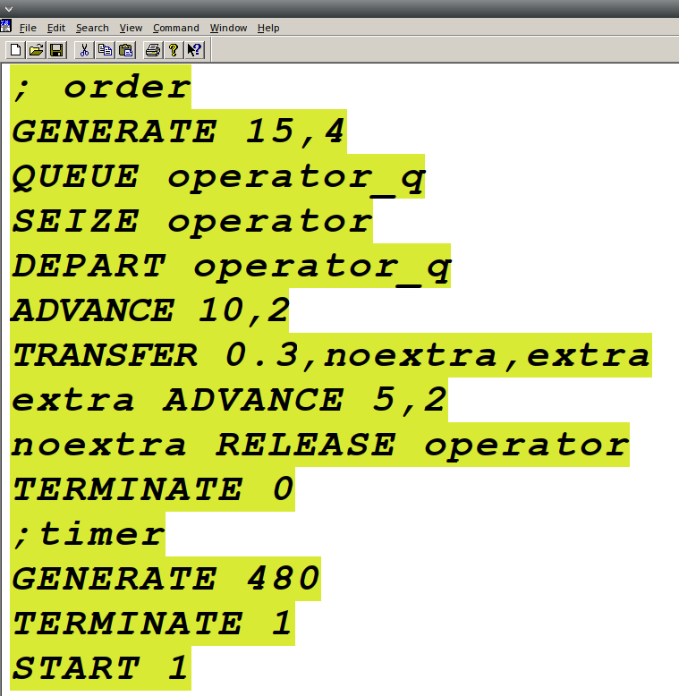{width=50%}

## Отчёт по модели оформления заказов двух типов

\centering
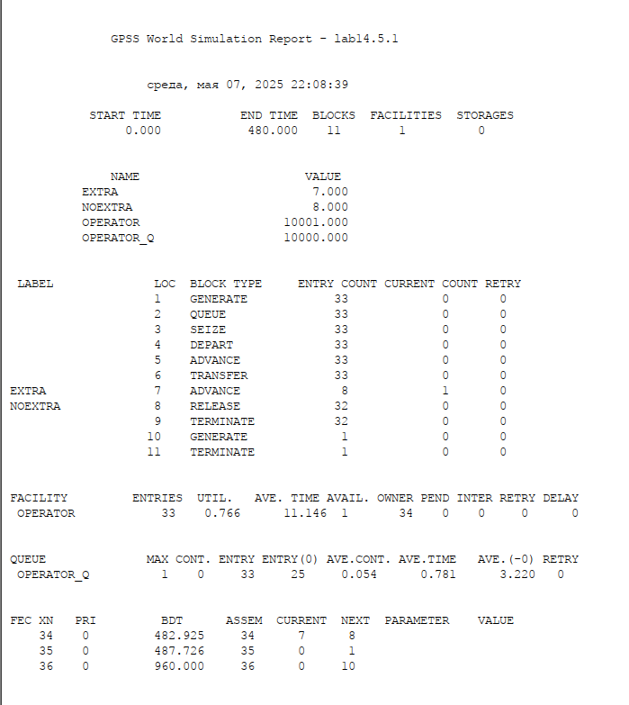{width=50%}

## Модель оформления заказов несколькими операторами

\centering
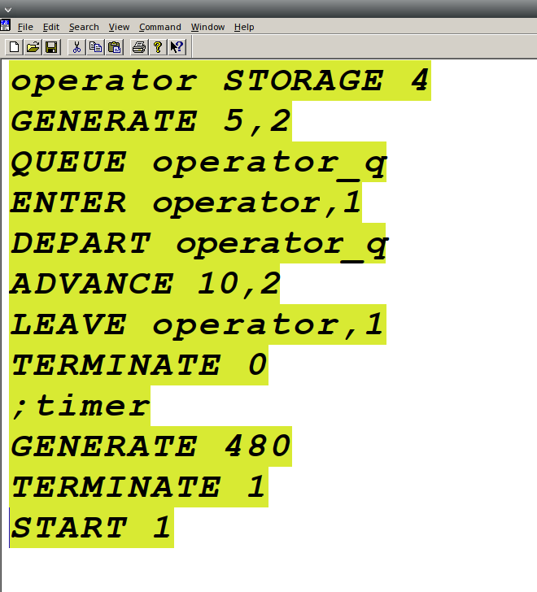{width=60%}

## Отчет по модели оформления заказов несколькими операторами

\centering
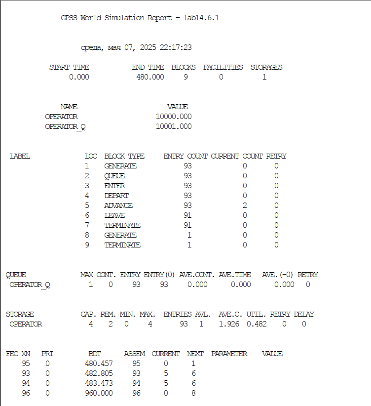{width=45%}

## Модель оформления заказов несколькими операторами с учетом отказов клиентов

\centering
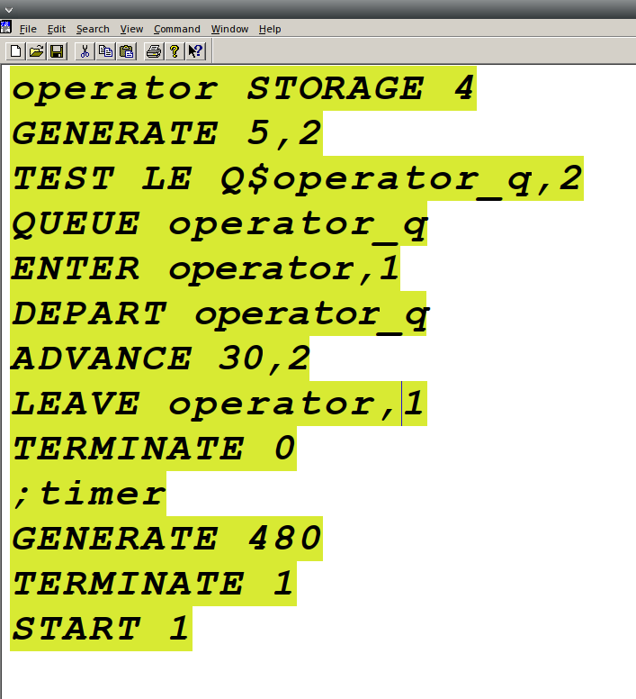{width=60%}

## Отчет по модели оформления заказов несколькими операторами с учетом отказов клиентов

\centering
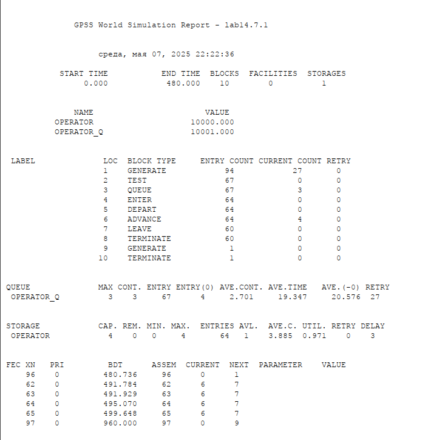{width=55%}

# Заключительная часть

## Выводы по работе

В результате была реализована с помощью *gpss*:

- модель оформления заказов клиентов одним оператором;
- построение гистограммы распределения заявок в очереди;
- модель обслуживания двух типов заказов от клиентов в интернет-магазине;
- модель оформления заказов несколькими операторами.

