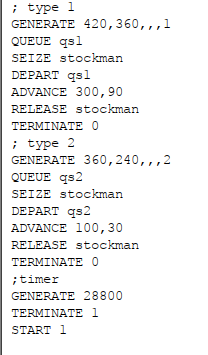
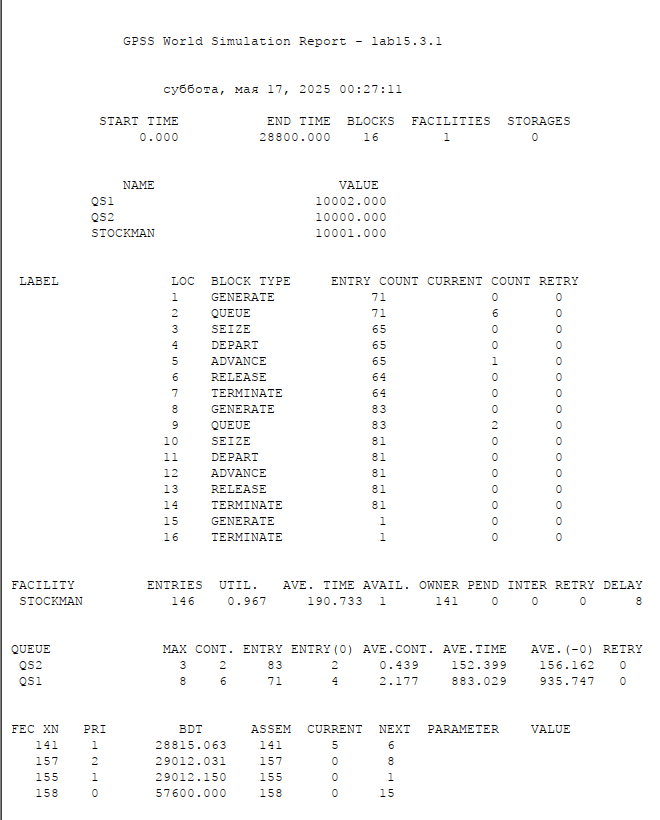
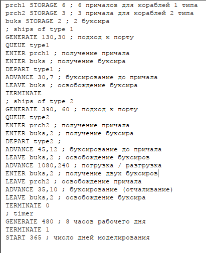
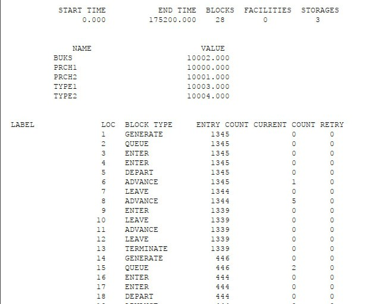
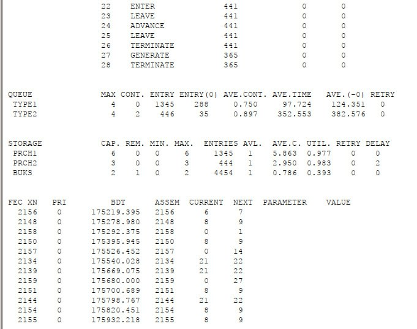

---
## Front matter
lang: ru-RU
title: Лабораторная работа №15
subtitle: Модели обслуживания с приоритетами. GPSS
author:
  - Ибатулина Д.Э.
institute:
  - Российский университет дружбы народов, Москва, Россия
date: 17 мая 2025

## i18n babel
babel-lang: russian
babel-otherlangs: english

## Formatting pdf
toc: false
toc-title: Содержание
slide_level: 2
aspectratio: 169
section-titles: true
theme: metropolis
header-includes:
 - \metroset{progressbar=frametitle,sectionpage=progressbar,numbering=fraction}
---

# Информация

## Докладчик

:::::::::::::: {.columns align=center}
::: {.column width="70%"}

  * Ибатулина Дарья Эдуардовна
  * студентка группы НФИбд-01-22
  * Фундаментальная информатика и информационные технологии
  * Российский университет дружбы народов
  * [1132226434@rudn.ru](mailto:1132226434@rudn.ru)
  * <https://deibatulina.github.io>

:::
::: {.column width="30%"}


:::
::::::::::::::

# Вводная часть

## Теоретическое введение

Приоритет транзактов задаётся через параметр E (пятый параметр) в блоке GENERATE или оператором PRIORITY. По умолчанию используется нулевой приоритет.

Пример фрагмента модели:

```gpss
GENERATE 10,,,1    ; Заявки 1 класса с приоритетом 1
QUEUE Ochered
SEIZE Kanal
DEPART Ochered
ADVANCE 8
RELEASE Kanal
TERMINATE
```

## Цель и задачи работы

Реализовать с помощью `gpss` модели обслуживания с приоритетами и провести анализ результатов:

- Модель обслуживания механиков на складе
- Модель обслуживания в порту судов двух типов

# Выполнение лабораторной работы

## Модель обслуживания механиков на складе

На фабрике на складе работает один кладовщик, который выдает запасные части механикам, обслуживающим станки. Время, необходимое для удовлетворения запроса, зависит от типа запасной части. Запросы бывают двух категорий. Для первой категории интервалы времени прихода механиков $420 \pm 360$ сек., время обслуживания -- $300 \pm 90$ сек. Для второй категории интервалы времени прихода механиков $360 \pm 240$ сек., время обслуживания -- $100 \pm 30$ сек. Порядок обслуживания механиков кладовщиком такой: запросы первой категории обслуживаются только в том случае, когда в очереди нет ни одного запроса второй категории. Внутри одной категории дисциплина обслуживания -- "первым пришел -- первым обслужился". Необходимо создать модель работы кладовой, моделирование выполнять в течение восьмичасового рабочего дня.

## Модель обслуживания механиков с приоритетами

\centering
{width=50%}

## Отчёт по модели

\centering
{width=45%}

## Модель обслуживания в порту судов двух типов

Морские суда двух типов прибывают в порт, где происходит их разгрузка. В порту есть два буксира, обеспечивающих ввод и вывод кораблей из порта. К первому типу судов относятся корабли малого тоннажа, которые требуют использования одного буксира. Корабли второго типа имеют большие размеры, и для их ввода и вывода из порта требуется два буксира. Из-за различия размеров двух типов кораблей необходимы и причалы различного размера. Кроме того, корабли имеют различное время погрузки/разгрузки. 
Требуется построить модель системы, в которой можно оценить время ожидания кораблями каждого типа входа в порт. Время ожидания входа в порт включает время ожидания освобождения причала и буксира. Корабль, ожидающий освобождения причала, не обслуживается буксиром до тех пор, пока не будет предоставлен нужный причал. Корабль второго типа не займёт буксир до тех пор, пока ему не будут доступны оба буксира.

## Модель обслуживания в порту судов двух типов

\centering
{width=45%}

## Отчёт по модели обслуживания в порту судов двух типов (1/2)

\centering
{width=50%}

## Отчёт по модели обслуживания в порту судов двух типов (2/2)

\centering
{width=50%}

# Заключительная часть

## Выводы по работе

В результате выполнения работы были реализованы с помощью gpss:

- Модель обслуживания механиков на складе;
- Модель обслуживания в порту судов двух типов.
