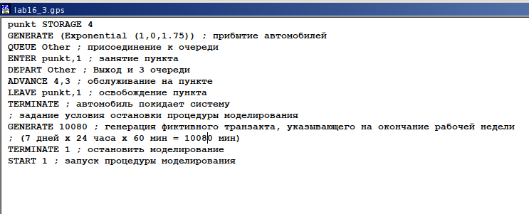
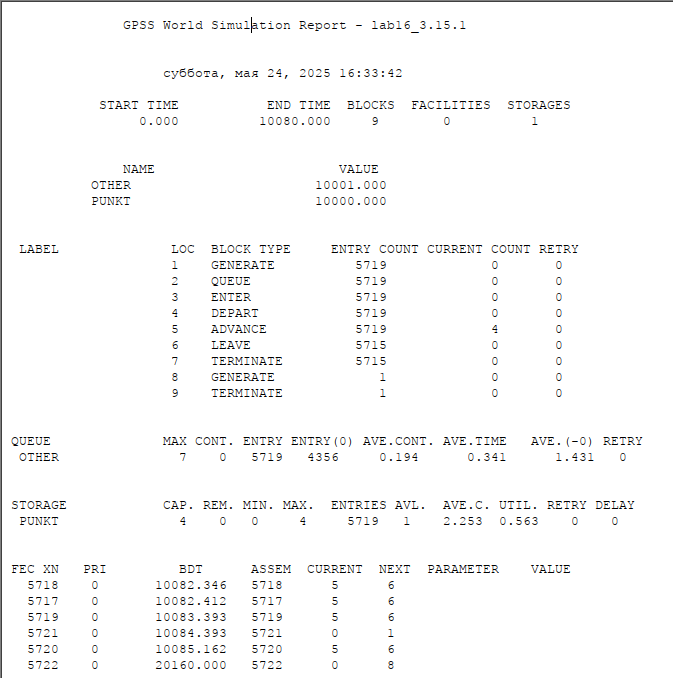

---
## Front matter
lang: ru-RU
title: Лабораторная работа №16
subtitle: Задачи оптимизации. Модель двух стратегий обслуживания
author:
  - Ибатулина Д.Э.
institute:
  - Российский университет дружбы народов, Москва, Россия
date: 24 мая 2025

## i18n babel
babel-lang: russian
babel-otherlangs: english

## Formatting pdf
toc: false
toc-title: Содержание
slide_level: 2
aspectratio: 169
section-titles: true
theme: metropolis
header-includes:
 - \metroset{progressbar=frametitle,sectionpage=progressbar,numbering=fraction}
---

# Информация

## Докладчик

:::::::::::::: {.columns align=center}
::: {.column width="70%"}

  * Ибатулина Дарья Эдуардовна
  * студентка группы НФИбд-01-22
  * Фундаментальная информатика и информационные технологии
  * Российский университет дружбы народов
  * [1132226434@rudn.ru](mailto:1132226434@rudn.ru)
  * <https://deibatulina.github.io>

:::
::: {.column width="30%"}

:::
::::::::::::::

# Вводная часть

## Теоретическое введение

Пакет GPSS(General Purpose Simulation System — система моделирования общего назначения) предназначен для имитационного моделирования дискретных систем.

Имитационная модель в GPSS представляет собой последовательность текстовых строк, каждая из которых определяет правила создания, перемещения, задержки и удаления транзактов.
 
*Транзакт* — динамический объект, отождествляемый с заявкой на обслуживание, который перемещается между элементами системы.

## Цель и задачи работы

Реализовать с помощью `gpss` модель двух стратегий обслуживания и оценить оптимальные параметры.

**Задание**

Реализовать с помощью gpss:

- модель с двумя очередями;
- модель с одной очередью;

Изменить модели так, чтобы определить оптимальное число пропускных пунктов для каждой из двух стратегий обслуживания.

# Выполнение лабораторной работы

## Постановка задачи

На пограничном контрольно-пропускном пункте транспорта имеются 2 пункта пропуска. Интервалы времени между поступлением автомобилей имеют экспоненциальное распределение со средним значением $\mu$. Время прохождения автомобилями пограничного контроля имеет равномерное распределение на интервале $[a, b]$. Предлагается две стратегии обслуживания прибывающих автомобилей:

1. автомобили образуют две очереди и обслуживаются соответствующими пунктами пропуска;

2. автомобили образуют одну общую очередь и обслуживаются освободившимся пунктом пропуска.

Исходные данные: $\mu$ = 1.75 мин, $a$ = 1 мин, $b$ = 7 мин.

## Построение модели

Целью моделирования является определение:

- характеристик качества обслуживания автомобилей, в частности, средних длин очередей; среднего времени обслуживания автомобиля; среднего времени пребывания автомобиля на пункте пропуска;

- наилучшей стратегии обслуживания автомобилей на пункте пограничного контроля;

- оптимального количества пропускных пунктов.

## Модель первой стратегии обслуживания

\centering
{width=50%}

## Отчёт по модели первой стратегии обслуживания

\centering
{width=45%}

## Модель второй стратегии обслуживания

\centering
{width=65%}

## Отчет по модели второй стратегии обслуживания

\centering
{width=50%}

## Сравнение стратегий

| Показатель                 | стратегия 1 |         |          |  стратегия 2 |
|----------------------------|-------------|---------|----------|--------------|
|                            | пункт 1     | пункт 2 | в целом  |              |
| Поступило автомобилей      | 2928        | 2925    | 5853     | 5719         |
| Обслужено автомобилей      | 2540        | 2536    | 5076     | 5049         |
| Коэффициент загрузки       | 0,997       | 0,996   | 0,9965   | 1            |
| Максимальная длина очереди | 393         | 393     | 786      | 668          |
| Средняя длина очереди      | 187,098     | 187,114 | 374,212  | 344,466      |
| Среднее время ожидания     | 644,107     | 644,823 | 644,465  | 607,138      |

## Модель двух стратегий обслуживания с 1 пропускным пунктом

\centering
{width=65%}

## Отчёт по модели двух стратегий обслуживания с 1 пропускным пунктом

\centering
{width=45%}

## Модель первой стратегии обслуживания с 3 пропускными пунктами

\centering
{width=50%}

## Отчёт по модели первой стратегии обслуживания с 3 пропускными пунктами (1/2)

\centering
{width=45%}

## Отчёт по модели первой стратегии обслуживания с 3 пропускными пунктами (2/2)

\centering
{width=65%}

## Модель первой стратегии обслуживания с 4 пропускными пунктами

\centering
{width=45%}

## Отчёт по модели первой стратегии обслуживания с 4 пропускными пунктами (1/2)

\centering
{width=45%}

## Отчёт по модели первой стратегии обслуживания с 4 пропускными пунктами (2/2)

\centering
{width=60%}

## Модель второй стратегии обслуживания с 3 пропускными пунктами

\centering
{width=65%}

## Отчёт по модели второй стратегии обслуживания с 3 пропускными пунктами

\centering
{width=45%}

## Модель второй стратегии обслуживания с 4 пропускными пунктами

\centering
{width=65%}

## Отчёт по модели второй стратегии обслуживания с 4 пропускными пунктами

\centering
{width=45%}

# Заключительная часть

## Выводы по работе

В результате выполнения данной лабораторной работы я реализовала с помощью `gpss`:

- модель с двумя очередями;

- модель с одной очередью;

- изменение модели таким образом, чтобы определить оптимальное число пропускных пунктов для каждой из двух стратегий.
