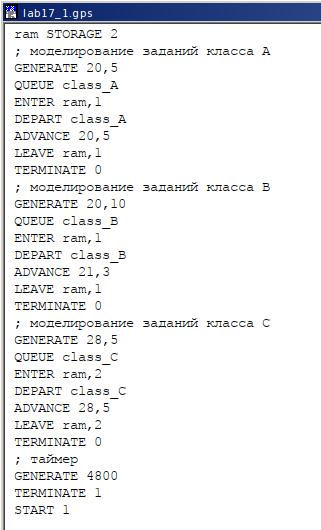
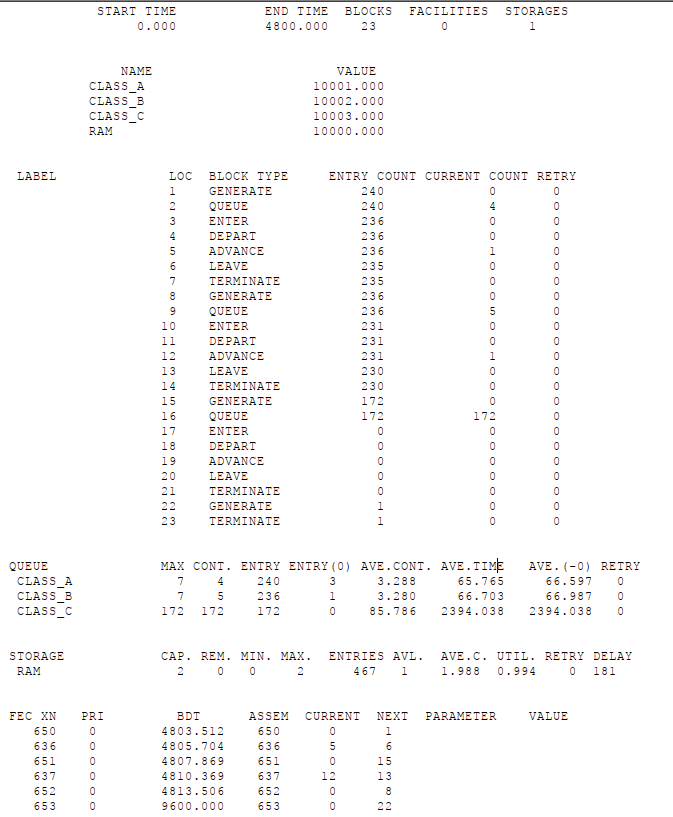
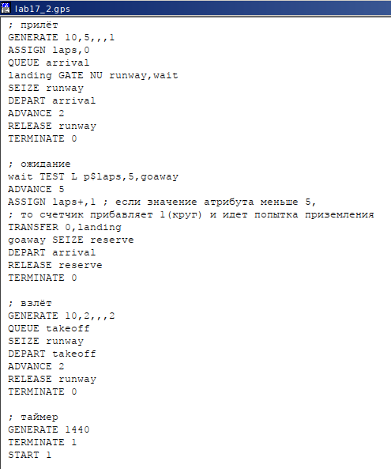
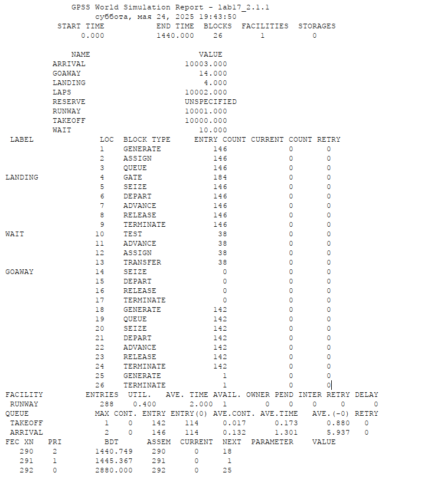
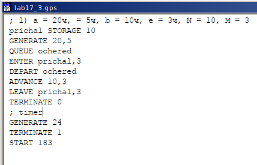
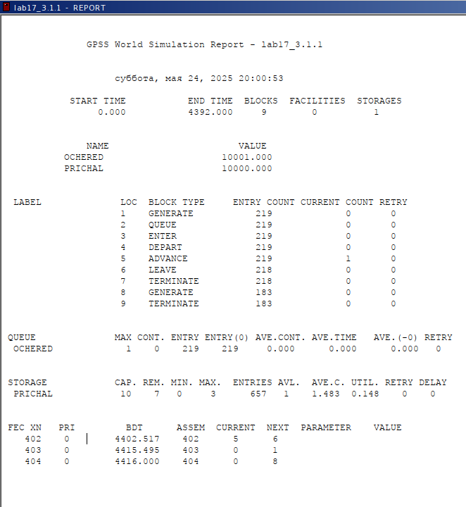
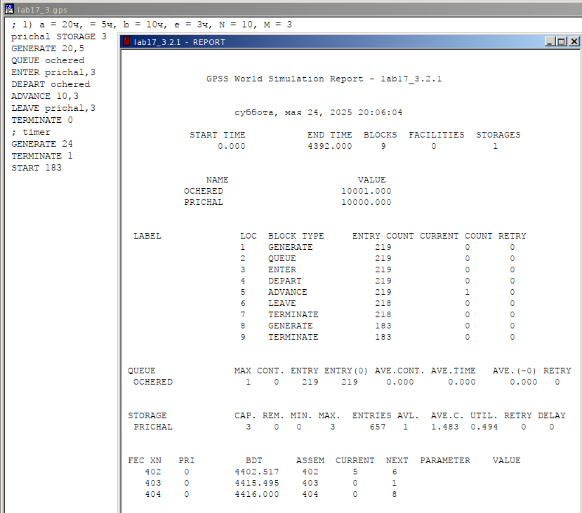
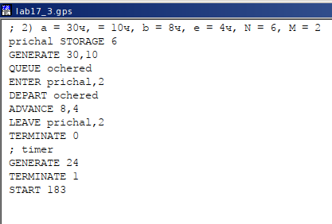
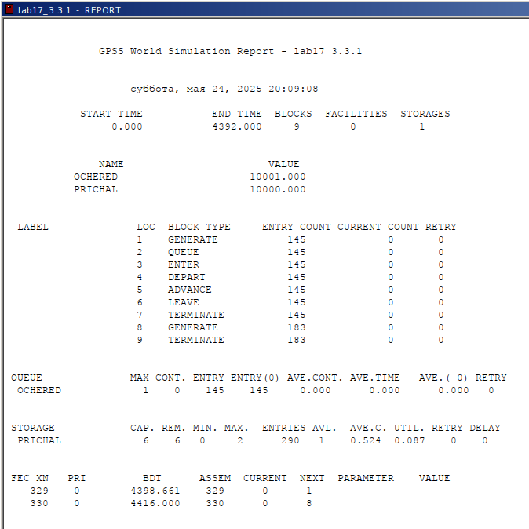
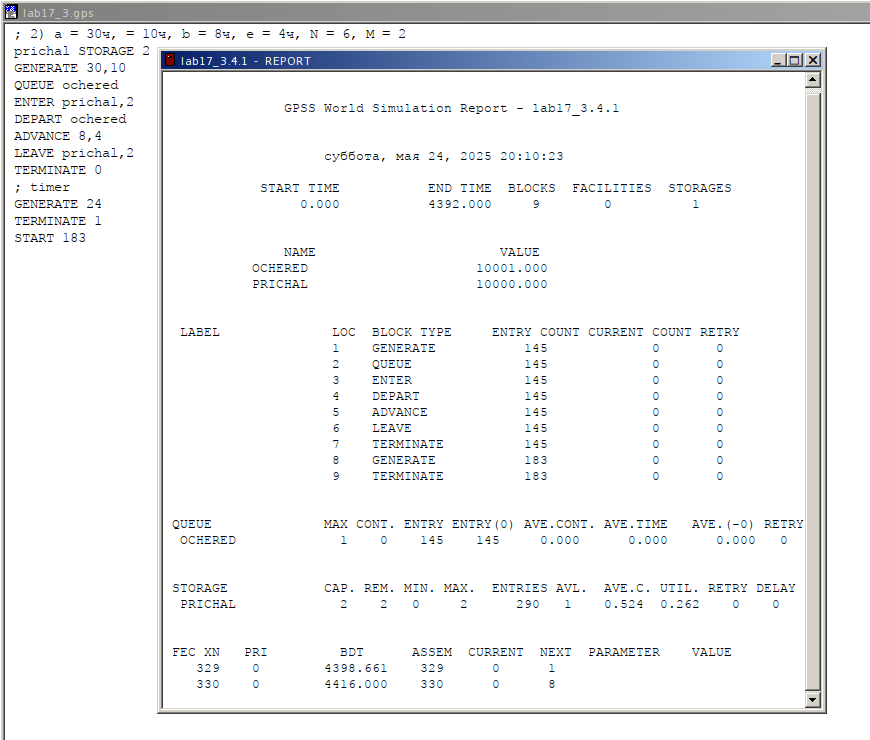

---
## Front matter
lang: ru-RU
title: Лабораторная работа №17
subtitle: Задания для самостоятельной работы. GPSS
author:
  - Ибатулина Д.Э.
institute:
  - Российский университет дружбы народов, Москва, Россия
date: 24 мая 2025

## i18n babel
babel-lang: russian
babel-otherlangs: english

## Formatting pdf
toc: false
toc-title: Содержание
slide_level: 2
aspectratio: 169
section-titles: true
theme: metropolis
header-includes:
 - \metroset{progressbar=frametitle,sectionpage=progressbar,numbering=fraction}
---

# Информация

## Докладчик

:::::::::::::: {.columns align=center}
::: {.column width="70%"}

  * Ибатулина Дарья Эдуардовна
  * студентка группы НФИбд-01-22
  * Фундаментальная информатика и информационные технологии
  * Российский университет дружбы народов
  * [1132226434@rudn.ru](mailto:1132226434@rudn.ru)
  * <https://deibatulina.github.io>

:::
::: {.column width="30%"}

:::
::::::::::::::

# Вводная часть

## Теоретическое введение

Пакет GPSS(General Purpose Simulation System — система моделирования общего назначения) предназначен для имитационного моделирования дискретных систем.

Имитационная модель в GPSS представляет собой последовательность текстовых строк, каждая из которых определяет правила создания, перемещения, задержки и удаления транзактов.
 
*Транзакт* — динамический объект, отождествляемый с заявкой на обслуживание, который перемещается между элементами системы.

## Цель и задачи работы

Реализовать с помощью `gpss` задания для самостоятельной работы.

**Задание**

Реализовать с помощью gpss:

- модель работы вычислительного центра;
- модель работы аэропорта;
- модель работы морского порта.

# Выполнение лабораторной работы

## Модель работы вычислительного центра

На вычислительном центре в обработку принимаются три класса заданий А, В и С. Исходя из наличия оперативной памяти ЭВМ задания классов А и В могут решаться одновременно, а задания класса С монополизируют ЭВМ. Задания класса А поступают через $20 \pm 5$ мин, класса В — через $20 \pm 10$ мин, класса С — через $28 \pm 5$ мин. Требуют для выполнения: класс А — $20 \pm 5$ мин, класс В — 21 \pm 3 мин, класс С — $28 \pm 5$ мин.
Задачи класса С загружаются в ЭВМ, если она полностью свободна. Задачи классов А и В могут дозагружаться к решающей задаче. Необходимо смоделировать работу ЭВМ за 80 ч. Определить её загрузку.

## Модель работы вычислительного центра

\centering
{width=60%}

## Отчёт по модели работы вычислительного центра

\centering
{width=45%}

## Модель работы аэропорта

Самолёты прибывают для посадки в район аэропорта каждые $10 \pm 5$ мин. Если взлетно-посадочная полоса свободна, прибывший самолёт получает разрешение на посадку. Если полоса занята, самолет выполняет полет по кругу и возвращается в аэропорт каждые 5 мин. Если после пятого круга самолет не получает разрешения на посадку, он отправляется на запасной аэродром. В аэропорту через каждые $10 \pm 2$ мин к взлетно -посадочной полосе выруливают готовые к взлёту самолёты и получают разрешение на взлёт, если полоса свободна. Для взлета и посадки самолёты занимают полосу ровно на 2 мин. Если при свободной полосе одновременно один самолёт прибывает для посадки, а другой - для взлёта, то полоса предоставляется взлетающей машине. Требуется: выполнить моделирование работы аэропорта в течение суток; подсчитать количество самолётов, которые взлетели, сели и были направлены на запасной аэродром; определить коэффициент загрузки взлетно-посадочной полосы.

## Модель работы аэропорта

\centering
{width=65%}

## Отчёт по модели работы аэропорта

\centering
{width=45%}

## Модель работы морского порта

Морские суда прибывают в порт каждые $[\alpha \pm \delta]$ часов. В порту имеется `N` причалов. Каждый корабль по длине занимает `M` причалов и находится в порту $[b \pm \varepsilon]$ часов.
Требуется построить GPSS-модель для анализа работы морского порта в течение полугода, определить оптимальное количество причалов для эффективной работы порта. Рассмотрим два варианта исходных данных:

1. $a = 20$ ч, $\delta = 5$ ч, $b = 10$ ч, $\varepsilon = 3$ ч, $N = 10$, $M = 3$;
2. $a = 30$ ч, $\delta = 10$ ч, $b = 8$ ч, $\varepsilon = 4$ ч, $N = 6$, $M = 2$.

## Модель работы морского порта (1 вариант)

\centering
{width=70%}

## Отчёт по модели работы морского порта (1 вариант)

\centering
{width=50%}

## Оптимизированная модель работы морского порта (1 вариант) и отчёт

\centering
{width=60%}

## Модель работы морского порта (2 вариант)

\centering
{width=70%}

## Отчёт по модели работы морского порта (2 вариант)

\centering
{width=50%}

## Оптимизированная модель работы морского порта (2 вариант) и отчёт

\centering
{width=60%}

# Заключительная часть

## Выводы по работе

В результате выполнения данной лабораторной работы я реализовала с помощью `gpss`:

- модель работы вычислительного центра;
- модель работы аэропорта;
- модель работы морского порта.
