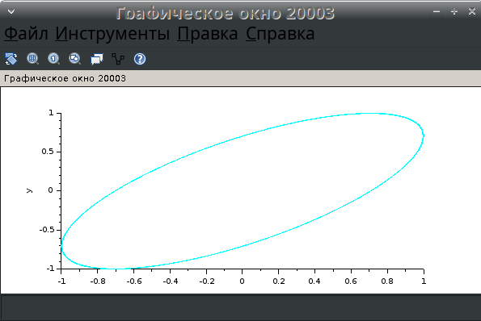

---
## Front matter
lang: ru-RU
title: Презентация по упражнению xcos
subtitle: Компонентное моделирование. Scilab, подсистема xcos
author:
  - Ибатулина Д.Э.
institute:
  - Российский университет дружбы народов, Москва, Россия
date: 5 марта 2025

## i18n babel
babel-lang: russian
babel-otherlangs: english

## Formatting pdf
toc: false
toc-title: Содержание
slide_level: 2
aspectratio: 169
section-titles: true
theme: metropolis
header-includes:
 - \metroset{progressbar=frametitle,sectionpage=progressbar,numbering=fraction}
---

# Информация

## Докладчик

:::::::::::::: {.columns align=center}
::: {.column width="70%"}

  * Ибатулина дарья эдуардовна
  * студентка группы НФИбд-01-22
  * Российский университет дружбы народов
  * [1132226434@rudn.ru](mailto:1132226434@rudn.ru)
  * <https://deibatulina.github.io>

:::
::: {.column width="30%"}

:::
::::::::::::::

# Вводная часть

## Актуальность

Тема моделирования различных процессов, происходящих в мире, актуальна, поскольку позволяет найти решения для их оптимизации.

## Объект и предмет исследования

- Процесс функционирования двух источников синусоидального сигнала
- Программное обеспечение для моделирования (xcos, OpenModelica)

## Цели и задачи

Научиться работать со средствами моделирования xcos и OpenModelica.

Задачи:

1. Реализовать имитационную  модель функционирования двух источников синусоидального сигнала, позволяющая в зависимости от задаваемых параметров построить различные фигуры Лиссажу в xcos с различными параметрами;
2. Реализовать имитационную  модель функционирования двух источников синусоидального сигнала, позволяющая в зависимости от задаваемых параметров построить различные фигуры Лиссажу в OpenModelica.

# Основная часть

## Теоретическое введение

\centering
{width=100%}

## Палитры блоков

\centering
{width=100%}

## Пример модели

\centering
{width=100%}

## Математическое выражение для кривой Лиссажу

$$
\begin{cases} 
x(t) = A \sin(at + \delta), \\ 
y(t) = B \sin(bt) 
\end{cases}
$$

## Задание характеристик блоку

\centering
{width=60%}

## $A = B = 1, a = 2, b = 2, \delta = 0$

\centering
{width=60%}

## $A = B = 1, a = 2, b = 2, \delta = \pi /4$

\centering
{width=60%}

## $A = B = 1, a = 2, b = 2, \delta = \pi /2$

\centering
{width=60%}

## $A = B = 1, a = 2, b = 2, \delta = 3\pi /4$

\centering
{width=60%}

## $A = B = 1, a = 2, b = 2, \delta = \pi$

\centering
{width=60%}

## $A = B = 1, a = 2, b = 4, \delta = 0$

\centering
{width=60%}

## $A = B = 1, a = 2, b = 4, \delta = \pi /4$

\centering
{width=60%}

## $A = B = 1, a = 2, b = 4, \delta = \pi /2$

\centering
{width=60%}

## $A = B = 1, a = 2, b = 4, \delta = 3\pi /4$

\centering
{width=60%}

## $A = B = 1, a = 2, b = 4, \delta = \pi$

\centering
{width=60%}

## $A = B = 1, a = 2, b = 6, \delta = 0$

\centering
{width=60%}

## $A = B = 1, a = 2, b = 6, \delta = \pi /4$

\centering
{width=60%}

## $A = B = 1, a = 2, b = 6, \delta = \pi /2$

\centering
{width=45%}

## $A = B = 1, a = 2, b = 6, \delta = 3\pi /4$

\centering
{width=60%}

## $A = B = 1, a = 2, b = 6, \delta = \pi$

\centering
{width=60%}

## $A = B = 1, a = 2, b = 3, \delta = 0$

\centering
{width=60%}

## $A = B = 1, a = 2, b = 3, \delta = \pi /4$

\centering
{width=60%}

## $A = B = 1, a = 2, b = 3, \delta = \pi /2$

\centering
{width=60%}

## $A = B = 1, a = 2, b = 3, \delta = 3\pi /4$

\centering
{width=60%}

## $A = B = 1, a = 2, b = 3, \delta = \pi$

\centering
{width=60%}

## Редактор OMEdit

\centering
{width=60%}

## Создание класса

\centering
{width=80%}

## Просмотр класса в текстовом виде

\centering
{width=60%}

## Написание кода для задания дифференциального уравнения

\centering
{width=60%}

## Задание параметров симуляции

\centering
{width=60%}

## Полученные графики для x и x'

\centering
{width=60%}

## Полученный график для x

\centering
{width=60%}

# Заключительная часть

## Выводы

В результате выполнения лабораторной работы я научилась работать со средствами моделирования xcos и OpenModelica.

