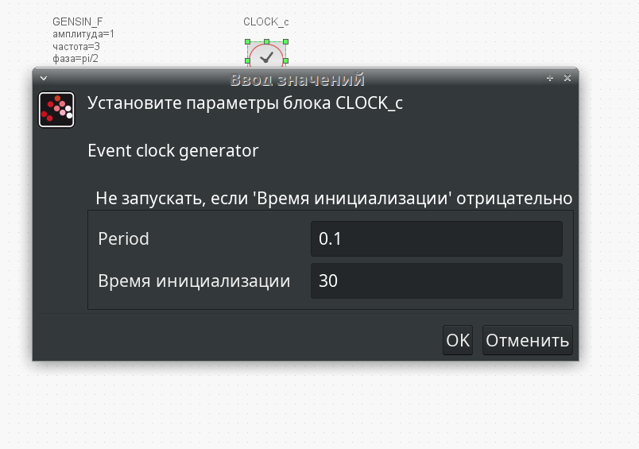
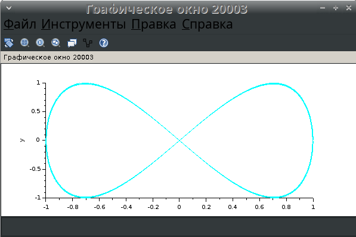

---
## Front matter
title: "Упражнение xcos"
subtitle: "Компонентное моделирование. Scilab, подсистема xcos"
author: "Ибатулина Дарья Эдуардовна, НФИбд-01-22"

## Generic otions
lang: ru-RU
toc-title: "Содержание"

## Bibliography
bibliography: bib/cite.bib
csl: pandoc/csl/gost-r-7-0-5-2008-numeric.csl

## Pdf output format
toc: true # Table of contents
toc-depth: 2
lof: true # List of figures
lot: false # List of tables
fontsize: 12pt
linestretch: 1.5
papersize: a4
documentclass: scrreprt
## I18n polyglossia
polyglossia-lang:
  name: russian
  options:
	- spelling=modern
	- babelshorthands=true
polyglossia-otherlangs:
  name: english
## I18n babel
babel-lang: russian
babel-otherlangs: english
## Fonts
mainfont: PT Serif
romanfont: PT Serif
sansfont: PT Sans
monofont: PT Mono
mainfontoptions: Ligatures=TeX
romanfontoptions: Ligatures=TeX
sansfontoptions: Ligatures=TeX,Scale=MatchLowercase
monofontoptions: Scale=MatchLowercase,Scale=0.9
## Biblatex
biblatex: true
biblio-style: "gost-numeric"
biblatexoptions:
  - parentracker=true
  - backend=biber
  - hyperref=auto
  - language=auto
  - autolang=other*
  - citestyle=gost-numeric
## Pandoc-crossref LaTeX customization
figureTitle: "Рис."
tableTitle: "Таблица"
listingTitle: "Листинг"
lofTitle: "Список иллюстраций"
lotTitle: "Список таблиц"
lolTitle: "Листинги"
## Misc options
indent: true
header-includes:
  - \usepackage{indentfirst}
  - \usepackage{float} # keep figures where there are in the text
  - \floatplacement{figure}{H} # keep figures where there are in the text
---

# Цель работы

Научиться работать со средствами моделирования xcos и OpenModelica.

# Задание

1. Реализовать имитационную модель функционирования двух источников синусоидального сигнала, позволяющая в зависимости от задаваемых параметров построить различные фигуры Лиссажу в xcos с различными параметрами;
2. Реализовать имитационную  модель функционирования двух источников синусоидального сигнала, позволяющая в зависимости от задаваемых параметров построить различные фигуры Лиссажу в OpenModelica.

# Теоретическое введение

Scilab — система компьютерной математики, предназначенная для решения вычислительных задач. Основное окно Scilab содержит обозреватель файлов, командное окно, обозреватель переменных и журнал команд (рис. [-@fig:001]).

{#fig:001 width=70%}

Программа xcos является приложением к пакету Scilab. Для вызова окна xcos необходимо в меню основного окна Scilab выбрать Инструменты, Визуальное моделирование xcos. При моделировании с использованием xcos реализуется принцип визуального программирования, в соответствии с которым пользователь на экране из палитры блоков (рис. [-@fig:002]) создаёт модель и осуществляет расчёты.

{#fig:002 width=70%}

На рис. [-@fig:003] в качестве примера приведена модель функционирования двух источников синусоидального сигнала, позволяющая в зависимости от задаваемых параметров построить различные фигуры Лиссажу.

{#fig:003 width=70%}

Математическое выражение для кривой Лиссажу:

$$
\begin{cases} 
x(t) = A \sin(at + \delta), \\ 
y(t) = B \sin(bt) 
\end{cases}
$$

Блокам можно задавать различные характеристики (рис. [-@fig:004], [-@fig:005], [-@fig:006]).

{#fig:004 width=70%}

{#fig:005 width=70%}

{#fig:006 width=70%}

Использованы следующие блоки xcos:

CLOCK_c - запуск часов модельного времени;

GENSIN_f - блок генератора синусоидального сигнала;

CSCOPEXY - анимированное регистрирующее устройство для построения графика типа y = f(x);

TEXT_f - задаёт текст примечаний.

# Выполнение лабораторной работы

## Реализация модели в xcos

Выполнив моделирование получим следующий график фигуры Лиссажу при параметрах: $A = B = 1, a = 2, b = 2, \delta = 0$ (рис. [-@fig:007]). Меняя фазу в первом генераторе на $\pi/4; \, \pi/2; \,  3\pi/4;\,  \pi;$ соответственно получим другие фигуры Лиссажу (рис. [-@fig:008], [-@fig:009], [-@fig:010], [-@fig:011]).

{#fig:007 width=70%}

{#fig:008 width=70%}

{#fig:009 width=70%}

{#fig:010 width=70%}

{#fig:011 width=70%}

Изменим параметр частоты на втором генераторе на 4.

Выполнив моделирование получим следующий график фигуры Лиссажу при параметрах: $A = B = 1, a = 2, b = 4, \delta = 0$ (рис. [-@fig:012]). Меняя фазу в первом генераторе на $\pi/4; \, \pi/2; \,  3\pi/4;\,  \pi;$ соответственно получим другие фигуры Лиссажу (рис. [-@fig:013], [-@fig:014], [-@fig:015], [-@fig:016]).

{#fig:012 width=70%}

{#fig:013 width=70%}

{#fig:014 width=70%}

{#fig:015 width=70%}

{#fig:016 width=70%}

Изменим параметр частоты на втором генераторе на 6.

Выполнив моделирование получим следующий график фигуры Лиссажу при параметрах: $A = B = 1, a = 2, b = 6, \delta = 0$ (рис. [-@fig:017]). Меняя фазу в первом генераторе на $\pi/4; \, \pi/2; \,  3\pi/4;\,  \pi;$ соответственно получим другие фигуры Лиссажу (рис. [-@fig:018], [-@fig:019], [-@fig:020], [-@fig:021]).

{#fig:017 width=70%}

{#fig:018 width=70%}

{#fig:019 width=70%}

{#fig:020 width=70%}

{#fig:021 width=70%}

Изменим параметр частоты на втором генераторе на 3.

Выполнив моделирование получим следующий график фигуры Лиссажу при параметрах: $A = B = 1, a = 2, b = 3, \delta = 0$ (рис. [-@fig:022]). Меняя фазу в первом генераторе на $\pi/4; \, \pi/2; \,  3\pi/4;\,  \pi;$ соответственно получим другие фигуры Лиссажу (рис. [-@fig:023], [-@fig:024], [-@fig:025], [-@fig:026]).

{#fig:022 width=70%}

{#fig:023 width=70%}

{#fig:024 width=70%}

{#fig:025 width=70%}

{#fig:026 width=70%}

## Реализация модели в OpenModelica

Смоделируем класс дифференциального уравнениия $x'=-x$. Для этого зайдём в OMEdit и создадим этот класс (рис. [-@fig:027], [-@fig:028], [-@fig:029], [-@fig:030], [-@fig:031]). 

{#fig:027 width=70%}

{#fig:028 width=70%}

{#fig:029 width=70%}

{#fig:030 width=70%}

{#fig:031 width=70%}

В результате получился такой график (рис. [-@fig:032], [-@fig:033]). 

{#fig:032 width=70%}

{#fig:033 width=70%}

# Выводы

В результате выполнения лабораторной работы я научилась работать со средствами моделирования xcos и OpenModelica.

# Список литературы{.unnumbered}

1. Королькова А.В., Кулябов Д.С. Руководство к упражнению. Компонентное моделирование. Scilab, подсистема xcos. Моделирование информационных процессов. - 2025. — 8 с.

::: {#refs}
:::
